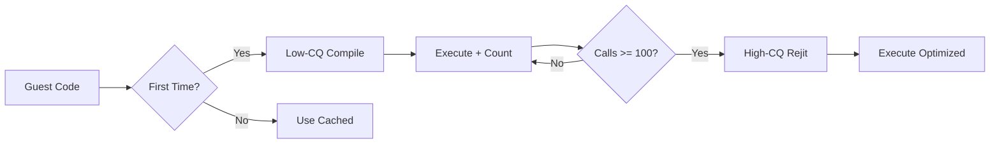

## Overview

ARMeilleure is Ryujinx's custom-built JIT (Just-In-Time) compiler for ARM CPU emulation. It translates ARM64 (and ARM32) guest code into optimized native x86-64 or ARM64 host code at runtime, providing high-performance CPU emulation.

<Info>
ARMeilleure uses a multi-stage translation pipeline: **Decode → IR Translation → Optimization → Register Allocation → Code Generation**
</Info>

## Translation Pipeline

### Stage 1: Decoding

The decoder (`src/ARMeilleure/Decoders/Decoder.cs`) performs recursive guest code analysis:

```csharp
public static Block[] Decode(IMemoryManager memory, ulong address, 
                             ExecutionMode mode, bool highCq, DecoderMode dMode)
{
    List<Block> blocks = [];
    Queue<Block> workQueue = new();
    Dictionary<ulong, Block> visited = new();
    
    int instructionLimit = highCq ? MaxInstsPerFunction : MaxInstsPerFunctionLowCq;
    // Decode blocks recursively...
}
```

**Key features:**
- **Basic block construction**: Follows control flow (branches, calls, returns)
- **Function size limits**: 2500 instructions (high-CQ) or 500 (low-CQ) to prevent excessive compilation time
- **Multi-block analysis**: Handles complex control flow graphs
- **Lazy decoding**: Only decodes when execution reaches new code regions

### Stage 2: IR Translation

Guest instructions are lifted into ARMeilleure's intermediate representation:

```csharp
// Operation structure from src/ARMeilleure/IntermediateRepresentation/Operation.cs
internal struct Operation
{
    internal struct Data
    {
        public ushort Instruction;
        public ushort Intrinsic;
        public ushort SourcesCount;
        public ushort DestinationsCount;
        public Operation ListPrevious;
        public Operation ListNext;
        public Operand* Destinations;
        public Operand* Sources;
    }
}
```

**IR characteristics:**
- **SSA form support**: Static Single Assignment for optimization passes
- **Intrusive linked list**: Efficient operation manipulation without allocations
- **Typed operands**: I32, I64, FP32, FP64, V128 (SIMD vector)
- **Intrinsics**: Hardware-accelerated operations (SIMD, crypto, etc.)

<CodeGroup>
```csharp Translation Example
// ARM instruction: ADD X0, X1, X2
// Translates to IR:
Operand dest = GetIntOrZR(op.Rd);  // X0
Operand src1 = GetIntOrZR(op.Rn);  // X1  
Operand src2 = GetIntOrZR(op.Rm);  // X2
Operation add = Operation(Instruction.Add, dest, src1, src2);
context.Add(add);
```

```csharp Vector Example
// ARM instruction: FADD V0.4S, V1.4S, V2.4S (4x float32 SIMD)
Operand dest = GetVec(op.Rd);
Operand src1 = GetVec(op.Rn);
Operand src2 = GetVec(op.Rm);
Operation vadd = Operation(Intrinsic.X86Addps, dest, src1, src2);
```
</CodeGroup>

### Stage 3: Optimization Passes

The compiler (`src/ARMeilleure/Translation/Compiler.cs`) applies optimization passes:

```csharp
public static CompiledFunction Compile(ControlFlowGraph cfg, 
                                       OperandType[] argTypes,
                                       OperandType retType,
                                       CompilerOptions options,
                                       Architecture target)
{
    CompilerContext cctx = new(cfg, argTypes, retType, options);
    
    if (options.HasFlag(CompilerOptions.Optimize))
    {
        TailMerge.RunPass(cctx);  // Merge duplicate block tails
    }
    
    if (options.HasFlag(CompilerOptions.SsaForm))
    {
        Dominance.FindDominators(cfg);
        Dominance.FindDominanceFrontiers(cfg);
        Ssa.Construct(cfg);  // Convert to SSA form
    }
    
    // Backend-specific code generation
    if (target == Architecture.X64)
        return CodeGen.X86.CodeGenerator.Generate(cctx);
    else if (target == Architecture.Arm64)
        return CodeGen.Arm64.CodeGenerator.Generate(cctx);
}
```

**Optimization techniques:**

<AccordionGroup>
<Accordion title="SSA Construction" icon="diagram-project">
Constructs Static Single Assignment form for advanced optimizations:
- Phi node insertion at control flow merge points
- Def-use chain tracking
- Enables constant propagation and dead code elimination
</Accordion>

<Accordion title="Constant Folding" icon="calculator">
Evaluates constant expressions at compile time:
```csharp
// Before: ADD r0, #5, #3
// After:  MOV r0, #8
```
Implemented in `CodeGen/Optimizations/ConstantFolding.cs`
</Accordion>

<Accordion title="Tail Merge" icon="code-merge">
Merges duplicate code at the end of basic blocks to reduce code size and improve instruction cache efficiency.
</Accordion>

<Accordion title="Block Placement" icon="arrows-to-dot">
Reorders basic blocks for:
- Better branch prediction (hot paths fall through)
- Improved instruction cache locality
- Reduced branch penalties
</Accordion>
</AccordionGroup>

### Stage 4: Register Allocation

Two allocation strategies based on compilation tier:

<Tabs>
<Tab title="Linear Scan (Low-CQ)">
**Fast allocation for initial compilation:**

```csharp
// LinearScanAllocator from RegisterAllocators/LinearScanAllocator.cs
// - Single pass through IR
// - Live interval computation
// - Greedy register assignment
// - Stack spilling when registers exhausted
```

**Characteristics:**
- O(n) complexity
- Minimal compilation overhead
- Used for first-time execution
</Tab>

<Tab title="Hybrid (High-CQ)">
**Advanced allocation for hot code:**

```csharp
// HybridAllocator from RegisterAllocators/HybridAllocator.cs
// - Graph coloring for frequently used values
// - Linear scan for cold regions
// - Copy coalescing
// - Optimal register pressure management
```

**Characteristics:**
- Higher quality allocation
- Reduced spill code
- Used after rejit threshold (100+ calls)
</Tab>
</Tabs>

### Stage 5: Code Generation

Native machine code generation for host architecture:

```csharp
// From CodeGen/X86/CodeGenerator.cs
public static CompiledFunction Generate(CompilerContext cctx)
{
    ControlFlowGraph cfg = cctx.Cfg;
    
    // Instruction table maps IR operations to code generators
    foreach (BasicBlock block in cfg.Blocks)
    {
        foreach (Operation operation in block.Operations)
        {
            Action<CodeGenContext, Operation> generator = 
                _instTable[(int)operation.Instruction];
            generator(context, operation);
        }
    }
    
    // Map executable memory and return function pointer
    return compiledFunc.MapWithPointer<GuestFunction>(out nint funcPointer);
}
```

**Backend features:**

<CardGroup cols={2}>
<Card title="x86-64 Backend" icon="x">
- SSE/AVX/AVX-512 SIMD support
- Hardware AES/SHA acceleration
- Optimized calling conventions (System V / Windows x64)
- Efficient stack frame management
</Card>

<Card title="ARM64 Backend" icon="a">
- Native ARM64 code on Apple Silicon / Linux ARM
- NEON SIMD instructions
- ARM crypto extensions
- Zero-overhead for ARM→ARM translation
</Card>
</CardGroup>

## Two-Tier Compilation

ARMeilleure uses adaptive compilation to balance startup time and performance:



### Low-CQ (Low Code Quality)

```csharp
// Fast compilation path
TranslatedFunction func = Translate(address, mode, highCq: false);
// - Minimal optimizations
// - Linear scan register allocation
// - Fast startup
// - Lower runtime performance
```

### High-CQ (High Code Quality)

```csharp
// Optimization compilation path (background threads)
if (callCount >= 100)
{
    TranslatedFunction func = Translate(address, mode, highCq: true);
    // - Full optimization passes
    // - Advanced register allocation
    // - Slower compilation
    // - Maximum runtime performance
}
```

**Rejit mechanism** from `src/ARMeilleure/Translation/Translator.cs:479`:

```csharp
internal static void EmitRejitCheck(ArmEmitterContext context, out Counter<uint> counter)
{
    const int MinsCallForRejit = 100;
    
    counter = new Counter<uint>(context.CountTable);
    Operand curCount = context.Load(OperandType.I32, address);
    Operand count = context.Add(curCount, Const(1));
    context.Store(address, count);
    
    // Enqueue for high-CQ recompilation after 100 calls
    context.BranchIf(lblEnd, curCount, Const(MinsCallForRejit), 
                     Comparison.NotEqual, BasicBlockFrequency.Cold);
    context.Call(typeof(NativeInterface).GetMethod(
                 nameof(NativeInterface.EnqueueForRejit)), 
                 Const(context.EntryAddress));
}
```

## Hardware Capabilities Detection

ARMeilleure detects and utilizes host CPU features:

```csharp
// From src/ARMeilleure/Optimizations.cs
public static class Optimizations
{
    // X86 SIMD extensions
    public static bool UseSseIfAvailable { get; set; } = true;
    public static bool UseAvxIfAvailable { get; set; } = true;
    public static bool UseAvx512FIfAvailable { get; set; } = true;
    
    // Crypto acceleration
    public static bool UseAesniIfAvailable { get; set; } = true;
    public static bool UseShaIfAvailable { get; set; } = true;
    
    // ARM extensions
    public static bool UseAdvSimdIfAvailable { get; set; } = true;
    public static bool UseArm64AesIfAvailable { get; set; } = true;
    
    // Runtime capability check
    internal static bool UseAvx512F => 
        UseAvx512FIfAvailable && X86HardwareCapabilities.SupportsAvx512F;
}
```

<Info>
**Performance impact:** Using AVX-512 can provide 2-4x speedup for vector operations compared to SSE2
</Info>

## Function Cache Management

### Translation Cache

```csharp
// From Translator.cs
internal TranslatorCache<TranslatedFunction> Functions { get; }
internal IAddressTable<ulong> FunctionTable { get; }

internal TranslatedFunction GetOrTranslate(ulong address, ExecutionMode mode)
{
    if (!Functions.TryGetValue(address, out TranslatedFunction func))
    {
        func = Translate(address, mode, highCq: false);
        TranslatedFunction oldFunc = Functions.GetOrAdd(address, func.GuestSize, func);
        
        if (oldFunc != func)
        {
            JitCache.Unmap(func.FuncPointer);  // Race condition, discard
            func = oldFunc;
        }
        
        RegisterFunction(address, func);
    }
    return func;
}
```

### JIT Cache Invalidation

When guest code is modified (self-modifying code, JIT compilers):

```csharp
public void InvalidateJitCacheRegion(ulong address, ulong size)
{
    ulong[] overlapAddresses = [];
    int overlapsCount = Functions.GetOverlaps(address, size, ref overlapAddresses);
    
    if (overlapsCount != 0)
    {
        ClearRejitQueue(allowRequeue: true);  // Stop background compilation
    }
    
    for (int index = 0; index < overlapsCount; index++)
    {
        ulong overlapAddress = overlapAddresses[index];
        if (Functions.TryGetValue(overlapAddress, out TranslatedFunction overlap))
        {
            Functions.Remove(overlapAddress);
            Volatile.Write(ref FunctionTable.GetValue(overlapAddress), FunctionTable.Fill);
            EnqueueForDeletion(overlapAddress, overlap);
        }
    }
}
```

## PPTC (Profiled Persistent Translation Cache)

ARMeilleure can save and load compiled code across sessions:

<Steps>
<Step title="Profile Collection">
During initial gameplay, track which functions are executed frequently and compile them to high-CQ
</Step>

<Step title="Cache Generation">
Serialize compiled functions to disk with:
- Function address and hash
- IR representation
- Compilation metadata
</Step>

<Step title="Cache Loading">
On subsequent launches:
```csharp
_ptc.Initialize(titleIdText, displayVersion, enabled, Memory.Type, cacheSelector);
_ptc.LoadTranslations(this);
_ptc.MakeAndSaveTranslations(this);
```
</Step>

<Step title="Validation">
Verify cached functions against current guest code using hash comparison
</Step>
</Steps>

<Warning>
PPTC reduces startup stutter significantly but requires disk space (typically 50-200 MB per game)
</Warning>

## Dispatch Mechanisms

### Managed Dispatch Loop

```csharp
// Simple C# loop for debugging
do
{
    address = ExecuteSingle(context, address);
}
while (context.Running && address != 0);

private ulong ExecuteSingle(State.ExecutionContext context, ulong address)
{
    TranslatedFunction func = GetOrTranslate(address, context.ExecutionMode);
    return func.Execute(Stubs.ContextWrapper, context);
}
```

### Unmanaged Dispatch Loop

```csharp
// High-performance native dispatch
if (Optimizations.UseUnmanagedDispatchLoop)
{
    Stubs.DispatchLoop(context.NativeContextPtr, address);
}
```

**Benefits:**
- Eliminates managed/native transitions
- Direct function table lookups
- Lower overhead for function calls
- 5-15% performance improvement

## Performance Characteristics

<CardGroup cols={3}>
<Card title="Startup" icon="clock">
**Low-CQ compilation:**
- ~0.1-0.5ms per function
- Minimal stuttering
- Gradual warmup
</Card>

<Card title="Runtime" icon="gauge-high">
**Execution speed:**
- 70-90% of native ARM hardware (x86 host)
- 95-100% of native (ARM host)
- High-CQ provides 20-40% speedup over low-CQ
</Card>

<Card title="Memory" icon="memory">
**Cache usage:**
- ~2-10 KB per compiled function
- Function table: 8 bytes per 4KB page
- Total: 50-500 MB per game
</Card>
</CardGroup>

## Debugging Support

ARMeilleure includes integrated debugging capabilities:

```csharp
if (Optimizations.EnableDebugging)
{
    context.DebugPc = address;
    do
    {
        if (Interlocked.CompareExchange(ref context.ShouldStep, 0, 1) == 1)
        {
            context.DebugPc = Step(context, context.DebugPc);
            context.StepHandler();
        }
        else
        {
            context.DebugPc = ExecuteSingle(context, context.DebugPc);
        }
        context.CheckInterrupt();
    }
    while (context.Running && context.DebugPc != 0);
}
```

**Features:**
- Single-step execution
- Precise PC tracking
- GDB stub integration (see [Debugging](/development/debugging))
- Breakpoint support

## Related Topics

<CardGroup cols={2}>
<Card title="Memory Management" icon="hard-drive" href="/architecture/memory-management">
How ARMeilleure interfaces with guest memory
</Card>

<Card title="HLE Services" icon="server" href="/architecture/hle">
How translated code calls into HLE services
</Card>

<Card title="Graphics Integration" icon="image" href="/architecture/graphics-subsystem">
GPU command submission from translated code
</Card>

<Card title="Performance Tuning" icon="sliders" href="/guides/configuration/performance">
Optimization settings for ARMeilleure
</Card>
</CardGroup>

## Source Code Reference

Key files to explore:

- `src/ARMeilleure/Translation/Translator.cs:22` - Main translator entry point
- `src/ARMeilleure/Translation/Compiler.cs:12` - Optimization pipeline
- `src/ARMeilleure/Decoders/Decoder.cs:11` - Instruction decoder
- `src/ARMeilleure/IntermediateRepresentation/Operation.cs:7` - IR operation structure
- `src/ARMeilleure/CodeGen/X86/CodeGenerator.cs:17` - x86-64 code generation
- `src/ARMeilleure/CodeGen/Arm64/CodeGenerator.cs` - ARM64 code generation
