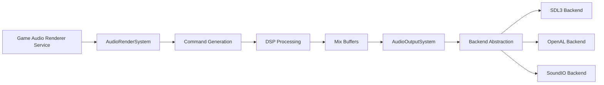

## Overview

Ryujinx's audio subsystem emulates the Nintendo Switch audio hardware and provides multi-backend audio output. The architecture separates audio rendering (processing) from output (playback):



<Info>
**Dual-layer design:** Renderer system processes audio commands, output system handles device playback
</Info>

## Audio Manager

The top-level audio manager from `src/Ryujinx.Audio/AudioManager.cs`:

```csharp
public class AudioManager : IDisposable
{
    /// <summary>
    /// Events signaled when the driver played audio buffers
    /// </summary>
    private readonly ManualResetEvent[] _updateRequiredEvents;
    
    /// <summary>
    /// Actions to execute when buffers complete
    /// </summary>
    private readonly Action[] _actions;
    
    /// <summary>
    /// Worker thread handling session updates
    /// </summary>
    private readonly Thread _workerThread;
    
    public AudioManager()
    {
        _updateRequiredEvents = new ManualResetEvent[2];
        _actions = new Action[2];
        
        _workerThread = new Thread(Update)
        {
            Name = "AudioManager.Worker",
        };
    }
    
    public void Initialize(ManualResetEvent updatedRequiredEvent, 
                          Action outputCallback, 
                          Action inputCallback)
    {
        lock (_lock)
        {
            _updateRequiredEvents[0] = updatedRequiredEvent;
            _actions[0] = outputCallback;  // Called when output buffer ready
            _actions[1] = inputCallback;   // Called when input captured
        }
    }
    
    private void Update()
    {
        while (_isRunning)
        {
            // Wait for driver signal or termination
            int index = WaitHandle.WaitAny(_updateRequiredEvents);
            
            if (index + 1 == _updateRequiredEvents.Length)
                break;  // Termination signal
            
            lock (_lock)
            {
                // Execute registered callbacks
                foreach (Action action in _actions)
                {
                    action?.Invoke();
                }
                
                _updateRequiredEvents[0].Reset();
            }
        }
    }
}
```

**Key features:**
- **Event-driven**: Callbacks triggered by audio hardware
- **Lock-free updates**: Minimal contention between audio and game threads
- **Separate input/output**: Independent pipelines for recording and playback

## Audio Renderer System

The core audio processing system from `src/Ryujinx.Audio/Renderer/Server/AudioRenderSystem.cs`:

```csharp
public class AudioRenderSystem : IDisposable
{
    private AudioRendererRenderingDevice _renderingDevice;
    private AudioRendererExecutionMode _executionMode;
    private readonly IWritableEvent _systemEvent;
    
    // Processing contexts
    private readonly VoiceContext _voiceContext;
    private readonly MixContext _mixContext;
    private readonly SinkContext _sinkContext;
    private readonly SplitterContext _splitterContext;
    private readonly EffectContext _effectContext;
    
    private PerformanceManager _performanceManager;
    private UpsamplerManager _upsamplerManager;
    
    // Audio buffers
    private Memory<float> _mixBuffer;
    private Memory<float> _depopBuffer;
    
    // Sample parameters
    private uint _sampleRate;
    private uint _sampleCount;
    private uint _mixBufferCount;
    private uint _voiceChannelCountMax;
    
    public IVirtualMemoryManager MemoryManager { get; private set; }
    
    public AudioRenderSystem(AudioRendererManager manager, IWritableEvent systemEvent)
    {
        _voiceContext = new VoiceContext();
        _mixContext = new MixContext();
        _sinkContext = new SinkContext();
        _splitterContext = new SplitterContext();
        _effectContext = new EffectContext();
    }
}
```

### Audio Rendering Pipeline

<Steps>
<Step title="Voice Processing">
**Voice Context** manages individual audio sources:

```csharp
public class VoiceContext
{
    private Memory<VoiceState> _voices;
    
    public struct VoiceState
    {
        public bool IsActive;
        public int Priority;
        public VoiceFormat Format;        // PCM16, ADPCM, Opus, etc.
        public float Volume;
        public float[] ChannelVolumes;
        public int SampleRate;
        public int MixId;                 // Target mix
        public WaveBuffer[] WaveBuffers;  // Audio data buffers
        public BiquadFilterParameter[] Filters;
    }
}
```

**Operations:**
- Decode audio samples (PCM, ADPCM, Opus)
- Apply per-voice effects (filters, pitch shift)
- Volume control and panning
</Step>

<Step title="Effect Processing">
**Effect Context** applies audio effects:

```csharp
public enum EffectType
{
    Invalid,
    BufferMix,       // Mix audio between buffers
    Aux,             // Auxiliary send/return
    Delay,           // Delay effect
    Reverb,          // Reverb effect
    Reverb3d,        // 3D reverb
    BiquadFilter,    // 2nd order IIR filter
    Limiter,         // Dynamic range limiter
    CaptureBuffer,   // Capture to buffer
    Compressor,      // Dynamic range compressor
}
```

**Example - Reverb:**
```csharp
public class ReverbEffect
{
    private float _roomSize;
    private float _damping;
    private float _earlyReflection;
    private float _lateReverbGain;
    private float[] _delayLines;
    private float[] _combFilters;
    
    public void Process(Span<float> output, ReadOnlySpan<float> input)
    {
        // Apply early reflections
        // Process comb filters for late reverb
        // Mix with dry signal
    }
}
```
</Step>

<Step title="Mixing">
**Mix Context** combines audio sources:

```csharp
public class MixContext  
{
    public struct MixState
    {
        public int MixId;
        public int DestinationMixId;  // Output mix (-1 = final)
        public float Volume;
        public bool IsUsed;
        
        // Channel mapping (up to 24 channels)
        public float[,] MixVolumes;   // [src_channel, dst_channel]
    }
    
    public void Mix(Span<float> output, ReadOnlySpan<float> input, 
                    int inputChannels, int outputChannels, 
                    float[,] volumes)
    {
        // Mix with per-channel volumes
        for (int frame = 0; frame < sampleCount; frame++)
        {
            for (int outCh = 0; outCh < outputChannels; outCh++)
            {
                float sample = 0;
                for (int inCh = 0; inCh < inputChannels; inCh++)
                {
                    sample += input[frame * inputChannels + inCh] * 
                             volumes[inCh, outCh];
                }
                output[frame * outputChannels + outCh] += sample;
            }
        }
    }
}
```

**Mixing stages:**
1. Voice → Mix (individual sources to submixes)
2. Mix → Mix (submix hierarchy)
3. Mix → Final (master output)
</Step>

<Step title="Sink Output">
**Sink Context** routes to output devices:

```csharp
public enum SinkType
{
    Invalid,
    Device,          // Physical output device
    CircularBuffer,  // Ring buffer for game reading
}

public class DeviceSink
{
    private readonly AudioOutputSystem _outputSystem;
    private readonly string _deviceName;
    private readonly uint _sampleRate;
    private readonly uint _channelCount;
    
    public void AppendBuffer(ReadOnlySpan<float> buffer, uint bufferTag)
    {
        // Send audio to output system
        _outputSystem.AppendBuffer(buffer, bufferTag);
    }
}
```
</Step>
</Steps>

### Command Generation

Audio processing is command-driven:

```csharp
public abstract class ICommand
{
    public CommandType Type { get; }
    
    public abstract void Process(CommandList context);
}

public enum CommandType
{
    // PCM operations
    PcmInt16DataSourceVersion1,
    PcmInt16DataSourceVersion2,
    PcmFloatDataSourceVersion1,
    AdpcmDataSourceVersion1,
    
    // Mixing
    MixRamp,
    MixRampGrouped,
    Mix,
    
    // Effects
    BiquadFilter,
    Reverb,
    Reverb3d,
    Delay,
    AuxiliaryBuffer,
    
    // Output
    DeviceSink,
    CircularBufferSink,
    
    // Performance
    PerformanceCommand,
}
```

**Command list execution:**

```csharp
public class CommandList
{
    private readonly List<ICommand> _commands;
    private readonly Memory<float> _mixBuffer;
    private readonly int _sampleCount;
    
    public void GenerateCommands(AudioRenderSystem system)
    {
        // Generate voice commands
        foreach (var voice in system.VoiceContext.GetActiveVoices())
        {
            AddCommand(new DataSourceCommand(voice));
            AddCommand(new BiquadFilterCommand(voice.Filters));
            AddCommand(new MixCommand(voice.MixId, voice.Volume));
        }
        
        // Generate effect commands
        foreach (var effect in system.EffectContext.GetActiveEffects())
        {
            AddCommand(CreateEffectCommand(effect));
        }
        
        // Generate sink commands
        foreach (var sink in system.SinkContext.GetActiveSinks())
        {
            AddCommand(new DeviceSinkCommand(sink));
        }
    }
    
    public void Execute()
    {
        foreach (var command in _commands)
        {
            command.Process(this);
        }
    }
}
```

## Audio Output System

Handles physical audio device output:

```csharp
public class AudioOutputSystem : IDisposable
{
    private readonly object _lock = new object();
    private readonly AudioOutputManager _manager;
    
    private readonly string _deviceName;
    private readonly uint _sampleRate;
    private readonly uint _channelCount;
    private readonly SampleFormat _sampleFormat;
    
    // Buffer queue
    private readonly Queue<AudioBuffer> _queuedBuffers;
    private readonly Queue<AudioBuffer> _releasedBuffers;
    
    private AudioBuffer _currentBuffer;
    
    public AudioOutputSystem(AudioOutputManager manager, 
                            string deviceName,
                            uint sampleRate,
                            uint channelCount)
    {
        _manager = manager;
        _deviceName = deviceName;
        _sampleRate = sampleRate;
        _channelCount = channelCount;
        
        _queuedBuffers = new Queue<AudioBuffer>();
        _releasedBuffers = new Queue<AudioBuffer>();
    }
    
    public void AppendBuffer(ReadOnlySpan<float> data, ulong bufferTag)
    {
        lock (_lock)
        {
            AudioBuffer buffer = new AudioBuffer
            {
                Tag = bufferTag,
                Data = data.ToArray(),
                SampleCount = (uint)data.Length / _channelCount,
            };
            
            _queuedBuffers.Enqueue(buffer);
        }
    }
    
    public bool TryGetReleasedBuffer(out ulong bufferTag)
    {
        lock (_lock)
        {
            if (_releasedBuffers.TryDequeue(out AudioBuffer buffer))
            {
                bufferTag = buffer.Tag;
                return true;
            }
            
            bufferTag = 0;
            return false;
        }
    }
}
```

### Buffer Management

<Tabs>
<Tab title="Buffer States">


**States:**
- **Queued**: Waiting for playback
- **Playing**: Currently outputting
- **Released**: Completed, ready for reuse
</Tab>

<Tab title="Buffer Structure">
```csharp
public struct AudioBuffer
{
    public ulong Tag;              // User tag for tracking
    public float[] Data;           // Sample data
    public uint SampleCount;       // Samples per channel
    public ulong PlayedSampleCount; // Progress tracker
}
```
</Tab>
</Tabs>

## Backend Abstraction

Multiple audio backends supported:

```csharp
public interface IAudioBackend : IDisposable
{
    string Name { get; }
    
    // Device enumeration
    IEnumerable<string> GetOutputDevices();
    
    // Stream management
    bool SupportsDirection(Direction direction);
    
    // Create output stream
    AudioDeviceStream OpenStream(string deviceId, 
                                 uint sampleRate,
                                 uint channelCount,
                                 SampleFormat format,
                                 Action<AudioBuffer> callback);
}
```

### SDL3 Backend

Preferred backend using SDL3 audio:

```csharp
public class SDL3AudioBackend : IAudioBackend
{
    public string Name => "SDL3";
    
    public AudioDeviceStream OpenStream(string deviceId,
                                       uint sampleRate,
                                       uint channelCount, 
                                       SampleFormat format,
                                       Action<AudioBuffer> callback)
    {
        SDL_AudioSpec spec = new()
        {
            freq = (int)sampleRate,
            format = ConvertFormat(format),
            channels = (byte)channelCount,
            samples = 1024,  // Buffer size
        };
        
        SDL_AudioDeviceID device = SDL_OpenAudioDevice(
            deviceId,
            false,  // Not capture
            ref spec,
            out SDL_AudioSpec obtained,
            0);
        
        return new SDL3AudioStream(device, obtained, callback);
    }
}
```

**Features:**
- Low latency
- Cross-platform
- Modern API
- Automatic resampling

### OpenAL Backend

Alternative using OpenAL Soft:

```csharp
public class OpenALAudioBackend : IAudioBackend
{
    private IntPtr _device;
    private IntPtr _context;
    
    public AudioDeviceStream OpenStream(/* ... */)
    {
        // Create OpenAL source and buffers
        uint[] buffers = new uint[4];
        uint source;
        
        AL.GenBuffers(buffers.Length, buffers);
        AL.GenSource(out source);
        
        // Configure source
        AL.Source(source, ALSourcei.SourceRelative, 1);
        AL.Source(source, ALSource3f.Position, 0, 0, 0);
        
        return new OpenALAudioStream(source, buffers, callback);
    }
}
```

**Features:**
- Wide compatibility
- 3D audio support
- Effects processing (EFX extension)

### SoundIO Backend

Legacy backend:

```csharp
public class SoundIOAudioBackend : IAudioBackend
{
    private SoundIO _soundIo;
    
    public AudioDeviceStream OpenStream(/* ... */)
    {
        SoundIODevice device = _soundIo.GetOutputDevice(deviceIndex);
        SoundIOOutStream outStream = device.CreateOutStream();
        
        outStream.Format = ConvertFormat(format);
        outStream.SampleRate = (int)sampleRate;
        outStream.Layout = SoundIOChannelLayout.GetDefault((int)channelCount);
        outStream.WriteCallback = WriteCallback;
        
        outStream.Open();
        outStream.Start();
        
        return new SoundIOAudioStream(outStream, callback);
    }
}
```

## Sample Format Conversion

Convert between internal float format and device formats:

```csharp
public enum SampleFormat
{
    PcmInt8,
    PcmInt16,
    PcmInt24,
    PcmInt32,
    PcmFloat,
}

public static class SampleConverter
{
    public static void ConvertFloatToInt16(Span<short> output, 
                                          ReadOnlySpan<float> input)
    {
        for (int i = 0; i < input.Length; i++)
        {
            float sample = Math.Clamp(input[i], -1.0f, 1.0f);
            output[i] = (short)(sample * 32767.0f);
        }
    }
    
    public static void ConvertInt16ToFloat(Span<float> output,
                                          ReadOnlySpan<short> input)
    {
        for (int i = 0; i < input.Length; i++)
        {
            output[i] = input[i] / 32768.0f;
        }
    }
}
```

## Audio Codecs

Supported audio formats:

<Tabs>
<Tab title="PCM">
```csharp
// Raw uncompressed audio
public class PcmDecoder
{
    public void Decode(Span<float> output, 
                      ReadOnlySpan<short> input,
                      int channelCount)
    {
        for (int i = 0; i < input.Length; i++)
        {
            output[i] = input[i] / 32768.0f;
        }
    }
}
```
**Formats:** 8-bit, 16-bit, 24-bit, 32-bit, float
</Tab>

<Tab title="ADPCM">
```csharp
// Adaptive Differential PCM
public class AdpcmDecoder
{
    private readonly short[] _coefficients;
    private AdpcmState _state;
    
    public void Decode(Span<short> output,
                      ReadOnlySpan<byte> input)
    {
        // Decode 4-bit samples with prediction
        foreach (byte nibble in input)
        {
            short predicted = Predict(_state);
            short decoded = predicted + DecodeDifference(nibble);
            _state.Update(decoded);
            // ...
        }
    }
}
```
**Compression:** ~4:1 ratio
</Tab>

<Tab title="Opus">
```csharp
// Opus codec via libopus
public class OpusDecoder
{
    private IntPtr _decoder;
    
    public void Decode(Span<float> output,
                      ReadOnlySpan<byte> input,
                      int frameSize)
    {
        int samples = opus_decode_float(
            _decoder,
            input,
            input.Length,
            output,
            frameSize,
            0);
    }
}
```
**Compression:** 6:1 to 40:1 ratio  
**Quality:** Very high at low bitrates
</Tab>
</Tabs>

## Synchronization & Timing

### Audio-Video Sync

```csharp
public class AudioSynchronizer
{
    private readonly Stopwatch _stopwatch = new();
    private long _playedSamples;
    private readonly uint _sampleRate;
    
    public TimeSpan GetPlaybackTime()
    {
        double seconds = (double)_playedSamples / _sampleRate;
        return TimeSpan.FromSeconds(seconds);
    }
    
    public void WaitForBuffer()
    {
        // Calculate how long to wait based on buffer fullness
        int queuedSamples = GetQueuedSampleCount();
        int targetSamples = (int)(_sampleRate * 0.1); // 100ms buffer
        
        if (queuedSamples > targetSamples)
        {
            int extraSamples = queuedSamples - targetSamples;
            double waitMs = (double)extraSamples / _sampleRate * 1000.0;
            Thread.Sleep((int)waitMs);
        }
    }
}
```

### Buffer Underrun Handling

```csharp
public void HandleUnderrun()
{
    if (_queuedBuffers.Count == 0 && _currentBuffer == null)
    {
        // Insert silence to prevent audio glitch
        float[] silence = new float[_sampleRate / 100]; // 10ms
        AppendBuffer(silence, UNDERRUN_TAG);
        
        Logger.Warning("Audio buffer underrun - inserting silence");
    }
}
```

## Performance Characteristics

<CardGroup cols={3}>
<Card title="Latency" icon="clock">
**Typical values:**
- SDL3: 20-40ms
- OpenAL: 30-60ms
- SoundIO: 25-50ms

**Configurable buffer size**
</Card>

<Card title="CPU Usage" icon="microchip">
**Rendering:**
- 0.5-2% per audio stream
- Scales with voice count
- Effect processing varies

**Output:**
- Less than 0.5% overhead
</Card>

<Card title="Memory" icon="memory">
**Buffers:**
- ~2-10 MB per game
- Mix buffers: 1-5 MB
- Effect state: Less than 1 MB

**Codec state minimal**
</Card>
</CardGroup>

## Configuration Options

```json
{
  "audio": {
    "backend": "SDL3",           // SDL3, OpenAL, SoundIO, Dummy
    "volume": 1.0,               // Master volume (0.0 - 1.0)
    "output_device": "default",  // Device name or "default"
    "enable_audio": true,        // Global audio enable
  }
}
```

## Debugging Tools

<CardGroup cols={2}>
<Card title="Audio Dumps" icon="file-audio">
Dump audio streams to WAV:
```csharp
EnableAudioDumping = true
AudioDumpPath = "./audio_dumps/"
```
</Card>

<Card title="Performance Stats" icon="chart-line">
Monitor processing time:
```csharp
ShowAudioStats = true
// Displays render time per frame
```
</Card>

<Card title="Device Info" icon="info-circle">
Log device capabilities:
```csharp
LogAudioDeviceInfo = true
// Lists sample rates, formats, channels
```
</Card>

<Card title="Dummy Backend" icon="volume-xmark">
Test without audio:
```csharp
backend = "Dummy"
// Simulates playback without output
```
</Card>
</CardGroup>

## Related Topics

<CardGroup cols={2}>
<Card title="HLE Services" icon="server" href="/architecture/hle">
Audio renderer service implementation
</Card>

<Card title="Performance Tuning" icon="sliders" href="/guides/configuration/performance">
Optimizing audio performance
</Card>

<Card title="Troubleshooting" icon="wrench" href="/guides/troubleshooting">
Resolving audio issues
</Card>

<Card title="Input System" icon="gamepad" href="/architecture/input-system">
Audio capture for microphone
</Card>
</CardGroup>

## Source Code Reference

- `src/Ryujinx.Audio/AudioManager.cs:9` - Audio manager
- `src/Ryujinx.Audio/Renderer/Server/AudioRenderSystem.cs:27` - Render system
- `src/Ryujinx.Audio/Output/AudioOutputSystem.cs` - Output system
- `src/Ryujinx.Audio.Backends.SDL3/` - SDL3 backend
- `src/Ryujinx.Audio.Backends.OpenAL/` - OpenAL backend
- `src/Ryujinx.Audio/Renderer/Dsp/Command/` - Audio commands
