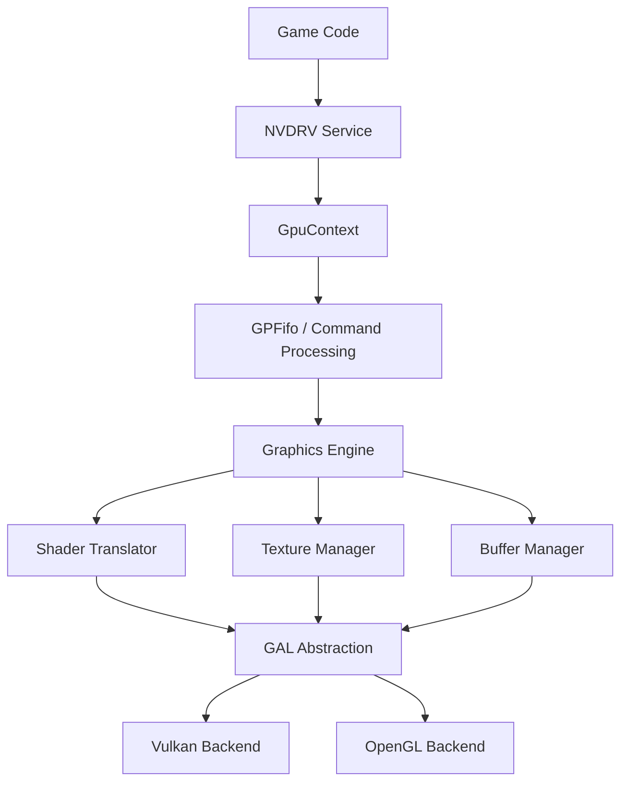

## Overview

Ryujinx's graphics subsystem emulates the NVIDIA Tegra X1 GPU, translating Switch graphics commands to host APIs (Vulkan, OpenGL). The architecture is layered:



<Info>
**GAL (Graphics Abstraction Layer)** provides a unified API for multiple rendering backends
</Info>

## GPU Context

The central GPU emulation context from `src/Ryujinx.Graphics.Gpu/GpuContext.cs`:

```csharp
public sealed class GpuContext : IDisposable
{
    /// <summary>
    /// Host renderer (Vulkan/OpenGL backend)
    /// </summary>
    public IRenderer Renderer { get; }
    
    /// <summary>
    /// GPU General Purpose FIFO queue
    /// </summary>
    public GPFifoDevice GPFifo { get; }
    
    /// <summary>
    /// GPU synchronization manager
    /// </summary>
    public SynchronizationManager Synchronization { get; }
    
    /// <summary>
    /// Presentation window
    /// </summary>
    public Window Window { get; }
    
    /// <summary>
    /// Sequence number for resource versioning
    /// </summary>
    internal int SequenceNumber { get; private set; }
    
    /// <summary>
    /// Registry of physical memories by process ID
    /// </summary>
    internal ConcurrentDictionary<ulong, PhysicalMemory> PhysicalMemoryRegistry { get; }
    
    /// <summary>
    /// Actions to execute on GPU sync points
    /// </summary>
    internal List<ISyncActionHandler> SyncActions { get; }
    internal List<ISyncActionHandler> SyncpointActions { get; }
    
    public GpuContext(IRenderer renderer, DirtyHacks hacks)
    {
        Renderer = renderer;
        GPFifo = new GPFifoDevice(this);
        Synchronization = new SynchronizationManager();
        Window = new Window(this);
        
        PhysicalMemoryRegistry = new ConcurrentDictionary<ulong, PhysicalMemory>();
        SyncActions = [];
        SyncpointActions = [];
    }
}
```

**Key responsibilities:**
- Command buffer submission and processing
- Memory management (texture, buffer, shader storage)
- Synchronization with CPU
- Multi-process GPU sharing

## Command Processing

### GPFifo (General Purpose FIFO)

The command submission interface:

```csharp
public class GPFifoDevice
{
    private readonly GpuContext _context;
    private readonly GPFifoProcessor _processor;
    
    // Command buffer submission
    public void Submit(ReadOnlySpan<ulong> entries)
    {
        foreach (ulong entry in entries)
        {
            ulong gpuVa = entry & 0xFFFFFFFFFF;
            int size = (int)((entry >> 40) & 0x1FFFFF);
            
            ProcessCommands(gpuVa, size);
        }
    }
    
    private void ProcessCommands(ulong gpuVa, int size)
    {
        // Read commands from GPU virtual address
        ReadOnlySpan<int> commands = _context.MemoryManager.Read<int>(gpuVa, size);
        
        // Process command buffer
        _processor.Process(commands);
    }
}
```

### Command Buffer Format

Switch uses pushbuffer-style command submission:

```csharp
// Command format: [Method | Argument]
// Method: bits 0-12 (8192 methods)
// SubChannel: bits 13-15 (8 subchannels)
// ArgumentCount: bits 16-28
// Type: bits 29-31

public void ProcessMethod(int method, int argument, int subChannel)
{
    switch (subChannel)
    {
        case 0: // 2D Engine
            _engine2d.ProcessMethod(method, argument);
            break;
        case 1: // 3D Engine  
            _engine3d.ProcessMethod(method, argument);
            break;
        case 2: // Compute
            _engineCompute.ProcessMethod(method, argument);
            break;
        case 3: // Inline-to-Memory
            _inlineToMemory.ProcessMethod(method, argument);
            break;
        case 4: // DMA Copy
            _dma.ProcessMethod(method, argument);
            break;
    }
}
```

<Tabs>
<Tab title="2D Engine">
Handles 2D blits and surface operations:
```csharp
- Surface copies
- Format conversions
- Rectangular fills
- Block linear <-> linear conversions
```
</Tab>

<Tab title="3D Engine">
Main rendering pipeline:
```csharp
- Vertex/fragment/geometry shaders
- Rasterization state
- Framebuffer configuration
- Texture sampling
- Draw calls
```
</Tab>

<Tab title="Compute Engine">
Compute shader dispatch:
```csharp
- Compute shader execution
- Shared memory configuration
- Grid/block dimensions
```
</Tab>

<Tab title="DMA Engine">
Asynchronous memory copies:
```csharp
- GPU <-> GPU copies
- Linear <-> block linear
- Pitch linear transfers
```
</Tab>
</Tabs>

## Graphics Engine (3D)

The main rendering engine processes graphics state and draw commands:

```csharp
public class ThreedClass : IDeviceState
{
    private readonly GpuContext _context;
    private readonly GpuChannel _channel;
    private readonly DeviceStateWithShadow<ThreedClassState> _state;
    
    // State management
    public void SetRenderTargets(int count, RenderTarget[] targets) { /* ... */ }
    public void SetViewports(ReadOnlySpan<Viewport> viewports) { /* ... */ }
    public void SetScissors(ReadOnlySpan<Rectangle<int>> scissors) { /* ... */ }
    public void SetVertexBuffers(ReadOnlySpan<VertexBufferState> buffers) { /* ... */ }
    
    // Shader binding
    public void SetShaderStage(ShaderStage stage, ulong gpuVa, bool enable) { /* ... */ }
    
    // Draw commands
    public void Draw(int vertexCount, int instanceCount, int firstVertex, 
                     int firstInstance) { /* ... */ }
    public void DrawIndexed(int indexCount, int instanceCount, int firstIndex,
                           int baseVertex, int firstInstance) { /* ... */ }
}
```

### Render State Management

Graphics state is cached and synchronized:

```csharp
public class DeviceStateWithShadow<T> where T : unmanaged
{
    private T _hostState;      // Current host state
    private T _shadowState;    // Last written state
    
    public void Update()
    {
        // Compare shadow vs host state
        // Only update changed fields
        if (!MemoryEquals(_hostState, _shadowState))
        {
            UpdateDirtyFields();
            _shadowState = _hostState;
        }
    }
}
```

**State groups:**
- **Rasterizer**: Primitive topology, polygon mode, cull mode, front face
- **Depth/Stencil**: Depth test, stencil test, depth bounds
- **Blend**: Blend equations, blend factors, color mask
- **Viewport**: Viewport transforms, depth range
- **Scissor**: Scissor rectangles

## Shader Translation

Shaders are translated from Switch binary format to host GLSL/SPIR-V:

### Shader Cache

From `src/Ryujinx.Graphics.Gpu/Shader/ShaderCache.cs`:

```csharp
class ShaderCache : IDisposable
{
    private readonly GpuContext _context;
    private readonly ShaderDumper _dumper;
    
    // Cached programs
    private readonly Dictionary<ulong, CachedShaderProgram> _cpPrograms;  // Compute
    private readonly Dictionary<ShaderAddresses, CachedShaderProgram> _gpPrograms; // Graphics
    
    // Disk cache
    private readonly ComputeShaderCacheHashTable _computeShaderCache;
    private readonly ShaderCacheHashTable _graphicsShaderCache;
    private readonly DiskCacheHostStorage _diskCacheHostStorage;
    
    public CachedShaderProgram GetGraphicsShader(ShaderAddresses addresses)
    {
        if (_gpPrograms.TryGetValue(addresses, out var program))
        {
            return program;
        }
        
        // Not cached - translate from binary
        program = TranslateGraphicsShader(addresses);
        _gpPrograms[addresses] = program;
        
        return program;
    }
}
```

### Translation Pipeline

<Steps>
<Step title="Binary Decode">
Decode Maxwell/Pascal GPU binary instructions:
```csharp
// Read shader code from GPU memory
ReadOnlySpan<byte> code = memoryManager.GetSpan(gpuVa, maxSize);

// Decode instruction stream
ShaderDecoder decoder = new ShaderDecoder(code);
List<Block> blocks = decoder.Decode();
```
</Step>

<Step title="Control Flow Analysis">
Build control flow graph:
```csharp
// Identify basic blocks
// Resolve branch targets
// Build dominator tree
ControlFlowGraph cfg = ControlFlowAnalysis.Build(blocks);
```
</Step>

<Step title="Translation to IR">
Convert to intermediate representation:
```csharp
// Lift GPU instructions to IR
// Track register/attribute usage
// Handle texture operations
// Process special functions
```
</Step>

<Step title="Optimization">
Optimize shader IR:
```csharp
// Dead code elimination
// Constant propagation
// Algebraic simplification
// Resource optimization
```
</Step>

<Step title="Code Generation">
Generate target shader language:
```csharp
if (backend == Backend.Vulkan)
{
    // Generate SPIR-V
    byte[] spirv = CodeGen.Spirv.Generate(program);
    return renderer.CompileShader(spirv);
}
else
{
    // Generate GLSL
    string glsl = CodeGen.Glsl.Generate(program);
    return renderer.CompileShader(glsl);
}
```
</Step>
</Steps>

### Guest-to-Host Feature Mapping

<Tabs>
<Tab title="Texture Operations">
```csharp
// Switch texture instructions -> Host equivalents
TEX   -> texture()        // Basic sampling
TEXS  -> textureGather()  // Gather operation  
TLD   -> texelFetch()     // Load without filtering
TLD4  -> textureGather()  // 4-component gather
TLDS  -> textureLod()     // Sample with LOD
TXQ   -> textureSize()    // Query texture size
```
</Tab>

<Tab title="Compute Features">
```csharp
// Compute shader features
Shared Memory     -> shared variables
Barriers          -> barrier()
Atomic Operations -> atomicAdd/atomicMin/etc
Image Load/Store  -> imageLoad/imageStore
```
</Tab>

<Tab title="Vertex Attributes">
```csharp
// Vertex input mapping
Attribute 0-15    -> in vec4 attr0..attr15
Built-ins:
  VertexId        -> gl_VertexID
  InstanceId      -> gl_InstanceID
  Position        -> gl_Position (output)
```
</Tab>
</Tabs>

### Shader Specialization

Shaders are specialized based on render state:

```csharp
public struct ShaderSpecializationState
{
    // Transform feedback
    public bool TransformFeedbackEnabled;
    public uint TransformFeedbackBufferMask;
    
    // Graphics state
    public bool AlphaTestEnabled;
    public CompareOp AlphaTestFunc;
    public float AlphaTestRef;
    
    // Texture state
    public bool TextureSrgb[32];
    public SamplerType TextureType[32];
    
    // Compute hash for cache lookup
    public Hash128 GetHash() { /* ... */ }
}
```

<Info>
Specialization allows aggressive optimization by baking constants into shader code
</Info>

## Texture Management

### Texture Pool

Textures are managed in pools:

```csharp
public class TexturePool
{
    private readonly GpuContext _context;
    private readonly GpuChannel _channel;
    
    private readonly Texture[] _textures;
    private readonly ulong _address;
    private readonly int _maximumId;
    
    public Texture Get(int id)
    {
        if (_textures[id] == null)
        {
            // Load texture descriptor from GPU memory
            TextureDescriptor descriptor = ReadDescriptor(id);
            
            // Create or find existing texture
            _textures[id] = _context.Methods.TextureManager.FindOrCreate(descriptor);
        }
        
        return _textures[id];
    }
}
```

### Texture Descriptor

Switch uses descriptors to define texture properties:

```csharp
public struct TextureDescriptor
{
    public ulong Address;           // GPU virtual address
    public Format Format;           // Pixel format
    public TextureTarget Target;    // 1D/2D/3D/Cube/Array
    public int Width;
    public int Height;
    public int Depth;
    public int Levels;              // Mipmap levels
    public int Layers;              // Array layers
    public SwizzleComponent[] Swizzle; // Channel swizzle
    public bool IsSrgb;
    public TileMode TileMode;       // Linear/block-linear
}
```

### Texture Formats

Ryujinx supports extensive format conversions:

<Tabs>
<Tab title="Color Formats">
```csharp
R8G8B8A8_UNORM
R8G8B8A8_SRGB
R16G16B16A16_FLOAT
B5G6R5_UNORM
BC1_UNORM (DXT1)
BC2_UNORM (DXT3)  
BC3_UNORM (DXT5)
BC4_UNORM
BC5_UNORM
BC6H_SFLOAT
BC7_UNORM
ASTC_4x4_UNORM
ASTC_8x8_SRGB
```
</Tab>

<Tab title="Depth Formats">
```csharp
D16_UNORM
D24_UNORM_S8_UINT
D32_FLOAT
D32_FLOAT_S8_UINT
S8_UINT
```
</Tab>

<Tab title="Special Formats">
```csharp
R11G11B10_FLOAT
R10G10B10A2_UNORM
E5B9G9R9_FLOAT (Shared exponent)
```
</Tab>
</Tabs>

### Block Linear Swizzling

Switch uses block-linear texture layout for cache efficiency:

```csharp
public static class LayoutConverter
{
    // Convert block-linear to linear
    public static void ConvertBlockLinearToLinear(
        Span<byte> dst,
        ReadOnlySpan<byte> src,
        int width,
        int height,
        int depth,
        int levels,
        int layers,
        int blockWidth,
        int blockHeight,
        int bytesPerPixel,
        int gobBlocksInY,
        int gobBlocksInZ,
        int gobBlocksInTileX)
    {
        // Deswizzle using GOB (Group of Bytes) layout
        // GOB size: 64 bytes (16 pixels x 4 bytes)
        // Organized in 2D/3D blocks for cache locality
    }
}
```

**Block-linear benefits:**
- Improved texture cache hit rate
- Better memory access patterns
- Efficient mipmap storage

## Buffer Management

### Buffer Cache

```csharp
public class BufferManager
{
    private readonly Dictionary<ulong, Buffer> _buffers;
    private readonly RangeList<Buffer> _bufferOverlaps;
    
    public BufferRange GetBuffer(ulong address, ulong size, bool write)
    {
        // Check for existing overlapping buffers
        Buffer buffer = FindOverlap(address, size);
        
        if (buffer == null)
        {
            // Create new buffer
            buffer = CreateBuffer(address, size);
            _buffers[address] = buffer;
        }
        
        // Synchronize if written by GPU
        if (write && buffer.GpuModified)
        {
            buffer.SynchronizeMemory();
        }
        
        return new BufferRange(buffer, address - buffer.Address, size);
    }
}
```

### Buffer Types

<CardGroup cols={2}>
<Card title="Vertex Buffers" icon="cube">
```csharp
// Vertex attribute data
- Position, normal, texcoord
- Instanced attributes  
- Stride and offset
```
</Card>

<Card title="Index Buffers" icon="list-ol">
```csharp
// Triangle indices
- U8/U16/U32 formats
- Primitive restart
```
</Card>

<Card title="Uniform Buffers" icon="sliders">
```csharp
// Shader constants
- Per-draw parameters
- Material properties
- Transform matrices
```
</Card>

<Card title="Storage Buffers" icon="database">
```csharp
// Read-write access
- Compute shader data
- Large structured buffers
```
</Card>
</CardGroup>

## Synchronization

### GPU-CPU Sync

Handling synchronization between CPU and GPU:

```csharp
public class SynchronizationManager
{
    // CPU waits for GPU
    public void WaitForFence(ulong fenceValue)
    {
        // Block CPU thread until GPU reaches fence point
        while (GetCompletedValue() < fenceValue)
        {
            Thread.Yield();
        }
    }
    
    // GPU signals fence
    public void SignalFence(ulong fenceValue)
    {
        // Queue fence signal in command stream
        _renderer.SetFence(fenceValue);
    }
    
    // Query completed work
    public ulong GetCompletedValue()
    {
        return _renderer.GetCompletedFenceValue();
    }
}
```

### Sync Actions

Actions triggered at synchronization points:

```csharp
public interface ISyncActionHandler
{
    void SyncPreActions(bool syncpoint);
    void SyncPostAction();
}

// Example: Buffer flush on sync
public class BufferSyncAction : ISyncActionHandler
{
    private readonly Buffer _buffer;
    
    public void SyncPreActions(bool syncpoint)
    {
        // Flush buffer to host before sync
        _buffer.Flush();
    }
    
    public void SyncPostAction()
    {
        // Update after GPU completion
        _buffer.InvalidateRange();
    }
}
```

## Graphics Abstraction Layer (GAL)

Unified interface for rendering backends:

```csharp
public interface IRenderer : IDisposable
{
    // Pipeline creation
    IProgram CreateProgram(ShaderSource[] shaders, ShaderInfo info);
    IBuffer CreateBuffer(int size, BufferAccess access);
    ITexture CreateTexture(TextureCreateInfo info);
    ISampler CreateSampler(SamplerCreateInfo info);
    
    // State management  
    void SetRenderTargets(ITexture[] colors, ITexture depthStencil);
    void SetViewports(ReadOnlySpan<Viewport> viewports);
    void SetPipeline(IPipeline pipeline);
    
    // Drawing
    void Draw(int vertexCount, int instanceCount, int firstVertex, int firstInstance);
    void DrawIndexed(int indexCount, int instanceCount, int firstIndex, 
                     int baseVertex, int firstInstance);
    
    // Compute
    void DispatchCompute(int groupsX, int groupsY, int groupsZ);
    
    // Synchronization
    void SetFence(ulong value);
    ulong GetCompletedFenceValue();
    
    // Present
    void Present(ITexture texture);
}
```

### Backend Implementations

<Tabs>
<Tab title="Vulkan">
**Advantages:**
- Lower CPU overhead
- Better multi-threading
- Advanced features (descriptor indexing, dynamic rendering)
- Preferred on Windows/Linux

**Key features:**
```csharp
- Pipeline state objects
- Command buffer recording
- Memory management (VMA)
- Synchronization primitives
```
</Tab>

<Tab title="OpenGL">
**Advantages:**
- Wider compatibility
- Simpler debugging
- Fallback for older hardware

**Key features:**
```csharp
- Direct state access (DSA)
- Persistent mapped buffers
- Compute shaders
- Compatibility context support
```
</Tab>
</Tabs>

## Presentation & Display

Window management and frame presentation:

```csharp
public class Window
{
    private readonly GpuContext _context;
    private ITexture[] _presentableTextures;
    
    public void Present(ITexture texture, ImageCrop crop, Action swapBuffersCallback)
    {
        // Apply any post-processing
        ITexture output = ApplyPostProcessing(texture);
        
        // Present to window
        _context.Renderer.Present(output, crop);
        
        // Swap buffers
        swapBuffersCallback?.Invoke();
    }
    
    public void SetSize(int width, int height, bool resizable)
    {
        // Resize render targets
        RecreateSwapchain(width, height);
    }
}
```

## Performance Optimizations

<AccordionGroup>
<Accordion title="Shader Caching" icon="floppy-disk">
- Disk cache for compiled shaders
- Reduces stuttering on repeated execution
- Per-game cache with version tracking
</Accordion>

<Accordion title="Buffer Coalescing" icon="layer-group">
- Merge small buffers into larger allocations
- Reduces bind overhead
- Improves memory locality
</Accordion>

<Accordion title="Lazy State Updates" icon="clock">
- Only update changed state
- Batch state changes
- Shadow state comparison
</Accordion>

<Accordion title="Async Compilation" icon="arrows-spin">
- Compile shaders on background threads
- Display loading indicator
- Minimal impact on frame time
</Accordion>
</AccordionGroup>

## Debugging Tools

<CardGroup cols={2}>
<Card title="Shader Dumps" icon="file-code">
Export guest and translated shaders:
```csharp
// Enable via configuration
shaderDumpPath = "./shader_dumps/"
```
</Card>

<Card title="Frame Capture" icon="camera">
RenderDoc integration:
- Capture frame commands
- Inspect state
- Debug shaders
</Card>

<Card title="Command Logging" icon="list">
Log GPU commands:
```csharp
LogLevel = LogLevel.Trace
```
Outputs method calls and arguments
</Card>

<Card title="Resource Tracking" icon="chart-line">
Monitor GPU memory:
- Texture usage
- Buffer allocations  
- Cache statistics
</Card>
</CardGroup>

## Related Topics

<CardGroup cols={2}>
<Card title="HLE Services" icon="server" href="/architecture/hle">
NVDRV service and ioctl interface
</Card>

<Card title="Memory Management" icon="memory" href="/architecture/memory-management">
GPU memory mapping and MMU
</Card>

<Card title="Performance Tuning" icon="gauge-high" href="/guides/configuration/performance">
Graphics optimization settings
</Card>

<Card title="Troubleshooting" icon="wrench" href="/guides/troubleshooting">
Resolving graphics issues
</Card>
</CardGroup>

## Source Code Reference

- `src/Ryujinx.Graphics.Gpu/GpuContext.cs:19` - GPU context
- `src/Ryujinx.Graphics.Gpu/Engine/GPFifo/GPFifoDevice.cs` - Command processor
- `src/Ryujinx.Graphics.Gpu/Engine/Threed/` - 3D engine
- `src/Ryujinx.Graphics.Gpu/Shader/ShaderCache.cs:22` - Shader cache
- `src/Ryujinx.Graphics.GAL/` - Graphics abstraction layer
- `src/Ryujinx.Graphics.Vulkan/` - Vulkan backend
- `src/Ryujinx.Graphics.OpenGL/` - OpenGL backend
