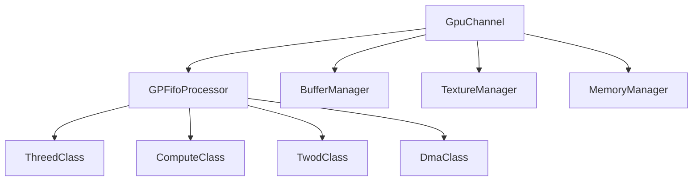
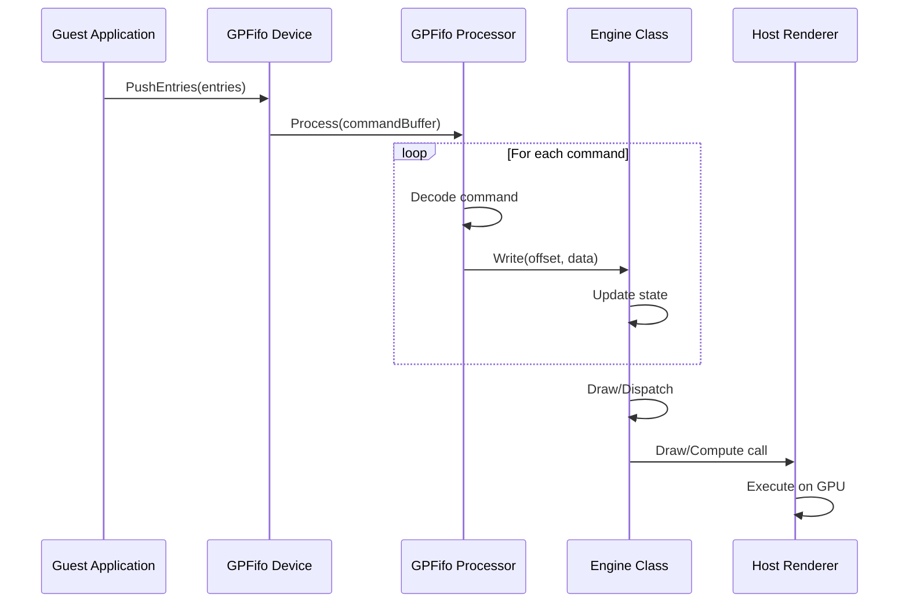

## Overview

Ryujinx emulates the NVIDIA Tegra X1's Maxwell GPU architecture, providing a complete software implementation of the graphics processing unit used in the Nintendo Switch. The GPU emulation layer sits between the guest application and the host graphics API (OpenGL or Vulkan).

<CardGroup cols={2}>
  <Card title="GpuContext" icon="server" href="#gpucontext">
    Central GPU emulation context managing all GPU resources and state
  </Card>
  <Card title="GpuChannel" icon="layer-group" href="#gpuchannel">
    Individual GPU command submission channels with isolated state
  </Card>
  <Card title="GPFifo" icon="list" href="#gpfifo-command-processing">
    General Purpose FIFO for command buffer submission and processing
  </Card>
  <Card title="Engine Classes" icon="cog" href="#engine-classes">
    Specialized engines for 3D, 2D, compute, and DMA operations
  </Card>
</CardGroup>

## GpuContext

The `GpuContext` class is the central hub of GPU emulation, coordinating all GPU operations and managing shared resources.

### Architecture

```csharp
namespace Ryujinx.Graphics.Gpu
{
    public sealed class GpuContext : IDisposable
    {
        public IRenderer Renderer { get; }           // Host renderer (OpenGL/Vulkan)
        public GPFifoDevice GPFifo { get; }          // Command submission device
        public SynchronizationManager Synchronization { get; }
        public Window Window { get; }                // Presentation window
        
        internal int SequenceNumber { get; private set; }
        internal ulong SyncNumber { get; private set; }
    }
}
```

<Note>
The GPU context uses a **Maxwell timer frequency** of 614.4 MHz (384/625 of nanoseconds) to accurately emulate GPU timing behavior.
</Note>

### Key Responsibilities

<AccordionGroup>
  <Accordion title="Memory Management" icon="memory">
    - Manages physical memory registries per process (keyed by process ID)
    - Supports multiple `PhysicalMemory` instances for multi-process emulation
    - Handles CPU virtual memory tracking and GPU memory mapping
    - Provides `MemoryManager` creation for GPU virtual address spaces
    
    ```csharp
    // Register a process's memory for GPU access
    public void RegisterProcess(ulong pid, IVirtualMemoryManagerTracked cpuMemory)
    {
        PhysicalMemory physicalMemory = new(this, cpuMemory);
        PhysicalMemoryRegistry.TryAdd(pid, physicalMemory);
    }
    ```
  </Accordion>

  <Accordion title="Channel Management" icon="layer-group">
    - Creates and manages `GpuChannel` instances
    - Each channel represents an independent command submission context
    - Channels can be bound to different memory managers
    
    ```csharp
    public GpuChannel CreateChannel()
    {
        return new GpuChannel(this);
    }
    ```
  </Accordion>

  <Accordion title="Synchronization" icon="clock">
    - Tracks sequence numbers for resource modification ordering
    - Manages sync actions triggered by CPU-GPU synchronization points
    - Handles buffer migrations between memory regions
    - Creates host sync objects for GPU-CPU coordination
    
    ```csharp
    internal void CreateHostSyncIfNeeded(HostSyncFlags flags)
    {
        // Creates fence/sync primitives when:
        // - Buffer migrations are pending
        // - Sync actions are registered
        // - Syncpoint increments occur
        Renderer.CreateSync(SyncNumber, strict: flags.HasFlag(HostSyncFlags.Strict));
        SyncNumber++;
    }
    ```
  </Accordion>

  <Accordion title="Shader Cache" icon="code">
    - Coordinates shader cache initialization across all processes
    - Propagates shader cache state changes to the host application
    - Manages disk cache for persistent shader storage
    
    ```csharp
    public void InitializeShaderCache(CancellationToken cancellationToken)
    {
        HostInitalized.WaitOne();
        foreach (PhysicalMemory physicalMemory in PhysicalMemoryRegistry.Values)
        {
            physicalMemory.ShaderCache.Initialize(cancellationToken);
        }
    }
    ```
  </Accordion>
</AccordionGroup>

### GPU Timer

The emulated GPU provides accurate timing using Maxwell's timer frequency:

```csharp
// Convert nanoseconds to Maxwell GPU ticks (614.4 MHz)
private static ulong ConvertNanosecondsToTicks(ulong nanoseconds)
{
    const int NsToTicksFractionNumerator = 384;
    const int NsToTicksFractionDenominator = 625;
    
    ulong divided = nanoseconds / NsToTicksFractionDenominator;
    ulong rounded = divided * NsToTicksFractionDenominator;
    ulong errorBias = (nanoseconds - rounded) * NsToTicksFractionNumerator / NsToTicksFractionDenominator;
    
    return divided * NsToTicksFractionNumerator + errorBias;
}
```

<Info>
The `FastGpuTime` configuration option can divide the reported time by 256 to prevent games from reducing resolution due to perceived slow performance.
</Info>

## GpuChannel

Each `GpuChannel` represents an independent command submission context with its own state and resource bindings.

### Channel Architecture



### Components

<CodeGroup>
```csharp src/Ryujinx.Graphics.Gpu/GpuChannel.cs
public class GpuChannel : IDisposable
{
    internal BufferManager BufferManager { get; }     // Buffer resource management
    internal TextureManager TextureManager { get; }   // Texture resource management
    internal MemoryManager MemoryManager { get; }     // GPU virtual memory
    
    // Bind a memory manager to this channel
    public void BindMemory(MemoryManager memoryManager)
    {
        memoryManager.Physical.BufferCache.NotifyBuffersModified += BufferManager.Rebind;
        memoryManager.MemoryUnmapped += MemoryUnmappedHandler;
        TextureManager.ReloadPools();
    }
}
```

```csharp Command Submission
// Push GPFIFO entries (command buffers)
public void PushEntries(ReadOnlySpan<ulong> entries)
{
    _device.PushEntries(_processor, entries);
}

// Write directly to engine state
public void Write(ClassId classId, int offset, uint value)
{
    _processor.Write(classId, offset, (int)value);
}
```
</CodeGroup>

<Warning>
When a channel's memory manager changes, all texture pools must be reloaded and buffer caches must be pruned to avoid stale references.
</Warning>

## GPFifo Command Processing

The **General Purpose FIFO** (GPFifo) is the primary mechanism for submitting commands to the GPU. It processes command buffers containing method calls to various engine classes.

### Command Buffer Format

Commands use a compressed format with multiple encoding schemes:

```csharp
struct CompressedMethod
{
    int MethodAddress;        // Target method offset
    int MethodSubchannel;     // Engine subchannel (0-4)
    int MethodCount;          // Number of arguments
    SecOp SecOp;             // Encoding type
    int ImmdData;            // Immediate data (for ImmdDataMethod)
}

enum SecOp
{
    IncMethod,       // Increment method address after each argument
    NonIncMethod,    // Keep method address constant (array data)
    OneInc,          // Increment once then keep constant
    ImmdDataMethod   // Single method call with immediate data
}
```

### Processing Pipeline

<Steps>
  <Step title="Command Decode">
    Commands are decoded from the GPFIFO stream, extracting method address, subchannel, and arguments.
    
    ```csharp
    public void Process(ulong baseGpuVa, ReadOnlySpan<int> commandBuffer)
    {
        for (int index = 0; index < commandBuffer.Length; index++)
        {
            int command = commandBuffer[index];
            
            if (_state.MethodCount != 0)
            {
                // Process method argument
                Send(gpuVa, _state.Method, command, _state.SubChannel, isLastCall);
            }
            else
            {
                // Decode new method header
                CompressedMethod meth = Unsafe.As<int, CompressedMethod>(ref command);
                // ...
            }
        }
    }
    ```
  </Step>

  <Step title="Fast Path Optimization">
    Common operations are optimized with fast paths:
    - **Inline-to-Memory uploads**: Batch copy data directly to GPU memory
    - **Uniform buffer updates**: Bulk constant buffer data transfers
    
    ```csharp
    private bool TryFastUniformBufferUpdate(CompressedMethod meth, ReadOnlySpan<int> commandBuffer)
    {
        if (meth.MethodAddress == UniformBufferUpdateDataMethodOffset &&
            meth.SecOp == SecOp.NonIncMethod)
        {
            _3dClass.ConstantBufferUpdate(commandBuffer.Slice(offset + 1, meth.MethodCount));
            return true;
        }
        return false;
    }
    ```
  </Step>

  <Step title="Engine Dispatch">
    Methods are routed to the appropriate engine class based on subchannel:
    - **Subchannel 0**: 3D Engine (ThreedClass)
    - **Subchannel 1**: Compute Engine (ComputeClass)
    - **Subchannel 2**: Inline-to-Memory (I2M)
    - **Subchannel 3**: 2D Engine (TwodClass)
    - **Subchannel 4**: DMA Engine (DmaClass)
  </Step>

  <Step title="Macro Execution">
    Methods in the range 0xE00+ trigger **Macro Method Expansion (MME)** execution:
    
    ```csharp
    if (offset >= 0xe00)
    {
        int macroIndex = (offset >> 1) & MacroIndexMask;
        
        if ((offset & 1) != 0)
            _fifoClass.MmePushArgument(macroIndex, gpuVa, argument);
        else
            _fifoClass.MmeStart(macroIndex, argument);
            
        if (isLastCall)
            _fifoClass.CallMme(macroIndex, state);
    }
    ```
  </Step>
</Steps>

## Engine Classes

Ryujinx implements multiple GPU engine classes that handle different types of operations.

### ThreedClass (3D Engine)

The primary graphics engine handling 3D rendering operations.

<Tabs>
  <Tab title="Overview">
    Located in `src/Ryujinx.Graphics.Gpu/Engine/Threed/`, the 3D engine manages:
    - Vertex and index buffer bindings
    - Render target configuration
    - Pipeline state (blend, depth, stencil, rasterizer)
    - Shader program binding
    - Draw calls (arrays, indexed, instanced, indirect)
    - Transform feedback
    - Conditional rendering
    
    ```csharp
    class ThreedClass : IDeviceState
    {
        private readonly DrawManager _drawManager;
        private readonly StateUpdater _stateUpdater;
        private readonly ConstantBufferUpdater _cbUpdater;
        private readonly SemaphoreUpdater _semaphoreUpdater;
    }
    ```
  </Tab>

  <Tab title="State Management">
    State is tracked in `ThreedClassState` with shadow RAM support:
    
    ```csharp
    public void Write(int offset, int data)
    {
        _state.WriteWithRedundancyCheck(offset, data, out bool valueChanged);
        
        if (valueChanged)
        {
            _stateUpdater.SetDirty(offset);
        }
    }
    ```
    
    Only changed state is propagated to the host API, minimizing overhead.
  </Tab>

  <Tab title="Draw Operations">
    The `DrawManager` coordinates all rendering operations:
    - Validates state before draws
    - Updates vertex/index buffers
    - Manages draw call batching
    - Handles deferred draws for optimization
    
    Key draw methods:
    - `DrawVertexArrayBeginEndInstanceFirst/Subsequent`
    - `DrawIndexBuffer{8,16,32}BeginEndInstance{First,Subsequent}`
    - `DrawEnd` - Finalizes the current draw operation
  </Tab>
</Tabs>

### ComputeClass

Handles compute shader dispatch operations:

```csharp
class ComputeClass
{
    // Dispatch compute work groups
    private void Dispatch()
    {
        // Update compute state
        UpdateShaderState();
        UpdateStorageBuffers();
        UpdateTextures();
        
        // Execute dispatch
        _context.Renderer.Pipeline.DispatchCompute(
            groupsX: state.DispatchParamsX,
            groupsY: state.DispatchParamsY,
            groupsZ: state.DispatchParamsZ
        );
    }
}
```

### DmaClass

Performs memory-to-memory copy operations:
- Linear-to-linear copies
- Tiled-to-linear and linear-to-tiled conversions
- Pitch linear memory layout handling

### TwodClass

2D blit and fill operations for surfaces:
- Surface copies with format conversion
- Texture blitting
- Solid color fills

## Memory Management

The GPU memory subsystem provides virtual addressing and resource tracking.

### MemoryManager

```csharp
class MemoryManager
{
    private PhysicalMemory _physical;  // Backing physical memory
    
    // Translate GPU virtual address to physical
    public bool TryGetPhysicalAddress(ulong gpuVa, out ulong physicalAddress)
    {
        // Page table walk
        // Returns physical address or throws on invalid mapping
    }
    
    // Read/write methods for various data types
    public T Read<T>(ulong gpuVa) where T : unmanaged;
    public void Write<T>(ulong gpuVa, T value) where T : unmanaged;
}
```

### Buffer Cache

The `BufferCache` (in `PhysicalMemory`) tracks all buffer objects:
- Handles overlapping buffer ranges
- Manages CPU modification tracking
- Performs buffer migrations when needed
- Implements copy-on-write semantics

```csharp
class BufferCache
{
    // Get or create buffer for GPU access
    public MultiRangeBuffer GetBuffer(MultiRange range, bool write)
    {
        // Check cache for existing buffer
        // Create new buffer if needed
        // Track modifications for synchronization
    }
}
```

## Command Buffer Flow



## Performance Optimizations

<CardGroup cols={2}>
  <Card title="State Redundancy Check" icon="filter">
    Only propagate state changes to host API using shadow RAM comparison
  </Card>
  <Card title="Fast Path Uploads" icon="rocket">
    Batch inline-to-memory and uniform buffer updates
  </Card>
  <Card title="Deferred Actions" icon="clock">
    Queue resource operations to run on the render thread
  </Card>
  <Card title="Sequence Numbers" icon="hashtag">
    Track resource modifications efficiently for cache coherency
  </Card>
</CardGroup>

## References

<CardGroup cols={2}>
  <Card title="Source Files" icon="folder-tree">
    - `src/Ryujinx.Graphics.Gpu/GpuContext.cs`
    - `src/Ryujinx.Graphics.Gpu/GpuChannel.cs`
    - `src/Ryujinx.Graphics.Gpu/Engine/GPFifo/GPFifoProcessor.cs`
    - `src/Ryujinx.Graphics.Gpu/Engine/Threed/ThreedClass.cs`
  </Card>
  <Card title="Related Topics" icon="link">
    - [Graphics Abstraction Layer](/architecture/graphics/gpu-emulation)
    - [Shader Translation](/architecture/graphics/shader-translation)
    - [OpenGL Backend](/architecture/graphics/opengl-backend)
  </Card>
</CardGroup>
