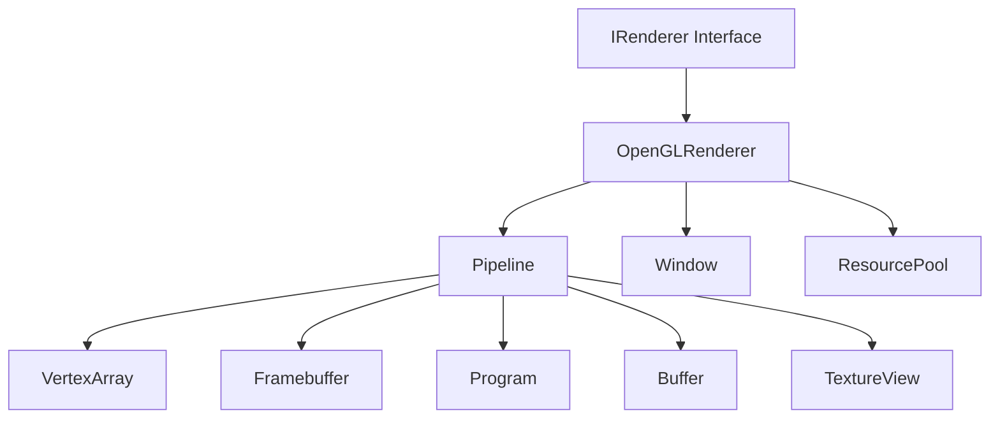

## Overview

The OpenGL backend implements the Graphics Abstraction Layer (GAL) using OpenGL 4.5 Core Profile and modern extensions. It translates high-level graphics commands from the GPU emulation layer into OpenGL API calls.

<Info>
Ryujinx requires **OpenGL 4.5** or higher with support for critical extensions like `ARB_direct_state_access` and `ARB_shader_storage_buffer_object`.
</Info>

## Architecture



## OpenGLRenderer

The main renderer implementation that initializes and manages the OpenGL context.

### Initialization

```csharp
public class OpenGLRenderer : IRenderer
{
    public void Initialize(GraphicsDebugLevel logLevel)
    {
        // Query hardware capabilities
        HwCapabilities = HwCapabilities.Create(_context);
        
        // Set up debug output
        if (logLevel != GraphicsDebugLevel.None)
        {
            GL.Enable(EnableCap.DebugOutput);
            GL.DebugMessageCallback(_debugCallback, IntPtr.Zero);
        }
        
        // Configure global state
        GL.Enable(EnableCap.FramebufferSrgb);
        GL.Enable(EnableCap.TextureCubeMapSeamless);
        
        // Initialize resource pools
        _resourcePool = new ResourcePool();
    }
}
```

### Hardware Capabilities

The renderer queries OpenGL implementation limits and available extensions:

<AccordionGroup>
  <Accordion title="Core Capabilities" icon="microchip">
    ```csharp
    class HwCapabilities
    {
        public int MaxTextureSize { get; set; }
        public int MaxTextureBufferSize { get; set; }
        public int MaxImageUnits { get; set; }
        public int MaxUniformBlockSize { get; set; }
        public int MaxStorageBufferSize { get; set; }
        public int MaxViewports { get; set; }
        public int MaxTextureAnisotropy { get; set; }
        
        public bool SupportsAstcCompression { get; set; }
        public bool SupportsImageLoadFormatted { get; set; }
        public bool SupportsIndirectParameters { get; set; }
        public bool SupportsFragmentShaderInterlock { get; set; }
        public bool SupportsFragmentShaderOrdering { get; set; }
        public bool SupportsGeometryShaderPassthrough { get; set; }
        public bool SupportsViewportSwizzle { get; set; }
    }
    ```
  </Accordion>

  <Accordion title="Vendor-Specific Workarounds" icon="wrench">
    The renderer detects GPU vendor and applies necessary workarounds:
    
    ```csharp
    string vendor = GL.GetString(StringName.Vendor);
    string renderer = GL.GetString(StringName.Renderer);
    
    if (vendor.Contains("NVIDIA"))
    {
        // NVIDIA-specific optimizations
        _isNvidia = true;
    }
    else if (vendor.Contains("AMD") || vendor.Contains("ATI"))
    {
        // AMD workarounds for driver bugs
        _isAmd = true;
        _maxSubgroupSize = 64; // AMD wavefront size
    }
    else if (vendor.Contains("Intel"))
    {
        // Intel driver-specific handling
        _isIntel = true;
    }
    ```
  </Accordion>
</AccordionGroup>

## Pipeline State Management

The `Pipeline` class implements `IPipeline` and manages all rendering state and resource bindings.

### State Tracking

```csharp
class Pipeline : IPipeline
{
    private Program _program;                  // Active shader program
    private VertexArray _vertexArray;         // Vertex buffer bindings
    private Framebuffer _framebuffer;         // Render target configuration
    
    private PrimitiveType _primitiveType;     // Draw topology
    private DrawElementsType _elementsType;   // Index buffer format
    
    private bool _rasterizerDiscard;          // Rasterizer enable/disable
    private bool _depthTestEnable;
    private bool _stencilTestEnable;
    private bool _cullEnable;
    
    private float[] _viewportArray;           // Viewport rectangles
    private double[] _depthRangeArray;        // Depth range per viewport
    
    private uint _scissorEnables;             // Per-viewport scissor enable bits
    private uint _fragmentOutputMap;          // Fragment shader output mapping
    
    private FrontFaceDirection _frontFace;    // Front face winding order
    private ClipOrigin _clipOrigin;           // NDC Z convention
}
```

### Drawing Operations

<Tabs>
  <Tab title="Non-Indexed Drawing">
    ```csharp
    public void Draw(int vertexCount, int instanceCount, int firstVertex, int firstInstance)
    {
        if (!_program.IsLinked)
            return;
            
        PreDraw();
        
        if (instanceCount > 1)
        {
            if (firstInstance != 0)
            {
                GL.DrawArraysInstancedBaseInstance(
                    _primitiveType,
                    firstVertex,
                    vertexCount,
                    instanceCount,
                    firstInstance
                );
            }
            else
            {
                GL.DrawArraysInstanced(_primitiveType, firstVertex, vertexCount, instanceCount);
            }
        }
        else
        {
            GL.DrawArrays(_primitiveType, firstVertex, vertexCount);
        }
        
        PostDraw();
    }
    ```
  </Tab>

  <Tab title="Indexed Drawing">
    ```csharp
    public void DrawIndexed(
        int indexCount,
        int instanceCount,
        int firstIndex,
        int firstVertex,
        int firstInstance)
    {
        PreDraw();
        
        nint indexOffset = _indexBaseOffset + firstIndex * GetIndexSize(_elementsType);
        
        if (firstInstance != 0 || firstVertex != 0)
        {
            GL.DrawElementsInstancedBaseVertexBaseInstance(
                _primitiveType,
                indexCount,
                _elementsType,
                indexOffset,
                instanceCount,
                firstVertex,
                firstInstance
            );
        }
        else if (instanceCount > 1)
        {
            GL.DrawElementsInstanced(_primitiveType, indexCount, _elementsType, indexOffset, instanceCount);
        }
        else
        {
            GL.DrawElements(_primitiveType, indexCount, _elementsType, indexOffset);
        }
        
        PostDraw();
    }
    ```
  </Tab>

  <Tab title="Indirect Drawing">
    ```csharp
    public void DrawIndirect(
        BufferRange indirectBuffer,
        int indirectBufferOffset,
        int indirectDrawCount)
    {
        PreDraw();
        
        int stride = (HasIndexBuffer ? 5 : 4) * sizeof(int);
        
        GL.BindBuffer(BufferTarget.DrawIndirectBuffer, indirectBuffer.Handle.ToInt32());
        
        if (indirectDrawCount > 1)
        {
            if (HasIndexBuffer)
            {
                GL.MultiDrawElementsIndirect(
                    _primitiveType,
                    _elementsType,
                    (IntPtr)indirectBufferOffset,
                    indirectDrawCount,
                    stride
                );
            }
            else
            {
                GL.MultiDrawArraysIndirect(
                    _primitiveType,
                    (IntPtr)indirectBufferOffset,
                    indirectDrawCount,
                    stride
                );
            }
        }
        else
        {
            // Single indirect draw
            if (HasIndexBuffer)
                GL.DrawElementsIndirect(_primitiveType, _elementsType, (IntPtr)indirectBufferOffset);
            else
                GL.DrawArraysIndirect(_primitiveType, (IntPtr)indirectBufferOffset);
        }
        
        PostDraw();
    }
    ```
  </Tab>
</Tabs>

### Pre/Post Draw Processing

```csharp
private void PreDraw()
{
    // Update dynamic state if needed
    UpdateVertexAttribs();
    UpdateBlendState();
    UpdateDepthState();
    UpdateStencilState();
    UpdateRasterizerState();
    UpdateScissorState();
    
    // Ensure framebuffer is bound
    if (_boundDrawFramebuffer != _framebuffer.Handle)
    {
        GL.BindFramebuffer(FramebufferTarget.DrawFramebuffer, _framebuffer.Handle);
        _boundDrawFramebuffer = _framebuffer.Handle;
    }
    
    // Track draw count for statistics
    DrawCount++;
}

private void PostDraw()
{
    // Clean up any temporary state
    // Handle pending synchronization
}
```

## Resource Management

### Buffer Objects

Buffers are managed using Direct State Access (DSA) for efficiency:

```csharp
class Buffer : IDisposable
{
    private int _handle;
    private int _size;
    
    public static Buffer Create(int size)
    {
        int handle = GL.CreateBuffer();
        GL.NamedBufferData(handle, size, IntPtr.Zero, BufferUsageHint.DynamicDraw);
        return new Buffer(handle, size);
    }
    
    public void SetData(int offset, ReadOnlySpan<byte> data)
    {
        unsafe
        {
            fixed (byte* ptr = data)
            {
                GL.NamedBufferSubData(_handle, (IntPtr)offset, data.Length, (IntPtr)ptr);
            }
        }
    }
    
    public PinnedSpan<byte> GetData(int offset, int size)
    {
        byte[] data = new byte[size];
        GL.GetNamedBufferSubData(_handle, (IntPtr)offset, size, data);
        return new PinnedSpan<byte>(data);
    }
}
```

<Warning>
**Persistent Mapping**: For frequently updated buffers, Ryujinx uses `GL_MAP_PERSISTENT_BIT` and `GL_MAP_COHERENT_BIT` flags to maintain mappings across draw calls, reducing driver overhead.
</Warning>

### Texture Management

Textures are created with immutable storage for optimal performance:

```csharp
class TextureView : ITexture
{
    public TextureView Create(TextureCreateInfo info)
    {
        int handle = GL.CreateTexture(info.Target.Convert());
        
        // Allocate immutable storage
        switch (info.Target)
        {
            case Target.Texture2D:
                GL.TextureStorage2D(
                    handle,
                    info.Levels,
                    (SizedInternalFormat)FormatTable.GetFormat(info.Format).PixelInternalFormat,
                    info.Width,
                    info.Height
                );
                break;
                
            case Target.Texture3D:
                GL.TextureStorage3D(
                    handle,
                    info.Levels,
                    (SizedInternalFormat)FormatTable.GetFormat(info.Format).PixelInternalFormat,
                    info.Width,
                    info.Height,
                    info.DepthOrLayers
                );
                break;
                
            // ... other texture targets
        }
        
        // Set swizzle if needed
        if (info.SwizzleR != SwizzleComponent.Red)
            GL.TextureParameter(handle, TextureParameterName.TextureSwizzleR, (int)info.SwizzleR.Convert());
        // ... other swizzle components
        
        return new TextureView(handle, info);
    }
}
```

### Format Conversion

The `FormatTable` maps GAL formats to OpenGL formats:

<CodeGroup>
```csharp Format Mapping
static class FormatTable
{
    public static FormatInfo GetFormat(Format format)
    {
        return format switch
        {
            Format.R8Unorm => new FormatInfo(
                PixelInternalFormat.R8,
                PixelFormat.Red,
                PixelType.UnsignedByte
            ),
            
            Format.R8G8B8A8Unorm => new FormatInfo(
                PixelInternalFormat.Rgba8,
                PixelFormat.Rgba,
                PixelType.UnsignedByte
            ),
            
            Format.B8G8R8A8Unorm => new FormatInfo(
                PixelInternalFormat.Rgba8,
                PixelFormat.Bgra,
                PixelType.UnsignedByte
            ),
            
            Format.D32FloatS8Uint => new FormatInfo(
                PixelInternalFormat.Depth32fStencil8,
                PixelFormat.DepthStencil,
                PixelType.Float32UnsignedInt248Rev
            ),
            
            // ... 100+ format mappings
        };
    }
}
```

```csharp Compressed Formats
// Compressed texture format handling
Format.BC1RgbaUnorm => new FormatInfo(
    PixelInternalFormat.CompressedRgbaS3tcDxt1Ext,
    PixelFormat.Rgba,
    PixelType.UnsignedByte,
    compressed: true
),

Format.BC7Unorm => new FormatInfo(
    PixelInternalFormat.CompressedRgbaBptcUnorm,
    PixelFormat.Rgba,
    PixelType.UnsignedByte,
    compressed: true
),

// ASTC requires extension
Format.Astc4x4Unorm => new FormatInfo(
    (PixelInternalFormat)0x93B0, // COMPRESSED_RGBA_ASTC_4x4_KHR
    PixelFormat.Rgba,
    PixelType.UnsignedByte,
    compressed: true
)
```
</CodeGroup>

## Vertex Input State

The `VertexArray` class manages vertex buffer bindings and attribute configurations.

### Vertex Array Objects

```csharp
class VertexArray : IDisposable
{
    private int _handle;
    private readonly VertexAttribDescriptor[] _vertexAttribs;
    private readonly VertexBufferDescriptor[] _vertexBuffers;
    
    public void SetVertexAttribs(ReadOnlySpan<VertexAttribDescriptor> attribs)
    {
        for (int i = 0; i < attribs.Length; i++)
        {
            var attrib = attribs[i];
            
            if (!attrib.IsZero)
            {
                GL.EnableVertexArrayAttrib(_handle, i);
                
                // Set format
                var format = FormatTable.GetFormatInfo(attrib.Format);
                
                if (format.IsInteger)
                {
                    GL.VertexArrayAttribIFormat(
                        _handle,
                        i,
                        format.Components,
                        (VertexAttribIType)format.PixelType,
                        attrib.Offset
                    );
                }
                else
                {
                    GL.VertexArrayAttribFormat(
                        _handle,
                        i,
                        format.Components,
                        (VertexAttribType)format.PixelType,
                        format.Normalized,
                        attrib.Offset
                    );
                }
                
                // Bind to buffer binding point
                GL.VertexArrayAttribBinding(_handle, i, attrib.BufferIndex);
            }
            else
            {
                GL.DisableVertexArrayAttrib(_handle, i);
            }
        }
    }
    
    public void SetVertexBuffers(ReadOnlySpan<VertexBufferDescriptor> buffers)
    {
        for (int i = 0; i < buffers.Length; i++)
        {
            var buffer = buffers[i];
            
            if (buffer.Buffer.Handle != BufferHandle.Null)
            {
                GL.VertexArrayVertexBuffer(
                    _handle,
                    i,
                    buffer.Buffer.Handle.ToInt32(),
                    (IntPtr)buffer.Offset,
                    buffer.Stride
                );
                
                // Set divisor for instanced attributes
                GL.VertexArrayBindingDivisor(_handle, i, buffer.Divisor);
            }
        }
    }
}
```

## Framebuffer Management

Framebuffers bind color and depth/stencil attachments for rendering.

```csharp
class Framebuffer : IDisposable
{
    private int _handle;
    private readonly FramebufferAttachment[] _colors;
    private FramebufferAttachment _depthStencil;
    
    public void AttachColor(int index, TextureView texture, int level = 0, int layer = 0)
    {
        if (texture.Target == Target.Texture3D)
        {
            GL.NamedFramebufferTextureLayer(
                _handle,
                FramebufferAttachment.ColorAttachment0 + index,
                texture.Handle,
                level,
                layer
            );
        }
        else
        {
            GL.NamedFramebufferTexture(
                _handle,
                FramebufferAttachment.ColorAttachment0 + index,
                texture.Handle,
                level
            );
        }
        
        _colors[index] = texture;
    }
    
    public void AttachDepthStencil(TextureView texture)
    {
        var attachment = texture.Format.HasStencil() 
            ? FramebufferAttachment.DepthStencilAttachment
            : FramebufferAttachment.DepthAttachment;
            
        GL.NamedFramebufferTexture(_handle, attachment, texture.Handle, 0);
        _depthStencil = texture;
    }
    
    public void SetDrawBuffers(int count)
    {
        DrawBuffersEnum[] buffers = new DrawBuffersEnum[count];
        for (int i = 0; i < count; i++)
        {
            buffers[i] = DrawBuffersEnum.ColorAttachment0 + i;
        }
        GL.NamedFramebufferDrawBuffers(_handle, count, buffers);
    }
}
```

## Shader Programs

Shader programs are compiled from GLSL generated by the shader translator.

```csharp
class Program : IProgram
{
    private int _handle;
    private bool _isLinked;
    
    public Program(ShaderSource[] shaders, ShaderInfo info)
    {
        _handle = GL.CreateProgram();
        
        int[] shaderHandles = new int[shaders.Length];
        
        for (int i = 0; i < shaders.Length; i++)
        {
            var shader = shaders[i];
            var shaderType = shader.Stage.Convert();
            
            int shaderHandle = GL.CreateShader(shaderType);
            GL.ShaderSource(shaderHandle, shader.Code);
            GL.CompileShader(shaderHandle);
            
            // Check compilation status
            GL.GetShader(shaderHandle, ShaderParameter.CompileStatus, out int status);
            if (status == 0)
            {
                string log = GL.GetShaderInfoLog(shaderHandle);
                Logger.Error?.Print(LogClass.Gpu, $"Shader compilation failed:\n{log}");
            }
            
            GL.AttachShader(_handle, shaderHandle);
            shaderHandles[i] = shaderHandle;
        }
        
        // Set transform feedback varyings if needed
        if (info.TransformFeedbackDescriptors != null)
        {
            string[] varyings = GetTransformFeedbackVaryings(info);
            GL.TransformFeedbackVaryings(_handle, varyings.Length, varyings, TransformFeedbackMode.InterleavedAttribs);
        }
        
        // Link program
        GL.LinkProgram(_handle);
        
        GL.GetProgram(_handle, GetProgramParameterName.LinkStatus, out int linkStatus);
        _isLinked = linkStatus != 0;
        
        if (!_isLinked)
        {
            string log = GL.GetProgramInfoLog(_handle);
            Logger.Error?.Print(LogClass.Gpu, $"Program linking failed:\n{log}");
        }
        
        // Clean up shader objects
        foreach (int shader in shaderHandles)
        {
            GL.DetachShader(_handle, shader);
            GL.DeleteShader(shader);
        }
    }
}
```

## Compute Shaders

Compute shader dispatch is straightforward:

```csharp
public void DispatchCompute(int groupsX, int groupsY, int groupsZ)
{
    if (!_program.IsLinked)
        return;
        
    GL.UseProgram(_program.Handle);
    
    // Bind resources (SSBOs, textures, etc.)
    BindComputeResources();
    
    // Dispatch work groups
    GL.DispatchCompute(groupsX, groupsY, groupsZ);
    
    // Memory barrier to ensure writes are visible
    GL.MemoryBarrier(MemoryBarrierFlags.ShaderStorageBarrierBit);
}
```

## Synchronization

OpenGL synchronization uses fence objects:

```csharp
class Sync : IDisposable
{
    private IntPtr _handle;
    
    public void CreateSync(ulong id, bool strict)
    {
        _handle = GL.FenceSync(SyncCondition.SyncGpuCommandsComplete, WaitSyncFlags.None);
    }
    
    public void WaitSync(ulong id)
    {
        if (_handle != IntPtr.Zero)
        {
            // Wait for sync with timeout
            GL.ClientWaitSync(_handle, ClientWaitSyncFlags.SyncFlushCommandsBit, 1000000000); // 1 second timeout
            GL.DeleteSync(_handle);
            _handle = IntPtr.Zero;
        }
    }
}
```

## Performance Considerations

<CardGroup cols={2}>
  <Card title="Direct State Access" icon="bolt">
    Uses DSA (ARB_direct_state_access) to eliminate redundant bindings and reduce driver overhead
  </Card>
  <Card title="Persistent Mapping" icon="map">
    Maps frequently updated buffers with persistent flags for zero-copy updates
  </Card>
  <Card title="Immutable Storage" icon="lock">
    Allocates textures with immutable storage (glTexStorage*) for driver optimization
  </Card>
  <Card title="State Tracking" icon="filter">
    Tracks OpenGL state to avoid redundant calls and minimize state changes
  </Card>
</CardGroup>

## Debugging

<Tabs>
  <Tab title="Debug Output">
    ```csharp
    private void OnDebugMessage(
        DebugSource source,
        DebugType type,
        int id,
        DebugSeverity severity,
        int length,
        IntPtr message,
        IntPtr userParam)
    {
        string msg = Marshal.PtrToStringAnsi(message, length);
        
        if (severity == DebugSeverity.DebugSeverityHigh)
        {
            Logger.Error?.Print(LogClass.Gpu, $"GL ERROR: {msg}");
        }
        else if (severity == DebugSeverity.DebugSeverityMedium)
        {
            Logger.Warning?.Print(LogClass.Gpu, $"GL WARNING: {msg}");
        }
    }
    ```
  </Tab>

  <Tab title="API Traces">
    When `GraphicsDebugLevel.Full` is enabled:
    - All OpenGL calls are logged
    - Resource creation/deletion is tracked
    - State changes are recorded
    - Performance markers are inserted
  </Tab>
</Tabs>

## References

<CardGroup cols={2}>
  <Card title="Source Files" icon="folder-tree">
    - `src/Ryujinx.Graphics.OpenGL/OpenGLRenderer.cs`
    - `src/Ryujinx.Graphics.OpenGL/Pipeline.cs`
    - `src/Ryujinx.Graphics.OpenGL/Buffer.cs`
    - `src/Ryujinx.Graphics.OpenGL/Image/TextureView.cs`
  </Card>
  <Card title="Related Topics" icon="link">
    - [GPU Emulation](/architecture/graphics/gpu-emulation)
    - [Shader Translation](/architecture/graphics/shader-translation)
    - [Vulkan Backend](/architecture/graphics/vulkan-backend)
  </Card>
</CardGroup>
