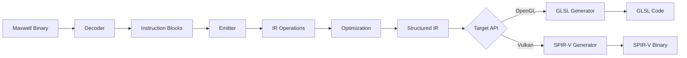
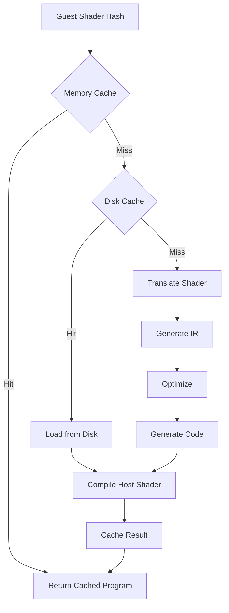

## Overview

Ryujinx's shader translation system converts NVIDIA Maxwell/Pascal GPU machine code into portable GLSL or SPIR-V shaders that can execute on OpenGL or Vulkan backends. This multi-stage translation pipeline includes decoding, intermediate representation (IR), optimization, and code generation.

<CardGroup cols={2}>
  <Card title="Decoding" icon="binary" href="#shader-decoding">
    Parse Maxwell GPU instructions into an abstract syntax tree
  </Card>
  <Card title="Intermediate Representation" icon="diagram-project" href="#intermediate-representation">
    Transform into SSA-form IR for optimization
  </Card>
  <Card title="Optimization" icon="gauge-high" href="#optimization-passes">
    Apply optimization passes to improve performance
  </Card>
  <Card title="Code Generation" icon="file-code" href="#code-generation">
    Generate GLSL or SPIR-V output for host APIs
  </Card>
</CardGroup>

## Translation Pipeline



## Shader Decoding

The decoder parses Maxwell GPU binary instructions into structured blocks.

### Instruction Decoding

```csharp
namespace Ryujinx.Graphics.Shader.Decoders
{
    static class Decoder
    {
        public static DecodedProgram Decode(
            ShaderDefinitions definitions,
            IGpuAccessor gpuAccessor,
            ulong address)
        {
            // Read shader header (for graphics shaders)
            byte[] code = gpuAccessor.GetCode(address, definitions.Size);
            
            // Disassemble instructions
            List<Block> blocks = new();
            Queue<ulong> branchTargets = new();
            branchTargets.Enqueue(address);
            
            while (branchTargets.Count > 0)
            {
                ulong blockAddress = branchTargets.Dequeue();
                Block block = DecodeBasicBlock(definitions, code, blockAddress, branchTargets);
                blocks.Add(block);
            }
            
            // Build control flow graph
            var cfg = BuildControlFlowGraph(blocks);
            
            return new DecodedProgram(cfg, definitions);
        }
    }
}
```

### Instruction Format

Maxwell instructions are decoded based on their encoding:

```csharp
struct InstOp
{
    public ulong Address { get; set; }          // Instruction address
    public ulong RawOpCode { get; set; }        // Raw 64-bit encoding
    public InstName Name { get; set; }          // Instruction mnemonic
    public InstProps Props { get; set; }        // Instruction properties
    public InstEmitter Emitter { get; set; }    // Emission function
}

enum InstName
{
    Ald,    // Attribute load
    Ast,    // Attribute store
    Bra,    // Branch
    Exit,   // Thread exit
    Fadd,   // Floating point add
    Fmul,   // Floating point multiply
    Fmad,   // Floating point multiply-add
    Ipa,    // Interpolate attribute
    Ld,     // Load from memory
    St,     // Store to memory
    Tex,    // Texture sample
    Txq,    // Texture query
    // ... 200+ instructions
}
```

### Control Flow Analysis

<AccordionGroup>
  <Accordion title="Basic Block Formation" icon="cubes">
    Instructions are grouped into basic blocks with no internal branches:
    
    ```csharp
    class Block
    {
        public ulong Address { get; set; }
        public ulong EndAddress { get; set; }
        public List<InstOp> OpCodes { get; }
        public List<Block> Successors { get; }
        public List<Block> Predecessors { get; }
        
        // Branch target analysis
        public HashSet<ulong> SyncTargets { get; } // For SYNC/BRK instructions
    }
    ```
  </Accordion>

  <Accordion title="Dominance Analysis" icon="sitemap">
    Compute dominator tree for optimization:
    
    ```csharp
    static class Dominance
    {
        public static void FindDominators(Block entry, int blocksCount)
        {
            // Initialize dominators
            foreach (Block block in blocks)
            {
                block.Dominators = new BitSet(blocksCount);
                block.Dominators.SetAll();
            }
            
            entry.Dominators.Clear();
            entry.Dominators.Set(entry.Index);
            
            // Iterate until fixed point
            bool changed;
            do
            {
                changed = false;
                foreach (Block block in blocks)
                {
                    if (block == entry) continue;
                    
                    BitSet newDom = ComputeDominators(block);
                    if (!newDom.Equals(block.Dominators))
                    {
                        block.Dominators = newDom;
                        changed = true;
                    }
                }
            } while (changed);
        }
    }
    ```
  </Accordion>
</AccordionGroup>

## Intermediate Representation

The IR uses a low-level SSA (Static Single Assignment) form suitable for optimization.

### IR Operations

```csharp
namespace Ryujinx.Graphics.Shader.IntermediateRepresentation
{
    enum Instruction
    {
        // Arithmetic
        Add, Subtract, Multiply, Divide,
        Negate, Absolute,
        FusedMultiplyAdd,
        
        // Bitwise
        BitwiseAnd, BitwiseOr, BitwiseXor, BitwiseNot,
        ShiftLeft, ShiftRightS32, ShiftRightU32,
        
        // Comparison
        Compare, CompareEqual, CompareLess, CompareLessOrEqual,
        
        // Control flow
        Branch, BranchIfTrue, BranchIfFalse,
        Call, Return,
        
        // Memory
        Load, Store,
        LoadAttribute, StoreAttribute,
        LoadConstant, LoadLocal, StoreLocal,
        LoadStorage, StoreStorage,
        
        // Texture
        TextureSample, ImageLoad, ImageStore,
        
        // Type conversion
        ConvertFP32ToFP64, ConvertFP64ToFP32,
        ConvertS32ToFP32, ConvertU32ToFP32,
        
        // Special
        PackHalf2x16, UnpackHalf2x16,
        VectorShuffle, VectorExtract,
        
        // Misc
        Discard, Barrier, MemoryBarrier,
        Phi, // SSA phi node
    }
}
```

### SSA Form

The IR is converted to SSA form where each variable is assigned exactly once:

```csharp
class EmitterContext
{
    private readonly Dictionary<Operand, Operand> _currentDefs = new();
    private readonly Stack<Dictionary<Operand, Operand>> _definitionStack = new();
    
    // Generate SSA phi nodes
    public void EnterBlock(Block block)
    {
        if (block.Predecessors.Count > 1)
        {
            // Insert phi nodes for variables with multiple definitions
            foreach (var (variable, _) in GetLiveVariables(block))
            {
                Operand dest = Local();
                Operand[] sources = new Operand[block.Predecessors.Count];
                
                for (int i = 0; i < block.Predecessors.Count; i++)
                {
                    sources[i] = GetCurrentDef(variable, block.Predecessors[i]);
                }
                
                var phi = new PhiNode(dest, sources);
                block.PhiNodes.Add(phi);
                
                SetCurrentDef(variable, dest);
            }
        }
    }
    
    // Load from variable (get current SSA version)
    public Operand Copy(Operand source)
    {
        if (source.Type == OperandType.Register)
        {
            return GetCurrentDef(source);
        }
        return source;
    }
    
    // Store to variable (create new SSA version)
    public void Copy(Operand dest, Operand source)
    {
        if (dest.Type == OperandType.Register)
        {
            Operand newDef = Local();
            Add(new Operation(Instruction.Copy, newDef, source));
            SetCurrentDef(dest, newDef);
        }
    }
}
```

### IR Example

Maxwell instruction to IR transformation:

<CodeGroup>
```asm Maxwell Assembly
# Floating-point multiply-add: R0 = R1 * R2 + R3
FFMA R0, R1, R2, R3
```

```csharp IR Operations
// Load operands (SSA versions)
Operand r1 = LoadRegister(1);  // %0
Operand r2 = LoadRegister(2);  // %1
Operand r3 = LoadRegister(3);  // %2

// Multiply
Operand mul = Local();          // %3
Add(new Operation(Instruction.Multiply, mul, r1, r2));

// Add
Operand result = Local();       // %4
Add(new Operation(Instruction.Add, result, mul, r3));

// Store result (new SSA version of R0)
SetRegister(0, result);
```

```llvm LLVM-style IR
%0 = load float, ptr %r1
%1 = load float, ptr %r2
%2 = load float, ptr %r3
%3 = fmul float %0, %1
%4 = fadd float %3, %2
store float %4, ptr %r0
```
</CodeGroup>

## Optimization Passes

Multiple optimization passes improve the generated code:

### Dead Code Elimination

```csharp
namespace Ryujinx.Graphics.Shader.Translation.Optimizations
{
    static class DeadCodeElimination
    {
        public static void RunPass(Function function)
        {
            // Mark all operations as dead initially
            HashSet<Operation> liveOps = new();
            Queue<Operation> worklist = new();
            
            // Mark operations with side effects as live
            foreach (var op in function.Operations)
            {
                if (HasSideEffects(op))
                {
                    liveOps.Add(op);
                    worklist.Enqueue(op);
                }
            }
            
            // Propagate liveness backwards
            while (worklist.Count > 0)
            {
                var op = worklist.Dequeue();
                
                // Mark all source operations as live
                for (int i = 0; i < op.SourcesCount; i++)
                {
                    var source = op.GetSource(i);
                    
                    if (source.Type == OperandType.LocalVariable)
                    {
                        var defOp = source.AsgOp;
                        if (defOp != null && liveOps.Add(defOp))
                        {
                            worklist.Enqueue(defOp);
                        }
                    }
                }
            }
            
            // Remove dead operations
            function.Operations.RemoveAll(op => !liveOps.Contains(op));
        }
        
        private static bool HasSideEffects(Operation op)
        {
            return op.Inst switch
            {
                Instruction.Store => true,
                Instruction.StoreAttribute => true,
                Instruction.StoreStorage => true,
                Instruction.ImageStore => true,
                Instruction.Discard => true,
                Instruction.Barrier => true,
                Instruction.Return => true,
                _ => false
            };
        }
    }
}
```

### Constant Folding

```csharp
static class ConstantFolding
{
    public static void RunPass(Function function)
    {
        foreach (var op in function.Operations)
        {
            if (CanFold(op))
            {
                Operand result = EvaluateConstant(op);
                
                // Replace operation with constant
                op.TurnIntoCopy(result);
            }
        }
    }
    
    private static bool CanFold(Operation op)
    {
        // Check if all sources are constants
        for (int i = 0; i < op.SourcesCount; i++)
        {
            if (op.GetSource(i).Type != OperandType.Constant)
                return false;
        }
        return true;
    }
    
    private static Operand EvaluateConstant(Operation op)
    {
        return op.Inst switch
        {
            Instruction.Add => Const(
                op.GetSource(0).Value + op.GetSource(1).Value
            ),
            
            Instruction.Multiply => Const(
                op.GetSource(0).Value * op.GetSource(1).Value
            ),
            
            Instruction.BitwiseAnd => Const(
                op.GetSource(0).Value & op.GetSource(1).Value
            ),
            
            // ... more operations
            
            _ => throw new InvalidOperationException()
        };
    }
}
```

### Common Subexpression Elimination

```csharp
static class CommonSubexpressionElimination
{
    public static void RunPass(Function function)
    {
        Dictionary<Operation, Operand> expressions = new();
        
        foreach (var op in function.Operations)
        {
            if (IsPure(op) && expressions.TryGetValue(op, out Operand existing))
            {
                // Replace with existing result
                op.TurnIntoCopy(existing);
            }
            else if (op.Dest != null)
            {
                expressions[op] = op.Dest;
            }
        }
    }
    
    private static bool IsPure(Operation op)
    {
        // Pure operations have no side effects and always return
        // the same result for the same inputs
        return op.Inst switch
        {
            Instruction.Add => true,
            Instruction.Multiply => true,
            Instruction.BitwiseAnd => true,
            Instruction.Load => false,  // May have side effects
            Instruction.Store => false, // Definitely has side effects
            _ => false
        };
    }
}
```

### Additional Passes

<CardGroup cols={2}>
  <Card title="Copy Propagation" icon="clone">
    Replace uses of copied variables with their source
  </Card>
  <Card title="Algebraic Simplification" icon="calculator">
    Apply algebraic identities (e.g., x * 1 = x, x + 0 = x)
  </Card>
  <Card title="Loop Invariant Code Motion" icon="repeat">
    Move calculations outside loops when possible
  </Card>
  <Card title="Register Allocation" icon="table-cells">
    Minimize register usage through smart allocation
  </Card>
</CardGroup>

## Code Generation

After optimization, the IR is converted to either GLSL or SPIR-V.

### GLSL Generation

```csharp
namespace Ryujinx.Graphics.Shader.CodeGen.Glsl
{
    class GlslGenerator
    {
        public static string Generate(
            StructuredProgramInfo info,
            ShaderConfig config)
        {
            var context = new CodeGenContext(config);
            
            // Generate declarations
            string declarations = Declarations.Generate(context, info);
            
            // Generate function bodies
            StringBuilder code = new();
            code.AppendLine(declarations);
            code.AppendLine();
            
            foreach (var function in info.Functions)
            {
                code.AppendLine(GenerateFunction(context, function));
            }
            
            return code.ToString();
        }
        
        private static string GenerateFunction(
            CodeGenContext context,
            StructuredFunction function)
        {
            StringBuilder code = new();
            
            // Function signature
            code.AppendLine($"{function.ReturnType} {function.Name}()");
            code.AppendLine("{");
            
            // Local variable declarations
            foreach (var local in function.Locals)
            {
                code.AppendLine($"    {local.Type} {local.Name};");
            }
            
            // Generate statements
            foreach (var statement in function.MainBlock.Statements)
            {
                code.AppendLine($"    {GenerateStatement(context, statement)}");
            }
            
            code.AppendLine("}");
            return code.ToString();
        }
    }
}
```

### GLSL Output Example

<CodeGroup>
```glsl Vertex Shader
#version 450 core

layout (location = 0) in vec3 in_position;
layout (location = 1) in vec2 in_texcoord;

layout (location = 0) out vec2 out_texcoord;

layout (std140, binding = 0) uniform VertexUniforms
{
    mat4 projection;
    mat4 modelView;
};

void main()
{
    vec4 position = vec4(in_position, 1.0);
    gl_Position = projection * modelView * position;
    out_texcoord = in_texcoord;
}
```

```glsl Fragment Shader
#version 450 core

layout (location = 0) in vec2 in_texcoord;
layout (location = 0) out vec4 out_color;

layout (binding = 0) uniform sampler2D tex;

void main()
{
    vec4 color = texture(tex, in_texcoord);
    
    // Alpha test
    if (color.a < 0.5)
        discard;
    
    out_color = color;
}
```
</CodeGroup>

### SPIR-V Generation

For Vulkan, shaders are compiled to SPIR-V binary:

```csharp
namespace Ryujinx.Graphics.Shader.CodeGen.Spirv
{
    class SpirvGenerator
    {
        public static byte[] Generate(
            StructuredProgramInfo info,
            ShaderConfig config)
        {
            var context = new CodeGenContext(config);
            var generator = new SpirvGenerator(context);
            
            // Generate SPIR-V instructions
            generator.GenerateHeader();
            generator.GenerateDeclarations(info);
            generator.GenerateFunctions(info);
            
            // Assemble binary
            return generator.Assemble();
        }
        
        private void GenerateHeader()
        {
            // Magic number
            AddWord(0x07230203);
            
            // Version (1.5)
            AddWord(0x00010500);
            
            // Generator (Ryujinx)
            AddWord(0x00000000);
            
            // Bound (max ID + 1)
            AddWord((uint)(_idCounter + 1));
            
            // Schema
            AddWord(0);
        }
        
        private void GenerateDeclarations(StructuredProgramInfo info)
        {
            // Capability declarations
            AddCapability(Capability.Shader);
            
            if (_config.Stage == ShaderStage.Geometry)
                AddCapability(Capability.Geometry);
            
            // Memory model
            AddInstruction(Op.OpMemoryModel,
                AddressingModel.Logical,
                MemoryModel.GLSL450
            );
            
            // Entry point
            GenerateEntryPoint(info);
            
            // Execution mode
            if (_config.Stage == ShaderStage.Fragment)
            {
                AddExecutionMode(
                    _entryPointId,
                    ExecutionMode.OriginUpperLeft
                );
            }
        }
    }
}
```

### Instruction Translation

<Tabs>
  <Tab title="Arithmetic Operations">
    ```csharp
    private void GenerateInstruction(Operation op)
    {
        switch (op.Inst)
        {
            case Instruction.Add:
                {
                    var src1 = GetSource(op.GetSource(0));
                    var src2 = GetSource(op.GetSource(1));
                    var dest = GetDestination(op.Dest);
                    
                    if (IsFloat(src1))
                        AddInstruction(Op.OpFAdd, dest, src1, src2);
                    else
                        AddInstruction(Op.OpIAdd, dest, src1, src2);
                    break;
                }
                
            case Instruction.Multiply:
                {
                    var src1 = GetSource(op.GetSource(0));
                    var src2 = GetSource(op.GetSource(1));
                    var dest = GetDestination(op.Dest);
                    
                    if (IsFloat(src1))
                        AddInstruction(Op.OpFMul, dest, src1, src2);
                    else
                        AddInstruction(Op.OpIMul, dest, src1, src2);
                    break;
                }
                
            case Instruction.FusedMultiplyAdd:
                {
                    var src1 = GetSource(op.GetSource(0));
                    var src2 = GetSource(op.GetSource(1));
                    var src3 = GetSource(op.GetSource(2));
                    var dest = GetDestination(op.Dest);
                    
                    AddInstruction(Op.OpFma, dest, src1, src2, src3);
                    break;
                }
        }
    }
    ```
  </Tab>

  <Tab title="Texture Operations">
    ```csharp
    case Instruction.TextureSample:
        {
            var texOp = (TextureOperation)op;
            
            // Get sampled image
            var sampledImage = GetSampledImage(
                texOp.GetSource(0).Value,
                texOp.Type
            );
            
            // Get coordinates
            var coords = GetCoordinates(texOp);
            
            // Optional bias/lod
            SpvOperand bias = default;
            SpvOperand lod = default;
            
            if (texOp.Flags.HasFlag(TextureFlags.LodBias))
            {
                bias = GetSource(texOp.GetSource(texOp.SourcesCount - 1));
            }
            else if (texOp.Flags.HasFlag(TextureFlags.LodLevel))
            {
                lod = GetSource(texOp.GetSource(texOp.SourcesCount - 1));
            }
            
            var dest = GetDestination(op.Dest);
            
            if (lod.IsValid)
            {
                AddInstruction(
                    Op.OpImageSampleExplicitLod,
                    dest,
                    sampledImage,
                    coords,
                    ImageOperands.Lod,
                    lod
                );
            }
            else if (bias.IsValid)
            {
                AddInstruction(
                    Op.OpImageSampleImplicitLod,
                    dest,
                    sampledImage,
                    coords,
                    ImageOperands.Bias,
                    bias
                );
            }
            else
            {
                AddInstruction(
                    Op.OpImageSampleImplicitLod,
                    dest,
                    sampledImage,
                    coords
                );
            }
            break;
        }
    ```
  </Tab>

  <Tab title="Memory Operations">
    ```csharp
    case Instruction.Load:
        {
            var address = GetSource(op.GetSource(0));
            var dest = GetDestination(op.Dest);
            
            // Determine storage class
            var storageClass = GetStorageClass(op);
            
            // Generate pointer
            var ptrType = GetPointerType(dest.Type, storageClass);
            var ptr = AllocateId();
            
            AddInstruction(
                Op.OpAccessChain,
                ptrType,
                ptr,
                GetBasePointer(storageClass),
                address
            );
            
            // Load from pointer
            AddInstruction(Op.OpLoad, dest, ptr);
            break;
        }
        
    case Instruction.Store:
        {
            var address = GetSource(op.GetSource(0));
            var value = GetSource(op.GetSource(1));
            
            var storageClass = GetStorageClass(op);
            var ptrType = GetPointerType(value.Type, storageClass);
            var ptr = AllocateId();
            
            AddInstruction(
                Op.OpAccessChain,
                ptrType,
                ptr,
                GetBasePointer(storageClass),
                address
            );
            
            AddInstruction(Op.OpStore, ptr, value);
            break;
        }
    ```
  </Tab>
</Tabs>

## Shader Caching

Ryujinx implements a multi-tier shader cache to avoid redundant translations.

### Cache Architecture



### Shader Cache Implementation

```csharp
namespace Ryujinx.Graphics.Gpu.Shader
{
    class ShaderCache
    {
        private readonly Dictionary<ulong, CachedShaderProgram> _cpPrograms;  // Compute
        private readonly Dictionary<ShaderAddresses, CachedShaderProgram> _gpPrograms;  // Graphics
        
        private readonly ComputeShaderCacheHashTable _computeShaderCache;
        private readonly ShaderCacheHashTable _graphicsShaderCache;
        private readonly DiskCacheHostStorage _diskCacheHostStorage;
        
        public CachedShaderProgram GetGraphicsShader(
            GpuState state,
            ShaderAddresses addresses)
        {
            // Check memory cache
            if (_gpPrograms.TryGetValue(addresses, out var program))
            {
                return program;
            }
            
            // Compute hash of all shader stages
            ulong hash = ComputeShaderHash(state, addresses);
            
            // Check disk cache
            if (_diskCacheHostStorage.TryLoad(hash, out byte[] binary))
            {
                program = LoadFromDiskCache(addresses, binary);
            }
            else
            {
                // Translate shader
                program = TranslateShader(state, addresses);
                
                // Save to disk cache
                _diskCacheHostStorage.Save(hash, program.HostProgram.GetBinary());
            }
            
            // Cache in memory
            _gpPrograms[addresses] = program;
            return program;
        }
        
        private CachedShaderProgram TranslateShader(
            GpuState state,
            ShaderAddresses addresses)
        {
            TranslatedShader[] stages = new TranslatedShader[6];
            
            // Translate each active stage
            for (int i = 0; i < 6; i++)
            {
                if (addresses.Get(i) != 0)
                {
                    stages[i] = TranslateStage(state, addresses.Get(i), (ShaderStage)i);
                }
            }
            
            // Link program
            var hostProgram = LinkProgram(stages);
            
            return new CachedShaderProgram(hostProgram, stages);
        }
    }
}
```

### Disk Cache Format

<AccordionGroup>
  <Accordion title="Cache Key Generation" icon="key">
    ```csharp
    private ulong ComputeShaderHash(GpuState state, ShaderAddresses addresses)
    {
        using var hasher = new XXHash64();
        
        // Hash shader code
        for (int stage = 0; stage < 6; stage++)
        {
            ulong address = addresses.Get(stage);
            if (address != 0)
            {
                byte[] code = _memoryManager.GetSpan(address, MaxShaderSize).ToArray();
                hasher.Append(code);
            }
        }
        
        // Hash relevant GPU state
        hasher.Append(BitConverter.GetBytes(state.Get<uint>(StateIndex.AlphaToCoverageEnable)));
        hasher.Append(BitConverter.GetBytes(state.Get<uint>(StateIndex.PrimitiveTopology)));
        // ... more state
        
        return hasher.GetHash();
    }
    ```
  </Accordion>

  <Accordion title="Cache Storage" icon="database">
    The disk cache stores:
    - **Guest shader code**: Original Maxwell binary
    - **Host shader binary**: Compiled GLSL/SPIR-V
    - **Shader metadata**: Stage info, bindings, attributes
    - **Translation options**: Flags used during translation
    
    Location: `{UserData}/games/{TitleId}/cache/shader/`
  </Accordion>
</AccordionGroup>

## Translation Options

Translation behavior is controlled by various options:

```csharp
struct TranslationOptions
{
    public TargetLanguage TargetLanguage { get; set; }  // GLSL or SPIR-V
    public TargetApi TargetApi { get; set; }            // OpenGL or Vulkan
    public TranslationFlags Flags { get; set; }         // Debug, compute, etc.
}

[Flags]
enum TranslationFlags
{
    None = 0,
    Compute = 1 << 0,         // Compute shader
    DebugMode = 1 << 1,       // Include debug info
    VertexA = 1 << 2,         // Vertex shader A (for dual vertex)
}

enum TargetLanguage
{
    Glsl,    // OpenGL Shading Language
    Spirv    // SPIR-V binary (Vulkan)
}
```

## Advanced Features

### Dual Vertex Shaders

Some games use two vertex shaders that must be combined:

```csharp
private CachedShaderProgram TranslateDualVertexShaders(
    GpuState state,
    ShaderAddresses addresses)
{
    // Translate both vertex shaders
    var vertexA = TranslateStage(state, addresses.VertexA, ShaderStage.Vertex);
    var vertexB = TranslateStage(state, addresses.VertexB, ShaderStage.Vertex);
    
    // Combine shaders:
    // - VertexA outputs are stored in temporaries
    // - VertexB reads from temporaries instead of attributes
    // - VertexB outputs become the final outputs
    var combined = CombineVertexShaders(vertexA, vertexB);
    
    return new CachedShaderProgram(combined);
}
```

### Geometry Shader Passthrough

Optimization for simple geometry shaders:

```csharp
if (header.GpPassthrough && capabilities.SupportsGeometryShaderPassthrough)
{
    // Use native passthrough instead of full geometry shader
    // Significantly faster on supported hardware
    definitions.SetGeometryPassthrough(true);
}
```

### Transform Feedback Emulation

For hosts without transform feedback support:

```csharp
if (!gpuAccessor.QueryHostSupportsTransformFeedback() && 
    gpuAccessor.QueryTransformFeedbackEnabled())
{
    // Emulate transform feedback using storage buffers
    // Vertex shader writes outputs to SSBO instead of varyings
    EmulateTransformFeedback(context);
}
```

## Performance Optimization

<CardGroup cols={2}>
  <Card title="Shader Specialization" icon="wand-magic-sparkles">
    Specialize shaders based on dynamic state to generate more efficient code
  </Card>
  <Card title="Aggressive Inlining" icon="compress">
    Inline function calls to enable better optimization
  </Card>
  <Card title="Loop Unrolling" icon="arrows-repeat">
    Unroll small loops with constant trip counts
  </Card>
  <Card title="Texture Array Flattening" icon="layer-group">
    Convert texture arrays to individual textures when beneficial
  </Card>
</CardGroup>

## Debugging

Ryujinx provides tools for shader debugging:

### Shader Dumping

```csharp
class ShaderDumper
{
    public void Dump(
        ShaderProgram program,
        ShaderStage stage,
        string path)
    {
        // Dump guest shader (Maxwell binary)
        File.WriteAllBytes(
            $"{path}/{stage}_guest.bin",
            program.Code
        );
        
        // Dump IR (human-readable)
        File.WriteAllText(
            $"{path}/{stage}_ir.txt",
            FormatIR(program.Operations)
        );
        
        // Dump generated code
        File.WriteAllText(
            $"{path}/{stage}_output.{GetExtension(program.Language)}",
            program.Code
        );
    }
}
```

### Translation Logging

With `TranslationFlags.DebugMode`:
- All IR operations are commented in output
- Source line numbers are preserved
- Optimization passes are logged

## References

<CardGroup cols={2}>
  <Card title="Source Files" icon="folder-tree">
    - `src/Ryujinx.Graphics.Shader/Translation/Translator.cs`
    - `src/Ryujinx.Graphics.Shader/Translation/TranslatorContext.cs`
    - `src/Ryujinx.Graphics.Shader/Decoders/Decoder.cs`
    - `src/Ryujinx.Graphics.Shader/CodeGen/Glsl/GlslGenerator.cs`
    - `src/Ryujinx.Graphics.Shader/CodeGen/Spirv/SpirvGenerator.cs`
    - `src/Ryujinx.Graphics.Gpu/Shader/ShaderCache.cs`
  </Card>
  <Card title="Related Topics" icon="link">
    - [GPU Emulation](/architecture/graphics/gpu-emulation)
    - [OpenGL Backend](/architecture/graphics/opengl-backend)
    - [Vulkan Backend](/architecture/graphics/vulkan-backend)
  </Card>
</CardGroup>
