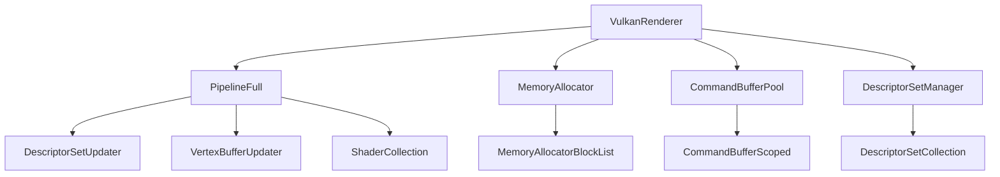

## Overview

The Vulkan backend is Ryujinx's primary graphics API implementation, providing high-performance rendering through direct control of GPU resources and minimal driver overhead. It implements the Graphics Abstraction Layer (GAL) using modern Vulkan 1.2+ features.

<Info>
Ryujinx requires **Vulkan 1.2** with extensions including `VK_KHR_dynamic_rendering`, `VK_EXT_extended_dynamic_state`, and `VK_EXT_transform_feedback` for optimal compatibility.
</Info>

## Architecture Overview



## VulkanRenderer

The main renderer class initializes the Vulkan instance, selects a physical device, and manages global resources.

### Initialization

<Steps>
  <Step title="Instance Creation">
    Create a Vulkan instance with required extensions:
    
    ```csharp
    public void Initialize(GraphicsDebugLevel logLevel)
    {
        // Create Vulkan instance
        _instance = VulkanInitialization.CreateInstance(
            Api,
            logLevel,
            _getRequiredExtensions(),
            out ExtDebugUtils debugUtilsExtension
        );
        
        // Set up debug messenger if debugging
        if (logLevel != GraphicsDebugLevel.None)
        {
            _debugMessenger = new VulkanDebugMessenger(
                Api,
                _instance,
                debugUtilsExtension,
                logLevel
            );
        }
    }
    ```
  </Step>

  <Step title="Physical Device Selection">
    Select the most suitable GPU:
    
    ```csharp
    _physicalDevice = VulkanInitialization.FindSuitablePhysicalDevice(
        Api,
        _instance,
        _surface,
        _preferredGpuId
    );
    
    // Query device properties and features
    PhysicalDeviceProperties properties = _physicalDevice.PhysicalDeviceProperties;
    Vendor = GetVendor(properties.VendorID);
    
    // Detect vendor-specific quirks
    IsNvidiaPreTuring = Vendor == Vendor.Nvidia && 
        properties.DriverVersion < GetNvidiaDriverVersion(430, 0);
    ```
  </Step>

  <Step title="Device and Queue Creation">
    Create logical device and command queue:
    
    ```csharp
    _device = VulkanInitialization.CreateDevice(
        Api,
        _physicalDevice,
        out uint queueFamilyIndex,
        out Queue queue
    );
    
    QueueFamilyIndex = queueFamilyIndex;
    Queue = queue;
    BackgroundQueue = queue; // Use same queue for background operations
    ```
  </Step>

  <Step title="Resource Initialization">
    Initialize memory allocators and resource managers:
    
    ```csharp
    // Memory allocation
    MemoryAllocator = new MemoryAllocator(Api, _physicalDevice, _device);
    HostMemoryAllocator = new HostMemoryAllocator(MemoryAllocator);
    
    // Command buffer pool
    CommandBufferPool = new CommandBufferPool(Api, _device, QueueFamilyIndex);
    
    // Pipeline resources
    PipelineLayoutCache = new PipelineLayoutCache(Api, _device);
    
    // Shader helpers and utilities
    HelperShader = new HelperShader(this, _device);
    ```
  </Step>
</Steps>

### Hardware Capabilities

```csharp
class HardwareCapabilities
{
    public bool SupportsIndexTypeUint8 { get; set; }
    public bool SupportsCustomBorderColor { get; set; }
    public bool SupportsIndirectFirstInstance { get; set; }
    public bool SupportsFragmentShaderInterlock { get; set; }
    public bool SupportsGeometryShaderPassthrough { get; set; }
    public bool SupportsSubgroupShuffle { get; set; }
    public bool SupportsConditionalRendering { get; set; }
    public bool SupportsExtendedDynamicState { get; set; }
    public bool SupportsExtendedDynamicState2 { get; set; }
    public bool SupportsMultiView { get; set; }
    public bool SupportsNullDescriptors { get; set; }
    public bool SupportsPushDescriptors { get; set; }
    public bool SupportsTransformFeedback { get; set; }
    
    public uint MaxColorAttachments { get; set; }
    public ulong MaxPushDescriptorsSize { get; set; }
    public uint SubgroupSize { get; set; }
    public uint StorageBufferOffsetAlignment { get; set; }
    public uint MinSubgroupSize { get; set; }
    public uint MaxSubgroupSize { get; set; }
}
```

## Pipeline Management

The `PipelineFull` class extends `PipelineBase` and manages all pipeline state and rendering operations.

### Pipeline State

```csharp
class PipelineBase
{
    protected PipelineDynamicState DynamicState;      // Dynamic state tracker
    private PipelineState _newState;                   // Pending state changes
    private bool _graphicsStateDirty;                  // Graphics pipeline dirty flag
    
    protected Auto<DisposablePipeline> Pipeline;       // Current pipeline object
    protected CommandBufferScoped Cbs;                 // Active command buffer
    
    private DescriptorSetUpdater _descriptorSetUpdater; // Resource binding manager
    private IndexBufferState _indexBuffer;             // Index buffer binding
    private VertexBufferState[] _vertexBuffers;        // Vertex buffer bindings
    
    private Auto<DisposableFramebuffer> _framebuffer;  // Current framebuffer
    private RenderPassHolder _rpHolder;                // Render pass manager
}
```

### Dynamic State Management

<Tabs>
  <Tab title="Viewport & Scissor">
    ```csharp
    public void SetViewports(ReadOnlySpan<Viewport> viewports)
    {
        int count = viewports.Length;
        
        if (DynamicState.SetViewports(viewports))
        {
            var vkViewports = stackalloc VkViewport[count];
            
            for (int i = 0; i < count; i++)
            {
                var viewport = viewports[i];
                
                vkViewports[i] = new VkViewport
                {
                    X = viewport.Region.X,
                    Y = viewport.Region.Y,
                    Width = viewport.Region.Width,
                    Height = viewport.Region.Height,
                    MinDepth = viewport.DepthNear,
                    MaxDepth = viewport.DepthFar
                };
            }
            
            Api.CmdSetViewport(CommandBuffer, 0, (uint)count, vkViewports);
        }
    }
    
    public void SetScissors(ReadOnlySpan<Rectangle<int>> scissors)
    {
        int count = scissors.Length;
        
        if (DynamicState.SetScissors(scissors))
        {
            var vkScissors = stackalloc VkRect2D[count];
            
            for (int i = 0; i < count; i++)
            {
                vkScissors[i] = new VkRect2D
                {
                    Offset = new Offset2D { X = scissors[i].X, Y = scissors[i].Y },
                    Extent = new Extent2D { Width = (uint)scissors[i].Width, Height = (uint)scissors[i].Height }
                };
            }
            
            Api.CmdSetScissor(CommandBuffer, 0, (uint)count, vkScissors);
        }
    }
    ```
  </Tab>

  <Tab title="Blend State">
    ```csharp
    public void SetBlendState(BlendDescriptor blend)
    {
        if (DynamicState.SetBlendState(blend))
        {
            // Set blend constants
            var blendConstants = stackalloc float[4]
            {
                blend.BlendConstant.Red,
                blend.BlendConstant.Green,
                blend.BlendConstant.Blue,
                blend.BlendConstant.Alpha
            };
            
            Api.CmdSetBlendConstants(CommandBuffer, blendConstants);
        }
    }
    ```
  </Tab>

  <Tab title="Depth/Stencil State">
    ```csharp
    public void SetDepthTest(DepthTestDescriptor depthTest)
    {
        if (Capabilities.SupportsExtendedDynamicState)
        {
            Api.CmdSetDepthTestEnableEXT(CommandBuffer, depthTest.TestEnable);
            Api.CmdSetDepthWriteEnableEXT(CommandBuffer, depthTest.WriteEnable);
            Api.CmdSetDepthCompareOpEXT(CommandBuffer, depthTest.Func.Convert());
        }
        
        // Always support depth bias
        Api.CmdSetDepthBias(
            CommandBuffer,
            depthTest.DepthBiasConstantFactor,
            depthTest.DepthBiasClamp,
            depthTest.DepthBiasSlopeFactor
        );
    }
    
    public void SetStencilTest(StencilTestDescriptor stencilTest)
    {
        if (Capabilities.SupportsExtendedDynamicState)
        {
            Api.CmdSetStencilTestEnableEXT(CommandBuffer, stencilTest.TestEnable);
            
            Api.CmdSetStencilOpEXT(
                CommandBuffer,
                StencilFaceFlags.FrontBit,
                stencilTest.FrontSFail.Convert(),
                stencilTest.FrontDpPass.Convert(),
                stencilTest.FrontDpFail.Convert(),
                stencilTest.FrontFunc.Convert()
            );
            
            // Set back face ops...
        }
        
        // Stencil reference and masks
        Api.CmdSetStencilCompareMask(CommandBuffer, StencilFaceFlags.FrontBit, stencilTest.FrontMask);
        Api.CmdSetStencilWriteMask(CommandBuffer, StencilFaceFlags.FrontBit, stencilTest.FrontMask);
        Api.CmdSetStencilReference(CommandBuffer, StencilFaceFlags.FrontBit, stencilTest.FrontRef);
    }
    ```
  </Tab>
</Tabs>

### Drawing Operations

```csharp
public void Draw(
    int vertexCount,
    int instanceCount,
    int firstVertex,
    int firstInstance)
{
    if (!RenderPassActive)
    {
        BeginRenderPass();
    }
    
    // Ensure pipeline is bound
    if (_graphicsStateDirty)
    {
        UpdateGraphicsPipeline();
    }
    
    // Update descriptors if needed
    _descriptorSetUpdater.UpdateAndBindDescriptorSets(Cbs, PipelineBindPoint.Graphics);
    
    // Bind vertex/index buffers if dirty
    if (_vertexBuffersDirty != 0)
    {
        _vertexBufferUpdater.Commit(Cbs);
        _vertexBuffersDirty = 0;
    }
    
    // Execute draw
    Api.CmdDraw(CommandBuffer, (uint)vertexCount, (uint)instanceCount, (uint)firstVertex, (uint)firstInstance);
    
    DrawCount++;
}

public void DrawIndexed(
    int indexCount,
    int instanceCount,
    int firstIndex,
    int firstVertex,
    int firstInstance)
{
    if (!RenderPassActive)
    {
        BeginRenderPass();
    }
    
    if (_graphicsStateDirty)
    {
        UpdateGraphicsPipeline();
    }
    
    _descriptorSetUpdater.UpdateAndBindDescriptorSets(Cbs, PipelineBindPoint.Graphics);
    
    if (_vertexBuffersDirty != 0)
    {
        _vertexBufferUpdater.Commit(Cbs);
        _vertexBuffersDirty = 0;
    }
    
    if (_needsIndexBufferRebind)
    {
        BindIndexBuffer();
        _needsIndexBufferRebind = false;
    }
    
    Api.CmdDrawIndexed(
        CommandBuffer,
        (uint)indexCount,
        (uint)instanceCount,
        (uint)firstIndex,
        firstVertex,
        (uint)firstInstance
    );
    
    DrawCount++;
}
```

## Descriptor Set Management

Vulkan's descriptor system binds resources (buffers, textures, samplers) to shaders.

### Descriptor Set Layout

Ryujinx organizes descriptors into **4 sets**:

<CardGroup cols={2}>
  <Card title="Set 0: Uniform Buffers" icon="table">
    Constant buffers for shader uniforms
  </Card>
  <Card title="Set 1: Storage Buffers" icon="database">
    Read/write storage buffers (SSBOs)
  </Card>
  <Card title="Set 2: Textures" icon="image">
    Sampled textures with samplers
  </Card>
  <Card title="Set 3: Images" icon="shapes">
    Storage images for compute/fragment shader writes
  </Card>
</CardGroup>

### Descriptor Set Updater

```csharp
class DescriptorSetUpdater
{
    private readonly BufferRef[] _uniformBufferRefs;
    private readonly BufferRef[] _storageBufferRefs;
    private readonly TextureRef[] _textureRefs;
    private readonly ImageRef[] _imageRefs;
    
    private readonly DescriptorBufferInfo[] _uniformBuffers;
    private readonly DescriptorBufferInfo[] _storageBuffers;
    private readonly DescriptorImageInfo[] _textures;
    private readonly DescriptorImageInfo[] _images;
    
    private readonly DescriptorSetTemplateUpdater _templateUpdater;
    
    public void UpdateAndBindDescriptorSets(CommandBufferScoped cbs, PipelineBindPoint pbp)
    {
        if (_program == null)
            return;
            
        // Update descriptor sets for each stage
        for (int stage = 0; stage < _program.Stages.Length; stage++)
        {
            var shaderStage = _program.Stages[stage];
            
            // Update uniform buffers
            UpdateBufferDescriptorSet(cbs, pbp, UniformSetIndex, 
                shaderStage.UniformBufferBindings, _uniformBufferRefs, _uniformBuffers);
            
            // Update storage buffers
            UpdateBufferDescriptorSet(cbs, pbp, StorageSetIndex,
                shaderStage.StorageBufferBindings, _storageBufferRefs, _storageBuffers);
            
            // Update textures
            UpdateTextureDescriptorSet(cbs, pbp, TextureSetIndex,
                shaderStage.TextureBindings, _textureRefs, _textures);
            
            // Update images
            UpdateImageDescriptorSet(cbs, pbp, ImageSetIndex,
                shaderStage.ImageBindings, _imageRefs, _images);
        }
    }
}
```

### Push Descriptors

For frequently updated resources, Ryujinx uses **push descriptors** (VK_KHR_push_descriptor) to avoid allocation overhead:

```csharp
private void UpdateBufferDescriptorSet(
    CommandBufferScoped cbs,
    PipelineBindPoint pbp,
    int setIndex,
    ReadOnlySpan<BufferDescriptor> bindings,
    BufferRef[] refs,
    DescriptorBufferInfo[] descriptors)
{
    if (bindings.Length == 0)
        return;
        
    // Build descriptor writes
    for (int i = 0; i < bindings.Length; i++)
    {
        ref var binding = ref bindings[i];
        ref var bufferRef = ref refs[binding.Binding];
        
        descriptors[i] = new DescriptorBufferInfo
        {
            Buffer = bufferRef.Buffer.Get(cbs).Value,
            Offset = (ulong)bufferRef.Offset,
            Range = (ulong)binding.Size
        };
    }
    
    // Use push descriptors if supported
    if (Capabilities.SupportsPushDescriptors)
    {
        var writes = stackalloc WriteDescriptorSet[bindings.Length];
        
        for (int i = 0; i < bindings.Length; i++)
        {
            writes[i] = new WriteDescriptorSet
            {
                SType = StructureType.WriteDescriptorSet,
                DstBinding = (uint)bindings[i].Binding,
                DescriptorCount = 1,
                DescriptorType = DescriptorType.UniformBuffer,
                PBufferInfo = &descriptors[i]
            };
        }
        
        PushDescriptorApi.CmdPushDescriptorSet(
            cbs.CommandBuffer,
            pbp,
            _program.PipelineLayout,
            (uint)setIndex,
            (uint)bindings.Length,
            writes
        );
    }
    else
    {
        // Allocate and bind descriptor set normally
        var descriptorSet = AllocateDescriptorSet(setIndex);
        UpdateDescriptorSet(descriptorSet, bindings, descriptors);
        BindDescriptorSet(cbs, pbp, setIndex, descriptorSet);
    }
}
```

## Command Buffer Management

Vulkan command buffers record GPU commands for later execution.

### Command Buffer Pool

```csharp
class CommandBufferPool
{
    private readonly List<CommandBufferHolder> _commandBuffers;
    private int _currentCommandBufferIndex;
    
    public CommandBufferScoped Rent()
    {
        // Get or create command buffer
        if (_currentCommandBufferIndex >= _commandBuffers.Count)
        {
            var commandBuffer = AllocateCommandBuffer();
            _commandBuffers.Add(new CommandBufferHolder(commandBuffer));
        }
        
        var holder = _commandBuffers[_currentCommandBufferIndex++];
        
        // Begin recording
        var beginInfo = new CommandBufferBeginInfo
        {
            SType = StructureType.CommandBufferBeginInfo,
            Flags = CommandBufferUsageFlags.OneTimeSubmitBit
        };
        
        Api.BeginCommandBuffer(holder.CommandBuffer, &beginInfo);
        
        return new CommandBufferScoped(this, holder);
    }
    
    public void Return(CommandBufferScoped scoped)
    {
        // End recording
        Api.EndCommandBuffer(scoped.CommandBuffer);
        
        // Submit to queue
        var submitInfo = new SubmitInfo
        {
            SType = StructureType.SubmitInfo,
            CommandBufferCount = 1,
            PCommandBuffers = &scoped.CommandBuffer
        };
        
        lock (_queueLock)
        {
            Api.QueueSubmit(Queue, 1, &submitInfo, default);
        }
    }
}
```

### Render Pass Management

With `VK_KHR_dynamic_rendering`, render passes are begun dynamically:

```csharp
private void BeginRenderPass()
{
    var colorAttachments = stackalloc RenderingAttachmentInfo[_framebuffer.ColorAttachmentCount];
    
    for (int i = 0; i < _framebuffer.ColorAttachmentCount; i++)
    {
        var attachment = _framebuffer.GetColorAttachment(i);
        
        colorAttachments[i] = new RenderingAttachmentInfo
        {
            SType = StructureType.RenderingAttachmentInfo,
            ImageView = attachment.ImageView,
            ImageLayout = ImageLayout.ColorAttachmentOptimal,
            LoadOp = attachment.LoadOp,
            StoreOp = attachment.StoreOp,
            ClearValue = attachment.ClearValue
        };
    }
    
    RenderingAttachmentInfo depthAttachment = default;
    RenderingAttachmentInfo stencilAttachment = default;
    
    if (_framebuffer.HasDepthStencil)
    {
        var dsAttachment = _framebuffer.GetDepthStencilAttachment();
        
        depthAttachment = new RenderingAttachmentInfo
        {
            SType = StructureType.RenderingAttachmentInfo,
            ImageView = dsAttachment.ImageView,
            ImageLayout = ImageLayout.DepthStencilAttachmentOptimal,
            LoadOp = dsAttachment.DepthLoadOp,
            StoreOp = dsAttachment.DepthStoreOp,
            ClearValue = dsAttachment.ClearValue
        };
        
        if (dsAttachment.Format.HasStencil())
        {
            stencilAttachment = depthAttachment;
            stencilAttachment.LoadOp = dsAttachment.StencilLoadOp;
            stencilAttachment.StoreOp = dsAttachment.StencilStoreOp;
        }
    }
    
    var renderingInfo = new RenderingInfo
    {
        SType = StructureType.RenderingInfo,
        RenderArea = _framebuffer.RenderArea,
        LayerCount = 1,
        ColorAttachmentCount = (uint)_framebuffer.ColorAttachmentCount,
        PColorAttachments = colorAttachments,
        PDepthAttachment = _framebuffer.HasDepthStencil ? &depthAttachment : null,
        PStencilAttachment = _framebuffer.HasDepthStencil && depthAttachment.Format.HasStencil() ? &stencilAttachment : null
    };
    
    Api.CmdBeginRendering(CommandBuffer, &renderingInfo);
    RenderPassActive = true;
}

private void EndRenderPass()
{
    if (RenderPassActive)
    {
        Api.CmdEndRendering(CommandBuffer);
        RenderPassActive = false;
    }
}
```

## Memory Management

### Memory Allocator

The `MemoryAllocator` manages device memory using a buddy allocator:

```csharp
class MemoryAllocator
{
    private readonly List<MemoryAllocatorBlockList> _blockLists;
    
    public MemoryAllocation Allocate(ulong size, ulong alignment, int memoryTypeIndex)
    {
        // Find appropriate block list
        var blockList = GetOrCreateBlockList(memoryTypeIndex);
        
        // Try to allocate from existing blocks
        var allocation = blockList.Allocate(size, alignment);
        
        if (allocation == null)
        {
            // Allocate new block
            ulong blockSize = Math.Max(size, DefaultBlockSize);
            
            var memoryAllocateInfo = new MemoryAllocateInfo
            {
                SType = StructureType.MemoryAllocateInfo,
                AllocationSize = blockSize,
                MemoryTypeIndex = (uint)memoryTypeIndex
            };
            
            Api.AllocateMemory(_device, &memoryAllocateInfo, null, out DeviceMemory memory);
            
            blockList.AddBlock(memory, blockSize);
            allocation = blockList.Allocate(size, alignment);
        }
        
        return allocation;
    }
}
```

### Buffer Creation

```csharp
public BufferHandle CreateBuffer(int size, BufferAccess access)
{
    var usage = BufferUsageFlags.TransferSrcBit | BufferUsageFlags.TransferDstBit;
    
    if (access.HasFlag(BufferAccess.Vertex))
        usage |= BufferUsageFlags.VertexBufferBit;
    if (access.HasFlag(BufferAccess.Index))
        usage |= BufferUsageFlags.IndexBufferBit;
    if (access.HasFlag(BufferAccess.Uniform))
        usage |= BufferUsageFlags.UniformBufferBit;
    if (access.HasFlag(BufferAccess.Storage))
        usage |= BufferUsageFlags.StorageBufferBit;
    
    var bufferCreateInfo = new BufferCreateInfo
    {
        SType = StructureType.BufferCreateInfo,
        Size = (ulong)size,
        Usage = usage,
        SharingMode = SharingMode.Exclusive
    };
    
    Api.CreateBuffer(_device, &bufferCreateInfo, null, out Buffer buffer);
    
    // Allocate memory
    Api.GetBufferMemoryRequirements(_device, buffer, out MemoryRequirements requirements);
    
    int memoryType = FindMemoryType(
        requirements.MemoryTypeBits,
        MemoryPropertyFlags.DeviceLocalBit
    );
    
    var allocation = MemoryAllocator.Allocate(
        requirements.Size,
        requirements.Alignment,
        memoryType
    );
    
    // Bind memory
    Api.BindBufferMemory(_device, buffer, allocation.Memory, allocation.Offset);
    
    return new BufferHandle(new Auto<DisposableBuffer>(new DisposableBuffer(Api, _device, buffer, allocation)));
}
```

## Synchronization

Vulkan synchronization uses fences, semaphores, and pipeline barriers.

### Fence-Based Sync

```csharp
class SyncManager
{
    private readonly Dictionary<ulong, MultiFenceHolder> _fences = new();
    
    public void CreateSync(ulong id, bool strict)
    {
        var fence = new MultiFenceHolder();
        
        // Create Vulkan fence
        var fenceCreateInfo = new FenceCreateInfo
        {
            SType = StructureType.FenceCreateInfo
        };
        
        Api.CreateFence(_device, &fenceCreateInfo, null, out Fence vkFence);
        
        fence.AddFence(vkFence);
        _fences[id] = fence;
    }
    
    public void WaitSync(ulong id)
    {
        if (_fences.TryGetValue(id, out var fence))
        {
            fence.Wait(Api, _device);
            fence.Dispose();
            _fences.Remove(id);
        }
    }
}
```

### Pipeline Barriers

```csharp
public void Barrier()
{
    var memoryBarrier = new MemoryBarrier
    {
        SType = StructureType.MemoryBarrier,
        SrcAccessMask = AccessFlags.MemoryWriteBit,
        DstAccessMask = AccessFlags.MemoryReadBit | AccessFlags.MemoryWriteBit
    };
    
    Api.CmdPipelineBarrier(
        CommandBuffer,
        PipelineStageFlags.AllCommandsBit,
        PipelineStageFlags.AllCommandsBit,
        DependencyFlags.None,
        1,
        &memoryBarrier,
        0,
        null,
        0,
        null
    );
}
```

## Shader Management

### SPIR-V Compilation

Shaders are compiled to SPIR-V:

```csharp
class Shader : IDisposable
{
    private ShaderModule _module;
    
    public Shader(VulkanRenderer gd, Device device, ShaderSource shader)
    {
        byte[] spirv = shader.Code; // Already compiled SPIR-V
        
        fixed (byte* pCode = spirv)
        {
            var createInfo = new ShaderModuleCreateInfo
            {
                SType = StructureType.ShaderModuleCreateInfo,
                CodeSize = (nuint)spirv.Length,
                PCode = (uint*)pCode
            };
            
            gd.Api.CreateShaderModule(device, &createInfo, null, out _module);
        }
    }
}
```

### Shader Collection

```csharp
class ShaderCollection : IProgram
{
    private readonly Shader[] _shaders;
    private PipelineLayout _pipelineLayout;
    
    public ShaderCollection(
        VulkanRenderer gd,
        Device device,
        ShaderSource[] sources,
        ResourceLayout resourceLayout)
    {
        _shaders = new Shader[sources.Length];
        
        for (int i = 0; i < sources.Length; i++)
        {
            _shaders[i] = new Shader(gd, device, sources[i]);
        }
        
        // Create pipeline layout from resource layout
        _pipelineLayout = gd.PipelineLayoutCache.Create(gd.Api, device, resourceLayout);
    }
}
```

## Performance Optimizations

<CardGroup cols={2}>
  <Card title="Push Descriptors" icon="bolt">
    Uses VK_KHR_push_descriptor to avoid descriptor set allocation overhead for frequently updated resources
  </Card>
  <Card title="Dynamic Rendering" icon="film">
    VK_KHR_dynamic_rendering eliminates render pass pre-creation and enables more flexible rendering
  </Card>
  <Card title="Extended Dynamic State" icon="sliders">
    VK_EXT_extended_dynamic_state reduces pipeline state object (PSO) permutations
  </Card>
  <Card title="Command Buffer Pooling" icon="layer-group">
    Reuses command buffers across frames to minimize allocation overhead
  </Card>
  <Card title="Memory Suballocation" icon="coins">
    Buddy allocator reduces memory fragmentation and minimizes allocation calls
  </Card>
  <Card title="Descriptor Templates" icon="stamp">
    Uses VK_KHR_descriptor_update_template for faster bulk descriptor updates
  </Card>
</CardGroup>

## Debugging

### Validation Layers

```csharp
private void InitializeDebugMessenger()
{
    var severityFlags = 
        DebugUtilsMessageSeverityFlagsEXT.ErrorBit |
        DebugUtilsMessageSeverityFlagsEXT.WarningBit;
    
    var typeFlags =
        DebugUtilsMessageTypeFlagsEXT.GeneralBit |
        DebugUtilsMessageTypeFlagsEXT.ValidationBit |
        DebugUtilsMessageTypeFlagsEXT.PerformanceBit;
    
    var createInfo = new DebugUtilsMessengerCreateInfoEXT
    {
        SType = StructureType.DebugUtilsMessengerCreateInfoExt,
        MessageSeverity = severityFlags,
        MessageType = typeFlags,
        PfnUserCallback = (PfnDebugUtilsMessengerCallbackEXT)DebugCallback
    };
    
    _debugUtilsApi.CreateDebugUtilsMessenger(_instance, &createInfo, null, out _debugMessenger);
}

private uint DebugCallback(
    DebugUtilsMessageSeverityFlagsEXT severity,
    DebugUtilsMessageTypeFlagsEXT type,
    DebugUtilsMessengerCallbackDataEXT* pCallbackData,
    void* pUserData)
{
    string message = Marshal.PtrToStringAnsi((IntPtr)pCallbackData->PMessage);
    
    if (severity.HasFlag(DebugUtilsMessageSeverityFlagsEXT.ErrorBit))
    {
        Logger.Error?.Print(LogClass.Gpu, $"Vulkan: {message}");
    }
    else if (severity.HasFlag(DebugUtilsMessageSeverityFlagsEXT.WarningBit))
    {
        Logger.Warning?.Print(LogClass.Gpu, $"Vulkan: {message}");
    }
    
    return Vk.False;
}
```

## References

<CardGroup cols={2}>
  <Card title="Source Files" icon="folder-tree">
    - `src/Ryujinx.Graphics.Vulkan/VulkanRenderer.cs`
    - `src/Ryujinx.Graphics.Vulkan/PipelineBase.cs`
    - `src/Ryujinx.Graphics.Vulkan/PipelineFull.cs`
    - `src/Ryujinx.Graphics.Vulkan/DescriptorSetUpdater.cs`
    - `src/Ryujinx.Graphics.Vulkan/MemoryAllocator.cs`
  </Card>
  <Card title="Related Topics" icon="link">
    - [GPU Emulation](/architecture/graphics/gpu-emulation)
    - [Shader Translation](/architecture/graphics/shader-translation)
    - [OpenGL Backend](/architecture/graphics/opengl-backend)
  </Card>
</CardGroup>
