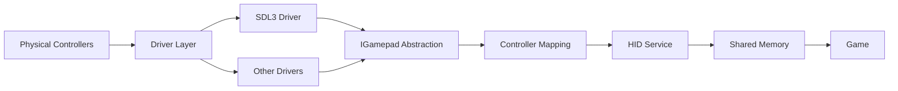

## Overview

Ryujinx's input system provides a flexible abstraction layer for various input devices, mapping host controllers to emulated Switch controllers. The architecture separates device drivers from HLE (High-Level Emulation) services:



<Info>
**Abstraction benefits:** Easy to add new input backends, consistent mapping across platforms, flexible configuration
</Info>

## Input Interfaces

Core abstractions from `src/Ryujinx.Input/`:

### IGamepadDriver

```csharp
public interface IGamepadDriver : IDisposable
{
    /// <summary>
    /// The name of the driver
    /// </summary>
    string DriverName { get; }
    
    /// <summary>
    /// Unique IDs of connected gamepads
    /// </summary>
    ReadOnlySpan<string> GamepadsIds { get; }
    
    /// <summary>
    /// Event triggered when a gamepad is connected
    /// </summary>
    event Action<string> OnGamepadConnected;
    
    /// <summary>
    /// Event triggered when a gamepad is disconnected
    /// </summary>
    event Action<string> OnGamepadDisconnected;
    
    /// <summary>
    /// Open a gamepad by unique ID
    /// </summary>
    IGamepad GetGamepad(string id);
    
    /// <summary>
    /// Returns all connected gamepads
    /// </summary>
    IEnumerable<IGamepad> GetGamepads();
    
    /// <summary>
    /// Clear internal state
    /// </summary>
    void Clear();
}
```

### IGamepad

```csharp
public interface IGamepad
{
    string Id { get; }
    string Name { get; }
    
    /// <summary>
    /// Supported features (rumble, motion, etc.)
    /// </summary>
    GamepadFeaturesFlag Features { get; }
    
    /// <summary>
    /// Current gamepad state snapshot
    /// </summary>
    GamepadStateSnapshot GetStateSnapshot();
    
    /// <summary>
    /// Current motion sensor data
    /// </summary>
    (Vector3 Accelerometer, Vector3 Gyroscope) GetMotionData();
    
    /// <summary>
    /// Set rumble/vibration
    /// </summary>
    void SetRumble(float lowFrequency, float highFrequency);
    
    /// <summary>
    /// Set player LED indicator
    /// </summary>
    void SetPlayerLed(int index);
}
```

### GamepadStateSnapshot

```csharp
public struct GamepadStateSnapshot
{
    /// <summary>
    /// Button states (bitfield)
    /// </summary>
    public GamepadButtonInputId Buttons { get; set; }
    
    /// <summary>
    /// Left stick position (-1.0 to 1.0)
    /// </summary>
    public (float X, float Y) LeftStick { get; set; }
    
    /// <summary>
    /// Right stick position (-1.0 to 1.0)
    /// </summary>
    public (float X, float Y) RightStick { get; set; }
    
    /// <summary>
    /// Left trigger value (0.0 to 1.0)
    /// </summary>
    public float LeftTrigger { get; set; }
    
    /// <summary>
    /// Right trigger value (0.0 to 1.0)
    /// </summary>
    public float RightTrigger { get; set; }
}
```

## Button Mapping

Button enumeration:

```csharp
[Flags]
public enum GamepadButtonInputId : uint
{
    Unbound       = 0,
    
    // Face buttons (Nintendo layout)
    A             = 1 << 0,
    B             = 1 << 1,
    X             = 1 << 2,
    Y             = 1 << 3,
    
    // Stick buttons
    LeftStick     = 1 << 4,
    RightStick    = 1 << 5,
    
    // Shoulder buttons
    LeftShoulder  = 1 << 6,
    RightShoulder = 1 << 7,
    
    // Triggers (as buttons when pressed past threshold)
    LeftTrigger   = 1 << 8,
    RightTrigger  = 1 << 9,
    
    // D-Pad
    DpadUp        = 1 << 10,
    DpadDown      = 1 << 11,
    DpadLeft      = 1 << 12,
    DpadRight     = 1 << 13,
    
    // System buttons
    Minus         = 1 << 14,  // Select/Back
    Plus          = 1 << 15,  // Start
    Guide         = 1 << 16,  // Home
    Capture       = 1 << 17,  // Screenshot
    
    // Additional buttons (Pro Controller, etc.)
    RightPaddle1  = 1 << 18,
    LeftPaddle1   = 1 << 19,
    RightPaddle2  = 1 << 20,
    LeftPaddle2   = 1 << 21,
    Touchpad      = 1 << 22,
    
    // Virtual buttons for stick directions
    LeftStickUp    = 1 << 23,
    LeftStickDown  = 1 << 24,
    LeftStickLeft  = 1 << 25,
    LeftStickRight = 1 << 26,
}
```

## SDL3 Driver Implementation

Primary input driver from `src/Ryujinx.Input.SDL3/SDL3Gamepad.cs`:

```csharp
public unsafe class SDL3Gamepad : IGamepad
{
    private SDL_Gamepad* _gamepadHandle;
    private readonly List<ButtonMappingEntry> _buttonsUserMapping;
    private StandardControllerInputConfig _configuration;
    
    // SDL3 button mapping to Ryujinx buttons
    private readonly SDL_GamepadButton[] _buttonsDriverMapping =
    [
        SDL_GamepadButton.SDL_GAMEPAD_BUTTON_INVALID,  // Unbound
        
        SDL_GamepadButton.SDL_GAMEPAD_BUTTON_EAST,     // A (Xbox: B)
        SDL_GamepadButton.SDL_GAMEPAD_BUTTON_SOUTH,    // B (Xbox: A)
        SDL_GamepadButton.SDL_GAMEPAD_BUTTON_NORTH,    // X (Xbox: Y)
        SDL_GamepadButton.SDL_GAMEPAD_BUTTON_WEST,     // Y (Xbox: X)
        
        SDL_GamepadButton.SDL_GAMEPAD_BUTTON_LEFT_STICK,
        SDL_GamepadButton.SDL_GAMEPAD_BUTTON_RIGHT_STICK,
        SDL_GamepadButton.SDL_GAMEPAD_BUTTON_LEFT_SHOULDER,
        SDL_GamepadButton.SDL_GAMEPAD_BUTTON_RIGHT_SHOULDER,
        
        // Triggers handled as axes
        SDL_GamepadButton.SDL_GAMEPAD_BUTTON_INVALID,
        SDL_GamepadButton.SDL_GAMEPAD_BUTTON_INVALID,
        
        SDL_GamepadButton.SDL_GAMEPAD_BUTTON_DPAD_UP,
        SDL_GamepadButton.SDL_GAMEPAD_BUTTON_DPAD_DOWN,
        SDL_GamepadButton.SDL_GAMEPAD_BUTTON_DPAD_LEFT,
        SDL_GamepadButton.SDL_GAMEPAD_BUTTON_DPAD_RIGHT,
        SDL_GamepadButton.SDL_GAMEPAD_BUTTON_BACK,     // Minus
        SDL_GamepadButton.SDL_GAMEPAD_BUTTON_START,    // Plus
        SDL_GamepadButton.SDL_GAMEPAD_BUTTON_GUIDE,    // Home
        SDL_GamepadButton.SDL_GAMEPAD_BUTTON_MISC1,    // Capture
        
        SDL_GamepadButton.SDL_GAMEPAD_BUTTON_RIGHT_PADDLE1,
        SDL_GamepadButton.SDL_GAMEPAD_BUTTON_LEFT_PADDLE1,
        SDL_GamepadButton.SDL_GAMEPAD_BUTTON_RIGHT_PADDLE2,
        SDL_GamepadButton.SDL_GAMEPAD_BUTTON_LEFT_PADDLE2,
        SDL_GamepadButton.SDL_GAMEPAD_BUTTON_TOUCHPAD,
    ];
    
    public SDL3Gamepad(SDL_Gamepad* gamepadHandle, string driverId)
    {
        _gamepadHandle = gamepadHandle;
        _buttonsUserMapping = new List<ButtonMappingEntry>(20);
        
        Name = SDL_GetGamepadName(_gamepadHandle);
        Id = driverId;
        Features = GetFeaturesFlag();
        
        // Auto-detect button layout (Xbox vs PlayStation)
        ConfigureFaceButtonMapping();
    }
}
```

### State Polling

```csharp
public GamepadStateSnapshot GetStateSnapshot()
{
    GamepadStateSnapshot snapshot = new();
    
    // Poll buttons
    for (int i = 0; i < _buttonsDriverMapping.Length; i++)
    {
        SDL_GamepadButton sdlButton = _buttonsDriverMapping[i];
        
        if (sdlButton != SDL_GamepadButton.SDL_GAMEPAD_BUTTON_INVALID)
        {
            if (SDL_GetGamepadButton(_gamepadHandle, sdlButton))
            {
                snapshot.Buttons |= (GamepadButtonInputId)(1u << i);
            }
        }
    }
    
    // Apply user button remapping
    snapshot.Buttons = ApplyButtonRemapping(snapshot.Buttons);
    
    // Poll left stick
    short lx = SDL_GetGamepadAxis(_gamepadHandle, SDL_GamepadAxis.SDL_GAMEPAD_AXIS_LEFTX);
    short ly = SDL_GetGamepadAxis(_gamepadHandle, SDL_GAMEPAD_AXIS_LEFTY);
    snapshot.LeftStick = (
        lx / 32768.0f,
        -ly / 32768.0f  // Invert Y axis
    );
    
    // Poll right stick
    short rx = SDL_GetGamepadAxis(_gamepadHandle, SDL_GAMEPAD_AXIS_RIGHTX);
    short ry = SDL_GetGamepadAxis(_gamepadHandle, SDL_GAMEPAD_AXIS_RIGHTY);
    snapshot.RightStick = (
        rx / 32768.0f,
        -ry / 32768.0f
    );
    
    // Poll triggers
    short lt = SDL_GetGamepadAxis(_gamepadHandle, SDL_GAMEPAD_AXIS_LEFT_TRIGGER);
    short rt = SDL_GetGamepadAxis(_gamepadHandle, SDL_GAMEPAD_AXIS_RIGHT_TRIGGER);
    snapshot.LeftTrigger = lt / 32768.0f;
    snapshot.RightTrigger = rt / 32768.0f;
    
    // Convert trigger to button press if past threshold
    if (snapshot.LeftTrigger > _triggerThreshold)
        snapshot.Buttons |= GamepadButtonInputId.LeftTrigger;
    if (snapshot.RightTrigger > _triggerThreshold)
        snapshot.Buttons |= GamepadButtonInputId.RightTrigger;
    
    return snapshot;
}
```

### Face Button Auto-Detection

SDL3 provides button label information:

```csharp
private void ConfigureFaceButtonMapping()
{
    // Get physical button labels from SDL3
    SDL_GamepadButton[] faceButtons = _buttonsDriverMapping[1..5];
    
    foreach (SDL_GamepadButton btn in faceButtons)
    {
        int mapId = SDL_GetGamepadButtonLabel(_gamepadHandle, btn) switch
        {
            // Xbox layout: A, B, X, Y
            SDL_GamepadButtonLabel.SDL_GAMEPAD_BUTTON_LABEL_A => 1,
            SDL_GamepadButtonLabel.SDL_GAMEPAD_BUTTON_LABEL_B => 2,
            SDL_GamepadButtonLabel.SDL_GAMEPAD_BUTTON_LABEL_X => 3,
            SDL_GamepadButtonLabel.SDL_GAMEPAD_BUTTON_LABEL_Y => 4,
            
            // PlayStation layout: Cross, Circle, Square, Triangle
            SDL_GamepadButtonLabel.SDL_GAMEPAD_BUTTON_LABEL_CROSS    => 1,
            SDL_GamepadButtonLabel.SDL_GAMEPAD_BUTTON_LABEL_CIRCLE   => 2,
            SDL_GamepadButtonLabel.SDL_GAMEPAD_BUTTON_LABEL_SQUARE   => 3,
            SDL_GamepadButtonLabel.SDL_GAMEPAD_BUTTON_LABEL_TRIANGLE => 4,
            
            _ => -1
        };
        
        if (mapId != -1)
        {
            // Store mapping for automatic layout adaptation
            _faceButtonLayout[btn] = (GamepadButtonInputId)(1u << mapId);
        }
    }
}
```

<Info>
**Smart mapping:** Automatically adapts to Xbox (ABXY) vs PlayStation (Cross/Circle/Square/Triangle) layouts
</Info>

## Motion Controls

Gyroscope and accelerometer support:

```csharp
public (Vector3 Accelerometer, Vector3 Gyroscope) GetMotionData()
{
    if (!SDL_GamepadHasSensor(_gamepadHandle, SDL_SensorType.SDL_SENSOR_ACCEL) ||
        !SDL_GamepadHasSensor(_gamepadHandle, SDL_SensorType.SDL_SENSOR_GYRO))
    {
        return (Vector3.Zero, Vector3.Zero);
    }
    
    // Read accelerometer (m/s²)
    float[] accelData = new float[3];
    SDL_GetGamepadSensorData(_gamepadHandle, 
                            SDL_SensorType.SDL_SENSOR_ACCEL,
                            accelData, 3);
    
    Vector3 accel = new Vector3(
        accelData[0],
        accelData[1],
        accelData[2]
    );
    
    // Read gyroscope (rad/s)
    float[] gyroData = new float[3];
    SDL_GetGamepadSensorData(_gamepadHandle,
                            SDL_SensorType.SDL_SENSOR_GYRO,
                            gyroData, 3);
    
    Vector3 gyro = new Vector3(
        gyroData[0],
        gyroData[1],
        gyroData[2]
    );
    
    // Apply calibration if configured
    if (_motionCalibration != null)
    {
        accel = _motionCalibration.CalibrateAccel(accel);
        gyro = _motionCalibration.CalibrateGyro(gyro);
    }
    
    return (accel, gyro);
}
```

**Motion calibration:**

```csharp
public class MotionCalibration
{
    public Vector3 AccelOffset { get; set; }
    public Vector3 GyroOffset { get; set; }
    public float AccelSensitivity { get; set; } = 1.0f;
    public float GyroSensitivity { get; set; } = 1.0f;
    
    public Vector3 CalibrateAccel(Vector3 raw)
    {
        return (raw - AccelOffset) * AccelSensitivity;
    }
    
    public Vector3 CalibrateGyro(Vector3 raw)
    {
        return (raw - GyroOffset) * GyroSensitivity;
    }
    
    public void PerformCalibration(IGamepad gamepad, int sampleCount = 100)
    {
        Vector3 accelSum = Vector3.Zero;
        Vector3 gyroSum = Vector3.Zero;
        
        for (int i = 0; i < sampleCount; i++)
        {
            var (accel, gyro) = gamepad.GetMotionData();
            accelSum += accel;
            gyroSum += gyro;
            Thread.Sleep(10);
        }
        
        AccelOffset = accelSum / sampleCount;
        GyroOffset = gyroSum / sampleCount;
    }
}
```

## Rumble/Haptics

```csharp
public void SetRumble(float lowFrequency, float highFrequency)
{
    if (!SDL_GamepadHasRumble(_gamepadHandle))
        return;
    
    // Convert 0.0-1.0 to 0-65535
    ushort low = (ushort)(Math.Clamp(lowFrequency, 0.0f, 1.0f) * 65535);
    ushort high = (ushort)(Math.Clamp(highFrequency, 0.0f, 1.0f) * 65535);
    
    // Set rumble with 1 second duration (can be infinite with 0xFFFFFFFF)
    SDL_RumbleGamepad(_gamepadHandle, low, high, 1000);
}

public void SetRumbleTriggers(float leftTrigger, float rightTrigger)
{
    if (!SDL_GamepadHasRumbleTriggers(_gamepadHandle))
        return;
    
    ushort left = (ushort)(Math.Clamp(leftTrigger, 0.0f, 1.0f) * 65535);
    ushort right = (ushort)(Math.Clamp(rightTrigger, 0.0f, 1.0f) * 65535);
    
    SDL_RumbleGamepadTriggers(_gamepadHandle, left, right, 1000);
}
```

**HD Rumble emulation:**

```csharp
public void SetHDRumble(float lowFreqLeft, float highFreqLeft,
                       float lowFreqRight, float highFreqRight)
{
    // Switch supports independent left/right Joy-Con rumble
    // Approximate with combined rumble on standard controllers
    
    float lowFreq = (lowFreqLeft + lowFreqRight) / 2.0f;
    float highFreq = (highFreqLeft + highFreqRight) / 2.0f;
    
    SetRumble(lowFreq, highFreq);
}
```

## Controller Configuration

User-configurable button mapping:

```csharp
public class StandardControllerInputConfig
{
    public Dictionary<GamepadButtonInputId, GamepadButtonInputId> ButtonMapping { get; set; }
    public Dictionary<StickInputId, StickInputId> StickMapping { get; set; }
    
    public float TriggerThreshold { get; set; } = 0.5f;
    public float StickDeadzone { get; set; } = 0.1f;
    public float StickRange { get; set; } = 1.0f;
    
    public bool EnableMotion { get; set; } = true;
    public bool EnableRumble { get; set; } = true;
    
    public MotionCalibration MotionCalibration { get; set; }
}

public void ApplyConfiguration(StandardControllerInputConfig config)
{
    _configuration = config;
    _triggerThreshold = config.TriggerThreshold;
    
    // Build user button remapping
    _buttonsUserMapping.Clear();
    foreach (var (from, to) in config.ButtonMapping)
    {
        _buttonsUserMapping.Add(new ButtonMappingEntry(to, from));
    }
    
    // Configure sticks
    foreach (var (from, to) in config.StickMapping)
    {
        _stickUserMapping[(int)from] = to;
    }
}
```

## HID Service Integration

Input data flows to the HID (Human Interface Device) shared memory:

```csharp
public class HidService
{
    private readonly KSharedMemory _hidSharedMemory;
    private readonly IGamepadDriver _gamepadDriver;
    
    public void Update()
    {
        // Get connected gamepads
        IEnumerable<IGamepad> gamepads = _gamepadDriver.GetGamepads();
        
        int playerIndex = 0;
        foreach (IGamepad gamepad in gamepads)
        {
            if (playerIndex >= 8)  // Max 8 players
                break;
            
            // Get current state
            GamepadStateSnapshot state = gamepad.GetStateSnapshot();
            
            // Write to HID shared memory
            WriteControllerState(playerIndex, state);
            
            // Handle motion if supported
            if (gamepad.Features.HasFlag(GamepadFeaturesFlag.Motion))
            {
                var (accel, gyro) = gamepad.GetMotionData();
                WriteMotionState(playerIndex, accel, gyro);
            }
            
            playerIndex++;
        }
    }
    
    private void WriteControllerState(int index, GamepadStateSnapshot state)
    {
        // HID shared memory format matches Switch hardware layout
        Span<byte> hidMem = _hidSharedMemory.GetSpan();
        
        int offset = GetControllerOffset(index);
        
        // Write button state
        BinaryPrimitives.WriteUInt32LittleEndian(
            hidMem.Slice(offset + 0x00), 
            (uint)state.Buttons);
        
        // Write stick positions (convert float to fixed-point)
        WriteStickData(hidMem, offset + 0x04, state.LeftStick);
        WriteStickData(hidMem, offset + 0x08, state.RightStick);
        
        // Write trigger values
        hidMem[offset + 0x0C] = (byte)(state.LeftTrigger * 255);
        hidMem[offset + 0x0D] = (byte)(state.RightTrigger * 255);
        
        // Increment sample number
        ulong sampleNumber = BinaryPrimitives.ReadUInt64LittleEndian(
            hidMem.Slice(offset + 0x10));
        BinaryPrimitives.WriteUInt64LittleEndian(
            hidMem.Slice(offset + 0x10),
            sampleNumber + 1);
    }
}
```

## Stick Processing

Deadzone and calibration:

```csharp
public static (float X, float Y) ApplyStickTransform(
    (float X, float Y) raw,
    float deadzone,
    float range)
{
    float x = raw.X;
    float y = raw.Y;
    
    // Calculate magnitude
    float magnitude = MathF.Sqrt(x * x + y * y);
    
    if (magnitude < deadzone)
    {
        // Inside deadzone - return zero
        return (0.0f, 0.0f);
    }
    
    // Apply deadzone compensation
    float normalizedMag = (magnitude - deadzone) / (range - deadzone);
    normalizedMag = Math.Clamp(normalizedMag, 0.0f, 1.0f);
    
    // Preserve direction
    float angle = MathF.Atan2(y, x);
    
    return (
        MathF.Cos(angle) * normalizedMag,
        MathF.Sin(angle) * normalizedMag
    );
}
```

**Radial vs axial deadzone:**

<Tabs>
<Tab title="Radial (Default)">
```csharp
// Circular deadzone - better for precise aiming
float magnitude = MathF.Sqrt(x * x + y * y);
if (magnitude < deadzone)
    return (0, 0);
```

**Pros:** Natural feel, preserves all directions equally
</Tab>

<Tab title="Axial">
```csharp
// Per-axis deadzone - better for platformers
float xOut = Math.Abs(x) < deadzone ? 0 : x;
float yOut = Math.Abs(y) < deadzone ? 0 : y;
return (xOut, yOut);
```

**Pros:** Easier cardinal directions, better for 2D games
</Tab>
</Tabs>

## Keyboard/Mouse Support

Keyboard input mapped to controller:

```csharp
public class KeyboardGamepad : IGamepad
{
    private readonly IKeyboard _keyboard;
    private readonly Dictionary<Key, GamepadButtonInputId> _keyMap;
    
    public KeyboardGamepad(IKeyboard keyboard)
    {
        _keyboard = keyboard;
        _keyMap = new Dictionary<Key, GamepadButtonInputId>
        {
            { Key.J, GamepadButtonInputId.A },
            { Key.K, GamepadButtonInputId.B },
            { Key.U, GamepadButtonInputId.X },
            { Key.I, GamepadButtonInputId.Y },
            { Key.W, GamepadButtonInputId.DpadUp },
            { Key.S, GamepadButtonInputId.DpadDown },
            { Key.A, GamepadButtonInputId.DpadLeft },
            { Key.D, GamepadButtonInputId.DpadRight },
            // ... more mappings
        };
    }
    
    public GamepadStateSnapshot GetStateSnapshot()
    {
        KeyboardStateSnapshot keyState = _keyboard.GetStateSnapshot();
        GamepadStateSnapshot gamepadState = new();
        
        // Map keys to buttons
        foreach (var (key, button) in _keyMap)
        {
            if (keyState.IsPressed(key))
            {
                gamepadState.Buttons |= button;
            }
        }
        
        // Simulate analog sticks with keyboard (WASD for left stick)
        float lx = 0, ly = 0;
        if (keyState.IsPressed(Key.Left))  lx -= 1.0f;
        if (keyState.IsPressed(Key.Right)) lx += 1.0f;
        if (keyState.IsPressed(Key.Up))    ly += 1.0f;
        if (keyState.IsPressed(Key.Down))  ly -= 1.0f;
        
        // Normalize diagonal movement
        float magnitude = MathF.Sqrt(lx * lx + ly * ly);
        if (magnitude > 1.0f)
        {
            lx /= magnitude;
            ly /= magnitude;
        }
        
        gamepadState.LeftStick = (lx, ly);
        
        return gamepadState;
    }
}
```

## Controller Types

Supported controller emulation:

<Tabs>
<Tab title="Pro Controller">
```csharp
public enum ControllerType
{
    ProController = 3,  // Full-featured controller
}

// Features:
// - All buttons and sticks
// - HD Rumble
// - Motion controls (6-axis)
// - NFC (amiibo)
// - Player LEDs
```
</Tab>

<Tab title="Joy-Con Pair">
```csharp
public enum ControllerType
{
    JoyConPair = 0,  // Left + Right Joy-Con
}

// Features:
// - Split into left/right
// - Independent rumble
// - Motion in each Joy-Con
// - IR camera (right Joy-Con)
```
</Tab>

<Tab title="Handheld">
```csharp
public enum ControllerType
{
    Handheld = 2,  // Attached Joy-Cons
}

// Features:
// - Same as Joy-Con Pair
// - Always connected
// - Can't be detached
```
</Tab>
</Tabs>

## Performance Considerations

<CardGroup cols={3}>
<Card title="Polling Rate" icon="clock">
**Typical rates:**
- 60 Hz: Most games
- 120 Hz: Fast-paced games
- 1000 Hz: Hardware polling

**Overhead:** Less than 0.1ms per poll
</Card>

<Card title="Latency" icon="stopwatch">
**Input-to-display:**
- USB: 1-4ms
- Bluetooth: 3-10ms
- Processing: Less than 1ms

**Total:** 4-15ms typical
</Card>

<Card title="Memory" icon="memory">
**Per controller:**
- Driver state: Less than 1 KB
- Rumble queue: ~4 KB
- Mapping config: Less than 1 KB

**Total:** ~65 KB per controller
</Card>
</CardGroup>

## Configuration Example

```json
{
  "input": {
    "player1": {
      "controller_type": "ProController",
      "input_backend": "SDL",
      "device_id": "030000005e040000120b000011050000",
      
      "button_mapping": {
        "a": "A",
        "b": "B",
        "x": "X",
        "y": "Y"
      },
      
      "trigger_threshold": 0.5,
      "stick_deadzone": 0.1,
      "stick_range": 1.0,
      
      "enable_motion": true,
      "enable_rumble": true,
      
      "motion_calibration": {
        "accel_offset": [0.0, 0.0, 0.0],
        "gyro_offset": [0.0, 0.0, 0.0],
        "accel_sensitivity": 1.0,
        "gyro_sensitivity": 1.0
      }
    }
  }
}
```

## Debugging Tools

<CardGroup cols={2}>
<Card title="Input Viewer" icon="eye">
Visual input overlay:
```csharp
ShowInputOverlay = true
// Displays button states and stick positions
```
</Card>

<Card title="Input Logging" icon="list">
Log all input events:
```csharp
EnableInputLogging = true
// Logs button presses and releases
```
</Card>

<Card title="Latency Monitor" icon="chart-line">
Measure input latency:
```csharp
ShowLatencyStats = true
// Displays input-to-render time
```
</Card>

<Card title="Device Info" icon="info-circle">
Controller capabilities:
```csharp
LogControllerInfo = true
// Lists detected features
```
</Card>
</CardGroup>

## Related Topics

<CardGroup cols={2}>
<Card title="HLE Services" icon="server" href="/architecture/hle">
HID service implementation
</Card>

<Card title="Configuration" icon="gear" href="/guides/configuration/controls">
Controller setup guide
</Card>

<Card title="Troubleshooting" icon="wrench" href="/guides/troubleshooting">
Resolving input issues
</Card>

<Card title="Motion Controls" icon="rotate" href="/guides/features/motion-controls">
Using motion controls
</Card>
</CardGroup>

## Source Code Reference

- `src/Ryujinx.Input/IGamepadDriver.cs:9` - Driver interface
- `src/Ryujinx.Input/IGamepad.cs` - Gamepad interface
- `src/Ryujinx.Input.SDL3/SDL3Gamepad.cs:14` - SDL3 implementation
- `src/Ryujinx.Input/Motion/` - Motion handling
- `src/Ryujinx.HLE/HOS/Services/Hid/` - HID service
