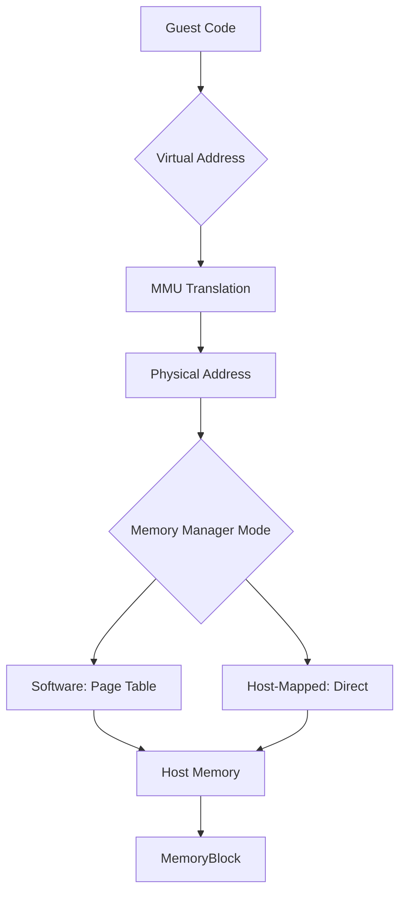

## Overview

Ryujinx implements sophisticated memory management to emulate the Nintendo Switch's memory hierarchy. The system provides:

<CardGroup cols={3}>
<Card title="Address Translation" icon="map">
64-bit guest virtual addresses mapped to host memory
</Card>

<Card title="MMU Emulation" icon="gear">
Page tables, memory protection, and access tracking
</Card>

<Card title="Multiple Modes" icon="layer-group">
Software-managed and host-mapped implementations
</Card>
</CardGroup>

## Memory Architecture



## Memory Block

The fundamental memory allocation unit from `src/Ryujinx.Memory/MemoryBlock.cs`:

```csharp
public sealed class MemoryBlock : IWritableBlock, IDisposable
{
    private readonly bool _usesSharedMemory;
    private readonly bool _isMirror;
    private readonly bool _viewCompatible;
    private readonly bool _forJit;
    private nint _sharedMemory;
    private nint _pointer;
    
    /// <summary>
    /// Pointer to the memory block data
    /// </summary>
    public nint Pointer => _pointer;
    
    /// <summary>
    /// Size of the memory block
    /// </summary>
    public ulong Size { get; }
    
    public MemoryBlock(ulong size, MemoryAllocationFlags flags = MemoryAllocationFlags.None)
    {
        if (flags.HasFlag(MemoryAllocationFlags.Mirrorable))
        {
            // Create shared memory for mirroring
            _sharedMemory = MemoryManagement.CreateSharedMemory(
                size, 
                flags.HasFlag(MemoryAllocationFlags.Reserve));
            
            if (!flags.HasFlag(MemoryAllocationFlags.NoMap))
            {
                _pointer = MemoryManagement.MapSharedMemory(_sharedMemory, size);
            }
            
            _usesSharedMemory = true;
        }
        else if (flags.HasFlag(MemoryAllocationFlags.Reserve))
        {
            // Reserve address space without committing
            _viewCompatible = flags.HasFlag(MemoryAllocationFlags.ViewCompatible);
            _forJit = flags.HasFlag(MemoryAllocationFlags.Jit);
            _pointer = MemoryManagement.Reserve(size, _forJit, _viewCompatible);
        }
        else
        {
            // Direct allocation
            _forJit = flags.HasFlag(MemoryAllocationFlags.Jit);
            _pointer = MemoryManagement.Allocate(size, _forJit);
        }
        
        Size = size;
    }
}
```

### Memory Allocation Flags

```csharp
[Flags]
public enum MemoryAllocationFlags
{
    None = 0,
    
    /// <summary>
    /// Reserve address space without committing physical memory
    /// </summary>
    Reserve = 1 << 0,
    
    /// <summary>
    /// Enable mirroring to multiple virtual addresses
    /// </summary>
    Mirrorable = 1 << 1,
    
    /// <summary>
    /// Don't map immediately (for deferred mapping)
    /// </summary>
    NoMap = 1 << 2,
    
    /// <summary>
    /// Memory will contain JIT code (requires executable permission)
    /// </summary>
    Jit = 1 << 3,
    
    /// <summary>
    /// Compatible with MapView operations
    /// </summary>
    ViewCompatible = 1 << 4,
}
```

<AccordionGroup>
<Accordion title="Reserve" icon="bookmark">
Reserves virtual address space without allocating physical memory. Physical pages are committed on-demand:

```csharp
// Reserve 4GB address space
MemoryBlock block = new(4UL * 1024 * 1024 * 1024, MemoryAllocationFlags.Reserve);

// Commit 1MB at offset 0x10000
block.Commit(0x10000, 1024 * 1024);
```

**Benefits:** Reduces memory usage for sparse allocations
</Accordion>

<Accordion title="Mirrorable" icon="clone">
Enables creating multiple mappings of the same physical memory:

```csharp
MemoryBlock primary = new(size, MemoryAllocationFlags.Mirrorable);
MemoryBlock mirror = primary.CreateMirror();

// Writes to either mapping are visible in both
primary.Write(0, data);
assert(mirror.Read(0) == data);
```

**Use cases:** Implementing memory aliasing, shared memory regions
</Accordion>

<Accordion title="Jit" icon="code">
Marks memory as containing executable code, enabling proper permissions:

```csharp
MemoryBlock jitBlock = new(size, MemoryAllocationFlags.Jit | MemoryAllocationFlags.Reserve);
jitBlock.Commit(0, codeSize);
jitBlock.Reprotect(0, codeSize, MemoryPermission.ReadAndExecute);
```

**Critical for:** ARMeilleure JIT compilation
</Accordion>
</AccordionGroup>

### Memory Operations

<Tabs>
<Tab title="Commit/Decommit">
```csharp
// Commit physical memory for a region
public void Commit(ulong offset, ulong size)
{
    MemoryManagement.Commit(GetPointerInternal(offset, size), size, _forJit);
}

// Decommit (free) physical memory
public void Decommit(ulong offset, ulong size)
{
    MemoryManagement.Decommit(GetPointerInternal(offset, size), size);
}
```

**Purpose:** On-demand memory allocation for large sparse regions
</Tab>

<Tab title="Memory Protection">
```csharp
public enum MemoryPermission
{
    None = 0,
    Read = 1 << 0,
    Write = 1 << 1,
    Execute = 1 << 2,
    
    ReadAndWrite = Read | Write,
    ReadAndExecute = Read | Execute,
}

public void Reprotect(ulong offset, ulong size, MemoryPermission permission)
{
    nint ptr = GetPointerInternal(offset, size);
    MemoryManagement.Reprotect(ptr, size, permission, _forJit);
}
```

**Use cases:** 
- JIT code protection
- Memory tracking (mark read-only to detect writes)
- Security isolation
</Tab>

<Tab title="View Mapping">
```csharp
// Map a view from another memory block
public void MapView(MemoryBlock srcBlock, 
                   ulong srcOffset,
                   ulong dstOffset, 
                   ulong size)
{
    if (srcBlock._sharedMemory == nint.Zero)
    {
        throw new ArgumentException(
            "Source block must be mirrorable");
    }
    
    MemoryManagement.MapView(
        srcBlock._sharedMemory,
        srcOffset,
        GetPointerInternal(dstOffset, size),
        size,
        this);
}

// Unmap a view
public void UnmapView(MemoryBlock srcBlock, ulong offset, ulong size)
{
    MemoryManagement.UnmapView(srcBlock._sharedMemory, offset, size, this);
}
```

**Purpose:** Alias memory regions without copying data
</Tab>
</Tabs>

## Virtual Memory Managers

Ryujinx provides two implementations of `IVirtualMemoryManager`:

### Address Space Manager (Software Mode)

From `src/Ryujinx.Memory/AddressSpaceManager.cs`:

```csharp
public sealed class AddressSpaceManager : VirtualMemoryManagerBase, IVirtualMemoryManager
{
    public bool UsesPrivateAllocations => false;
    
    public int AddressSpaceBits { get; }
    
    private readonly MemoryBlock _backingMemory;
    private readonly PageTable<nuint> _pageTable;
    
    protected override ulong AddressSpaceSize { get; }
    
    public AddressSpaceManager(MemoryBlock backingMemory, ulong addressSpaceSize)
    {
        ulong asSize = PageSize;
        int asBits = PageBits;
        
        // Round up to next power of 2
        while (asSize < addressSpaceSize)
        {
            asSize <<= 1;
            asBits++;
        }
        
        AddressSpaceBits = asBits;
        AddressSpaceSize = asSize;
        _backingMemory = backingMemory;
        _pageTable = new PageTable<nuint>();
    }
    
    public void Map(ulong va, ulong pa, ulong size, MemoryMapFlags flags)
    {
        AssertValidAddressAndSize(va, size);
        
        while (size != 0)
        {
            _pageTable.Map(va, (nuint)(ulong)_backingMemory.GetPointer(pa, PageSize));
            
            va += PageSize;
            pa += PageSize;
            size -= PageSize;
        }
    }
    
    public void Unmap(ulong va, ulong size)
    {
        AssertValidAddressAndSize(va, size);
        
        while (size != 0)
        {
            _pageTable.Unmap(va);
            va += PageSize;
            size -= PageSize;
        }
    }
}
```

**Characteristics:**
- **Software page table**: Explicit VA → PA mapping
- **Flexible**: Supports arbitrary mappings
- **Overhead**: Page table lookup on every access
- **Memory efficient**: Single backing store

**When used:** Default mode, maximum compatibility

### Memory Manager (Host-Mapped Mode)

From `src/Ryujinx.Memory/MemoryManager.cs` (file not shown, but similar structure):

```csharp
public sealed class MemoryManager : VirtualMemoryManagerBase, IVirtualMemoryManager
{
    public bool UsesPrivateAllocations => true;
    
    private readonly MemoryBlock _backingMemory;
    private readonly InvalidAccessHandler _invalidAccessHandler;
    
    // Direct mapping: guest VA = host address
    public void Map(ulong va, ulong pa, ulong size, MemoryMapFlags flags)
    {
        // Map guest memory directly into host address space
        _backingMemory.MapView(sourceBlock, pa, va, size);
    }
    
    public nuint GetPointer(ulong va, ulong size)
    {
        // Direct pointer arithmetic - no table lookup!
        return _backingMemory.Pointer + (nint)va;
    }
}
```

**Characteristics:**
- **Direct mapping**: Guest VA directly corresponds to host address
- **Zero overhead**: No page table lookup
- **Fast**: Maximum performance
- **Requires**: Large host address space (64-bit only)

**When used:** High-performance mode, when host has sufficient address space

### Comparison

<CardGroup cols={2}>
<Card title="Software (AddressSpaceManager)" icon="table">
**Pros:**
- Works on 32-bit hosts
- Flexible memory layout
- Lower memory usage

**Cons:**
- Page table lookup overhead
- Slower memory access
- Additional memory for page tables
</Card>

<Card title="Host-Mapped (MemoryManager)" icon="bolt">
**Pros:**
- Zero translation overhead
- Maximum performance
- Simple implementation

**Cons:**
- Requires 64-bit host
- Uses more address space
- Less flexible
</Card>
</CardGroup>

## Page Tables

Multi-level page table for address translation:

```csharp
public class PageTable<T> where T : unmanaged
{
    private const int PageBits = 12;  // 4KB pages
    private const int PageSize = 1 << PageBits;
    private const int PageMask = PageSize - 1;
    
    private const int PtLevelBits = 9;  // 512 entries per level
    private const int PtLevelSize = 1 << PtLevelBits;
    private const int PtLevelMask = PtLevelSize - 1;
    
    // Multi-level page table structure
    private T[][][] _pageTable;  // 3-level table for 39-bit VA space
    
    public void Map(ulong va, T pa)
    {
        int l1Index = (int)((va >> (PageBits + PtLevelBits * 2)) & PtLevelMask);
        int l2Index = (int)((va >> (PageBits + PtLevelBits)) & PtLevelMask);
        int l3Index = (int)((va >> PageBits) & PtLevelMask);
        
        if (_pageTable[l1Index] == null)
            _pageTable[l1Index] = new T[PtLevelSize][];
        
        if (_pageTable[l1Index][l2Index] == null)
            _pageTable[l1Index][l2Index] = new T[PtLevelSize];
        
        _pageTable[l1Index][l2Index][l3Index] = pa;
    }
    
    public T GetPointer(ulong va)
    {
        int l1Index = (int)((va >> (PageBits + PtLevelBits * 2)) & PtLevelMask);
        int l2Index = (int)((va >> (PageBits + PtLevelBits)) & PtLevelMask);
        int l3Index = (int)((va >> PageBits) & PtLevelMask);
        
        return _pageTable[l1Index][l2Index][l3Index];
    }
}
```

**Page table structure:**
```
39-bit Virtual Address:
[38:30] [29:21] [20:12] [11:0]
  L1      L2      L3    Offset
 
512    x 512   x 512  x 4096 = 512 GB address space
```

<Info>
**Memory efficiency:** Level tables allocated on-demand, minimizing memory overhead for sparse mappings
</Info>

## Memory Tracking

Detect and handle memory modifications:

```csharp
public class MemoryTracking
{
    private readonly MemoryBlock _block;
    private readonly Dictionary<ulong, RegionHandle> _handles;
    
    // Register a region for tracking
    public RegionHandle BeginTracking(ulong address, ulong size)
    {
        RegionHandle handle = new RegionHandle(this, address, size);
        _handles[address] = handle;
        
        // Mark region as read-only to trigger faults
        _block.Reprotect(address, size, MemoryPermission.Read);
        
        return handle;
    }
    
    // Called when guest writes to tracked region
    public void OnInvalidAccess(ulong address, bool write)
    {
        if (write)
        {
            // Find affected handles
            foreach (var handle in GetOverlappingHandles(address))
            {
                handle.SignalModified();
                
                // Re-enable write access
                _block.Reprotect(handle.Address, handle.Size, 
                               MemoryPermission.ReadAndWrite);
            }
        }
    }
}

public class RegionHandle
{
    public ulong Address { get; }
    public ulong Size { get; }
    public bool Dirty { get; private set; }
    
    public Action OnModified { get; set; }
    
    internal void SignalModified()
    {
        Dirty = true;
        OnModified?.Invoke();
    }
    
    public void Reprotect()
    {
        Dirty = false;
        // Re-protect region as read-only
    }
}
```

**Use cases:**
- **Texture cache invalidation**: Detect when guest modifies texture data
- **Shader cache invalidation**: Detect code modification
- **Buffer coherency**: Track buffer updates for GPU synchronization

## Memory Regions

Guest memory is divided into regions:

```csharp
public enum MemoryRegion
{
    Application,     // Game code and data
    Applet,         // System applets
    NvServices,     // GPU and multimedia
    System,         // System modules
}

public class MemoryArrange
{
    // Memory region configurations
    public static readonly MemoryArrange MemoryArrange4GB = new()
    {
        ApplicationSize = 0xcd500000,  // 3285 MB
        AppletSize      = 0x1fb00000,  // 507 MB
        NvServicesSize  = 0x2c000000,  // 704 MB  
        SystemSize      = 0x02c00000,  // 44 MB
    };
    
    public static readonly MemoryArrange MemoryArrange6GB = new()
    {
        ApplicationSize = 0xef600000,  // 3830 MB
        AppletSize      = 0x1fb00000,  // 507 MB
        NvServicesSize  = 0x8e000000,  // 2272 MB
        SystemSize      = 0x02c00000,  // 44 MB
    };
}
```

**Memory layout (4GB mode):**
```
0x0000000000 - 0x00cd500000: Application (3285 MB)
0x00cd500000 - 0x00ec400000: Applet (507 MB)
0x00ec400000 - 0x0118400000: NvServices (704 MB)
0x0118400000 - 0x011b000000: System (44 MB)
```

## Invalid Access Handler

Handles invalid memory accesses gracefully:

```csharp
public delegate bool InvalidAccessHandler(ulong va, bool write);

public class MemoryBlock
{
    private InvalidAccessHandler _invalidAccessHandler;
    
    public void SetInvalidAccessHandler(InvalidAccessHandler handler)
    {
        _invalidAccessHandler = handler;
        
        // Register native exception handler
        if (OperatingSystem.IsWindows())
        {
            AddVectoredExceptionHandler(1, ExceptionHandler);
        }
        else
        {
            // Install SIGSEGV handler on Unix
        }
    }
    
    private long ExceptionHandler(nint exceptionInfo)
    {
        // Parse exception details
        ulong faultAddress = GetFaultAddress(exceptionInfo);
        bool isWrite = IsWriteAccess(exceptionInfo);
        
        // Check if in managed memory range
        if (faultAddress >= (ulong)_pointer && 
            faultAddress < (ulong)_pointer + Size)
        {
            ulong offset = faultAddress - (ulong)_pointer;
            
            // Invoke handler
            if (_invalidAccessHandler?.Invoke(offset, isWrite) == true)
            {
                return EXCEPTION_CONTINUE_EXECUTION;  // Handler fixed it
            }
        }
        
        return EXCEPTION_CONTINUE_SEARCH;  // Not handled
    }
}
```

**Applications:**
- Memory tracking (write detection)
- Lazy memory allocation
- Access violation debugging

## Platform-Specific Memory Management

<Tabs>
<Tab title="Windows">
```csharp
public static class MemoryManagementWindows
{
    [DllImport("kernel32.dll")]
    private static extern nint VirtualAlloc(
        nint lpAddress,
        nuint dwSize,
        AllocationType flAllocationType,
        MemoryProtection flProtect);
    
    [DllImport("kernel32.dll")]
    private static extern bool VirtualProtect(
        nint lpAddress,
        nuint dwSize,
        MemoryProtection flNewProtect,
        out MemoryProtection lpflOldProtect);
    
    public static nint Allocate(ulong size, bool forJit)
    {
        MemoryProtection protection = forJit 
            ? MemoryProtection.ExecuteReadWrite
            : MemoryProtection.ReadWrite;
        
        return VirtualAlloc(
            nint.Zero,
            (nuint)size,
            AllocationType.Commit | AllocationType.Reserve,
            protection);
    }
}
```
</Tab>

<Tab title="Linux/Unix">
```csharp
public static class MemoryManagementUnix
{
    [DllImport("libc", SetLastError = true)]
    private static extern nint mmap(
        nint addr,
        nuint length,
        MmapProts prot,
        MmapFlags flags,
        int fd,
        long offset);
    
    [DllImport("libc", SetLastError = true)]
    private static extern int mprotect(
        nint addr,
        nuint len,
        MmapProts prot);
    
    public static nint Allocate(ulong size, bool forJit)
    {
        MmapProts prot = MmapProts.PROT_READ | MmapProts.PROT_WRITE;
        if (forJit)
            prot |= MmapProts.PROT_EXEC;
        
        return mmap(
            nint.Zero,
            (nuint)size,
            prot,
            MmapFlags.MAP_PRIVATE | MmapFlags.MAP_ANONYMOUS,
            -1,
            0);
    }
}
```
</Tab>

<Tab title="macOS">
```csharp
public static class MemoryManagementMacOS
{
    // Similar to Unix but with additional restrictions
    // for JIT memory due to security policies
    
    [DllImport("libSystem.dylib")]
    private static extern int pthread_jit_write_protect_np(int enabled);
    
    public static void SetJitWriteProtection(bool enabled)
    {
        // Required on Apple Silicon for JIT compilation
        pthread_jit_write_protect_np(enabled ? 1 : 0);
    }
}
```
</Tab>
</Tabs>

## Memory Statistics

```csharp
public class MemoryStats
{
    public ulong TotalAllocated { get; set; }
    public ulong TotalCommitted { get; set; }
    public ulong TotalReserved { get; set; }
    
    public Dictionary<MemoryRegion, ulong> RegionUsage { get; }
    
    public void PrintStats()
    {
        Logger.Info($"Memory Statistics:");
        Logger.Info($"  Allocated:  {TotalAllocated / 1024 / 1024} MB");
        Logger.Info($"  Committed:  {TotalCommitted / 1024 / 1024} MB");
        Logger.Info($"  Reserved:   {TotalReserved / 1024 / 1024} MB");
        
        Logger.Info($"Region Usage:");
        foreach (var (region, size) in RegionUsage)
        {
            Logger.Info($"  {region}: {size / 1024 / 1024} MB");
        }
    }
}
```

## Performance Considerations

<AccordionGroup>
<Accordion title="Page Size" icon="file-lines">
**4KB pages:**
- Standard page size
- Fine-grained protection
- Higher page table memory overhead

**64KB pages (experimental):**
- Reduced page table size
- Coarser protection granularity
- Better for large allocations
</Accordion>

<Accordion title="Memory Mode Selection" icon="toggle-on">
**Auto-detect:**
```csharp
bool use64BitAddressSpace = Environment.Is64BitProcess && 
                           GetAvailableAddressSpace() > 512UL * 1024 * 1024 * 1024;

if (use64BitAddressSpace)
    memoryManager = new MemoryManager(...);
else
    memoryManager = new AddressSpaceManager(...);
```
</Accordion>

<Accordion title="Large Pages" icon="pager">
**Benefits:**
- Reduced TLB misses
- Better performance for large allocations

**Limitations:**
- Not always available
- Requires elevated privileges on some platforms
</Accordion>
</AccordionGroup>

## Debugging Tools

<CardGroup cols={2}>
<Card title="Memory Dumps" icon="floppy-disk">
Dump memory regions:
```csharp
memoryManager.DumpMemoryRegion(address, size, "memory.bin");
```
</Card>

<Card title="Access Logging" icon="list">
Log memory accesses:
```csharp
EnableMemoryAccessLogging = true;
// Logs all reads/writes
```
</Card>

<Card title="Protection Tracking" icon="shield">
Track protection changes:
```csharp
LogMemoryProtectionChanges = true;
```
</Card>

<Card title="Leak Detection" icon="bug">
Detect memory leaks:
```csharp
EnableMemoryLeakDetection = true;
// Warns about unreleased allocations
```
</Card>
</CardGroup>

## Related Topics

<CardGroup cols={2}>
<Card title="ARMeilleure" icon="microchip" href="/architecture/armeilleure">
JIT compiler memory usage
</Card>

<Card title="Graphics Subsystem" icon="display" href="/architecture/graphics-subsystem">
GPU memory management
</Card>

<Card title="HLE Services" icon="server" href="/architecture/hle">
Kernel memory management
</Card>

<Card title="Performance" icon="gauge-high" href="/guides/configuration/performance">
Memory optimization settings
</Card>
</CardGroup>

## Source Code Reference

- `src/Ryujinx.Memory/MemoryBlock.cs:10` - Memory block implementation
- `src/Ryujinx.Memory/AddressSpaceManager.cs:12` - Software memory manager
- `src/Ryujinx.Memory/PageTable.cs` - Page table implementation
- `src/Ryujinx.Memory/MemoryManagement.cs` - Platform-specific allocations
- `src/Ryujinx.Memory/Tracking/` - Memory tracking system
