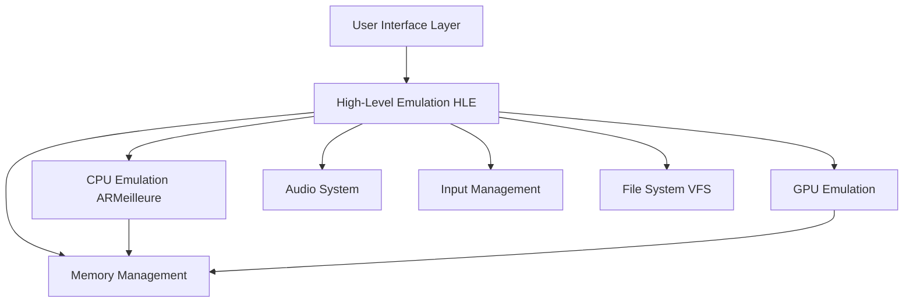

Ryujinx is a Nintendo Switch emulator written in C# that provides accurate emulation of the Switch hardware and operating system. The architecture is modular, separating concerns into distinct subsystems that work together to emulate the complete Switch experience.

## System Architecture

Ryujinx follows a layered architecture that emulates the Nintendo Switch at both the hardware and software levels:



## Core Subsystems

The emulator is composed of several major subsystems, each responsible for emulating a specific aspect of the Nintendo Switch:

<CardGroup cols={2}>
  <Card title="CPU Emulation" icon="microchip" href="#cpu-emulation-armeilleure">
    ARMeilleure JIT compiler for ARMv8 instruction translation
  </Card>
  <Card title="GPU Emulation" icon="display" href="#gpu-emulation">
    Maxwell GPU emulation with OpenGL, Vulkan, and Metal backends
  </Card>
  <Card title="High-Level Emulation" icon="layer-group" href="#high-level-emulation-hle">
    OS services and system calls implementation
  </Card>
  <Card title="Audio System" icon="volume-high" href="#audio-system">
    Audio rendering with multiple backend support
  </Card>
  <Card title="Input Management" icon="gamepad" href="#input-management">
    Controller, keyboard, and motion input handling
  </Card>
  <Card title="Memory Management" icon="memory" href="#memory-management">
    Virtual memory and memory mapping
  </Card>
</CardGroup>

---

## CPU Emulation (ARMeilleure)

ARMeilleure is the CPU emulation core that translates ARM instructions to host machine code.

### Key Features

- **ARMv8 CPU Emulation**: Supports most 64-bit ARMv8 instructions and partial 32-bit ARMv7 support
- **JIT Compilation**: Translates ARM code to a custom intermediate representation (IR), optimizes it, and generates native x86/x64 code
- **Profiled Persistent Translation Cache (PPTC)**: Caches translated functions to disk, dramatically reducing load times on subsequent launches
- **Multiple Memory Modes**: Software page table (slower but compatible) and host-mapped modes (faster)

### Architecture Layers

1. **Decoders** (`ARMeilleure/Decoders`): Decode ARM instructions into internal representations
2. **Translation** (`ARMeilleure/Translation`): Convert decoded instructions to intermediate representation
3. **Optimizations** (`ARMeilleure/Optimizations.cs`): Apply optimization passes to the IR
4. **Code Generation** (`ARMeilleure/CodeGen`): Generate native machine code from optimized IR
5. **State Management** (`ARMeilleure/State`): Manage CPU register state and execution context

### Integration Point

The CPU emulator is exposed through the `Ryujinx.Cpu` project, which wraps ARMeilleure and provides the execution interface used by the HLE layer.

---

## GPU Emulation

The GPU subsystem emulates the NVIDIA Maxwell architecture found in the Switch's Tegra X1 SoC.

### Graphics Stack

<CardGroup cols={2}>
  <Card title="Graphics Gpu" icon="layer-group">
    **Ryujinx.Graphics.Gpu**
    
    High-level GPU state management, command buffer processing, and Maxwell GPU emulation
  </Card>
  <Card title="Graphics GAL" icon="plug">
    **Ryujinx.Graphics.GAL**
    
    Graphics Abstraction Layer - unified interface for different graphics APIs
  </Card>
  <Card title="Backend Implementations" icon="code">
    **OpenGL, Vulkan, Metal**
    
    Platform-specific renderers implementing the GAL interface
  </Card>
  <Card title="Shader Subsystem" icon="wand-magic-sparkles">
    **Ryujinx.Graphics.Shader**
    
    Maxwell shader translator and compiler
  </Card>
</CardGroup>

### Key Components

- **GpuContext** (`Ryujinx.Graphics.Gpu/GpuContext.cs`): Central GPU management and coordination
- **GpuChannel**: Manages command submission and synchronization
- **Engine**: GPU engines (2D, 3D, DMA, compute) that process graphics commands
- **Shader Translation**: Converts Maxwell shader binaries to GLSL, SPIR-V, or MSL
- **Texture Management**: Texture caching, format conversion, and decompression
- **Memory Management**: GPU memory allocation and virtual address translation

### Graphics Enhancements

- Resolution scaling (upscaling/downscaling)
- Anti-aliasing (FXAA, SMAA)
- Anisotropic filtering
- Aspect ratio adjustment
- FSR (FidelityFX Super Resolution)
- Disk shader caching

---

## High-Level Emulation (HLE)

The HLE layer (`Ryujinx.HLE`) emulates the Switch's operating system (Horizon OS) and provides implementations of system services.

### Core HLE Components

<CardGroup cols={2}>
  <Card title="Horizon OS" icon="globe">
    **Ryujinx.HLE/HOS**
    
    Main OS emulation including kernel, IPC, and system services
  </Card>
  <Card title="Kernel" icon="gear">
    **Ryujinx.HLE/HOS/Kernel**
    
    Process management, threading, synchronization, and memory
  </Card>
  <Card title="Services" icon="server">
    **Ryujinx.Horizon**
    
    System services (audio, filesystem, friends, etc.)
  </Card>
  <Card title="File System" icon="folder-tree">
    **Ryujinx.HLE/FileSystem**
    
    Virtual file system with LibHac integration
  </Card>
</CardGroup>

### Switch Class

The `Switch` class (`Ryujinx.HLE/Switch.cs`) is the central orchestrator that ties all emulation components together:

```csharp
public class Switch
{
    public HleConfiguration Configuration
    public GpuContext Gpu
    public VirtualFileSystem FileSystem
    public HOS.Horizon System
    public ProcessLoader Processes
    public Hid Hid  // Human Interface Devices
    // ...
}
```

### System Services

Ryujinx implements the Switch's system services through the `Ryujinx.Horizon` project, which provides:

- **am** (Application Manager): Application lifecycle management
- **fs** (File System): File operations and save data
- **hid** (Human Interface Devices): Input device management
- **audio**: Audio rendering and capture
- **friend**: Friends list and presence
- **nim** (Network Installation Manager): Software updates
- **nifm** (Network Interface Manager): Network connectivity
- And many more...

---

## Audio System

The audio subsystem provides accurate audio emulation with multiple backend options.

### Audio Architecture

- **AudioManager** (`Ryujinx.Audio/AudioManager.cs`): Central audio coordination
- **Renderer**: Audio rendering engine that processes audio streams
- **Output/Input**: Audio output and input (microphone) interfaces
- **Integration**: Bridge between HLE services and audio backends

### Supported Backends

<CardGroup cols={3}>
  <Card title="SDL3" icon="headphones">
    Primary audio backend using SDL3 (default)
  </Card>
  <Card title="OpenAL" icon="headphones">
    OpenAL Soft for cross-platform audio
  </Card>
  <Card title="libsoundio" icon="headphones">
    Low-latency audio library fallback
  </Card>
</CardGroup>

### Features

- Full audio output support
- Multiple audio streams and mixing
- 3D audio and effects processing
- Low-latency audio rendering

<Note>
  Audio input (microphone) is not currently supported in Ryujinx.
</Note>

---

## Input Management

The input system handles all user input devices and translates them to Switch controller inputs.

### Input Stack

- **Ryujinx.Input**: Abstract input interfaces and state management
- **Ryujinx.Input.SDL3**: SDL3-based input driver implementation
- **HID Services**: Translation layer between input drivers and game input

### Supported Inputs

<CardGroup cols={2}>
  <Card title="Controllers" icon="gamepad">
    - Xbox controllers
    - PlayStation controllers
    - Nintendo controllers (Pro, Joy-Con)
    - Generic gamepads
  </Card>
  <Card title="Other Inputs" icon="keyboard">
    - Keyboard and mouse
    - Touch screen input
    - Motion controls (gyroscope/accelerometer)
  </Card>
</CardGroup>

### Features

- **Input Configuration**: Flexible button mapping and controller profiles
- **Motion Controls**: Native motion support for compatible controllers
- **Multi-Controller**: Support for multiple connected controllers
- **Input Assigner**: Automatic controller detection and assignment

---

## Memory Management

The memory subsystem (`Ryujinx.Memory`) provides virtual memory management and address translation.

### Memory Components

- **MemoryBlock**: Large contiguous memory allocations with platform-specific implementations
- **VirtualMemoryManager**: Virtual address space management and translation
- **AddressSpaceManager**: Address space allocation and mapping
- **MemoryTracking**: Track memory access and modifications for GPU cache invalidation

### Memory Manager Modes

1. **Software Page Table**: Software-based address translation (slowest, most compatible)
2. **Host Mapped**: Maps guest memory directly to host address space (faster)
3. **Host Unchecked**: Host mapped without bounds checking (fastest, default)

### Memory Layout

Ryujinx emulates the Switch's memory configuration:

- **4 GB or 6 GB DRAM**: Standard Switch has 4GB, some models have 6GB
- **Virtual Address Space**: 39-bit address space (512 GB)
- **Memory Regions**: Code, heap, stack, and memory-mapped I/O regions

---

## File System

The virtual file system integrates with LibHac to provide Switch-compatible file operations.

### File System Features

- **Game Loading**: Load NSP, XCI, NSO, NRO, and other Switch formats
- **Save Data**: Save data management and encryption
- **Title Management**: Installed titles and updates
- **DLC Management**: Add-on content and downloadable content
- **Mod Support**: romfs, exefs, and runtime mods (cheats)

### Storage

- **NAND Emulation**: Emulated NAND flash storage
- **SD Card**: Emulated SD card storage
- **RomFS**: Read-only filesystem for game data
- **Save Data**: Encrypted save data compatible with Switch

---

## System Integration

All subsystems work together through the central `Switch` class, which initializes and coordinates:

1. **Configuration**: System settings and emulation options
2. **Memory Allocation**: Allocate DRAM and set up memory managers
3. **GPU Initialization**: Initialize graphics context and renderer
4. **Horizon OS**: Initialize OS services and kernel
5. **Input/Audio**: Set up input and audio device drivers
6. **Process Loader**: Load and execute game applications

### Execution Flow

```
1. User launches game → ProcessLoader loads executable
2. CPU executes game code → ARMeilleure translates and runs
3. Game makes system calls → HLE services handle requests
4. Game submits GPU commands → GPU emulator processes and renders
5. Game outputs audio → Audio system renders to backend
6. User provides input → Input system translates to game input
```

---

## Performance Optimizations

<CardGroup cols={2}>
  <Card title="PPTC" icon="rocket">
    **Profiled Persistent Translation Cache**
    
    Caches translated CPU code for faster subsequent launches
  </Card>
  <Card title="Shader Cache" icon="database">
    **Disk Shader Caching**
    
    Caches compiled shaders to eliminate stutter
  </Card>
  <Card title="Multi-threading" icon="layer-group">
    **Parallel Execution**
    
    GPU and CPU run on separate threads for better performance
  </Card>
  <Card title="Memory Modes" icon="gauge-high">
    **Fast Memory Access**
    
    Host-mapped memory for near-native memory performance
  </Card>
</CardGroup>

---

## Next Steps

<CardGroup cols={2}>
  <Card title="Project Structure" icon="folder-tree" href="/architecture/project-structure">
    Explore the detailed project and directory structure
  </Card>
  <Card title="Contributing" icon="code-pull-request" href="/development/contributing">
    Learn how to contribute to Ryujinx development
  </Card>
</CardGroup>
