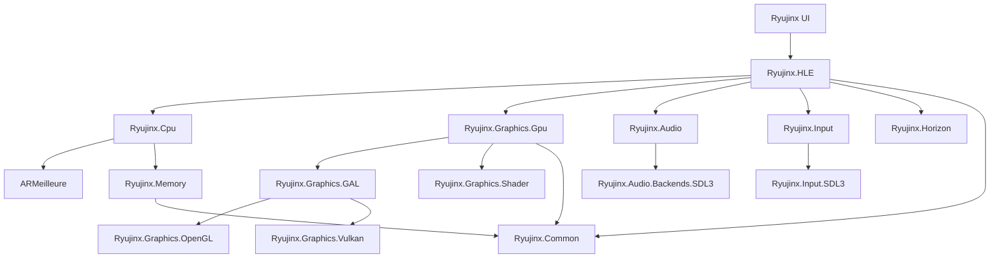

Ryujinx is organized as a Visual Studio solution with multiple C# projects, each serving a specific purpose in the emulation stack. This page provides a comprehensive overview of the project structure and key directories.

## Solution Overview

The Ryujinx solution (`Ryujinx.sln`) contains over 30 projects organized into logical groups:

- **Core Emulation**: CPU, GPU, HLE, Memory
- **Graphics**: GPU backends, shader translation, texture handling
- **Audio**: Audio rendering and backend implementations
- **Input**: Input abstraction and driver implementations
- **Utilities**: Common libraries, generators, and tools
- **Application**: Main UI application
- **Testing**: Unit tests and test utilities

---

## Core Projects

These projects form the foundation of the emulator:

<CardGroup cols={2}>
  <Card title="ARMeilleure" icon="microchip">
    **CPU Emulation Core**
    
    JIT compiler for ARMv8 instruction translation to native code
  </Card>
  <Card title="Ryujinx.Cpu" icon="gear">
    **CPU Interface**
    
    Wrapper and interface layer for ARMeilleure
  </Card>
  <Card title="Ryujinx.HLE" icon="layer-group">
    **High-Level Emulation**
    
    Operating system and system services emulation
  </Card>
  <Card title="Ryujinx.Memory" icon="memory">
    **Memory Management**
    
    Virtual memory manager and memory operations
  </Card>
</CardGroup>

### ARMeilleure

**Path**: `src/ARMeilleure/`

The CPU emulation core that translates ARM instructions to host machine code.

```
ARMeilleure/
├── CodeGen/           # Native code generation (x86/x64)
├── Common/            # Shared utilities and constants
├── Decoders/          # ARM instruction decoders
│   ├── A32/           # ARMv7 32-bit instructions
│   └── A64/           # ARMv8 64-bit instructions
├── Instructions/      # Instruction implementations
│   ├── InstEmit.cs    # Instruction emission
│   └── ...
├── IntermediateRepresentation/  # Custom IR definitions
├── Translation/       # Translation and JIT compilation
│   ├── Cache/         # PPTC cache implementation
│   ├── Translator.cs  # Main translation orchestrator
│   └── ...
├── State/             # CPU state and register management
└── Optimizations.cs   # Optimization passes
```

**Key Files**:
- `Translation/Translator.cs`: Main JIT translation orchestrator
- `Decoders/Decoder.cs`: ARM instruction decoder entry point
- `CodeGen/X86/CodeGenerator.cs`: x86/x64 code generation
- `Optimizations.cs`: IR optimization configuration

### Ryujinx.HLE

**Path**: `src/Ryujinx.HLE/`

High-level emulation of the Switch operating system and services.

```
Ryujinx.HLE/
├── HOS/                      # Horizon OS emulation
│   ├── Kernel/               # Kernel implementation
│   │   ├── Process/          # Process management
│   │   ├── Threading/        # Thread scheduling
│   │   ├── Memory/           # Kernel memory management
│   │   ├── Ipc/              # Inter-process communication
│   │   └── SupervisorCall/   # System call (SVC) handlers
│   ├── Services/             # System services (IPC servers)
│   │   ├── Am/               # Application Manager
│   │   ├── Audio/            # Audio services
│   │   ├── Fs/               # File System services
│   │   ├── Hid/              # Human Interface Devices
│   │   ├── Nifm/             # Network Interface Manager
│   │   └── ...
│   ├── Applets/              # System applets
│   │   ├── SoftwareKeyboard/
│   │   ├── Controller/
│   │   ├── Error/
│   │   └── ...
│   └── Horizon.cs            # Main OS initialization
├── FileSystem/               # Virtual file system
├── Loaders/                  # Game loaders (NSP, XCI, NSO, NRO)
├── Debugger/                 # GDB stub for debugging
└── Switch.cs                 # Main emulator orchestrator
```

**Key Files**:
- `Switch.cs`: Central class that orchestrates all emulation components
- `HOS/Horizon.cs`: Horizon OS initialization and management
- `HOS/Kernel/KernelContext.cs`: Kernel context and resources
- `Loaders/Processes/ProcessLoader.cs`: Load and start applications

### Ryujinx.Memory

**Path**: `src/Ryujinx.Memory/`

Low-level memory management and virtual address translation.

```
Ryujinx.Memory/
├── MemoryBlock.cs            # Large memory allocation
├── VirtualMemoryManagerBase.cs  # VM manager base
├── AddressSpaceManager.cs    # Address space management
├── MemoryManagement.cs       # Platform-agnostic memory ops
├── MemoryManagementUnix.cs   # Unix/Linux memory operations
├── MemoryManagementWindows.cs # Windows memory operations
├── Tracking/                 # Memory tracking for GPU cache
└── Range/                    # Memory range utilities
```

**Key Interfaces**:
- `IVirtualMemoryManager`: Interface for memory operations
- `MemoryBlock`: Platform-specific memory allocation

---

## Graphics Projects

The graphics subsystem is split into multiple projects for modularity:

<CardGroup cols={2}>
  <Card title="Ryujinx.Graphics.Gpu" icon="display">
    High-level GPU emulation and command processing
  </Card>
  <Card title="Ryujinx.Graphics.GAL" icon="plug">
    Graphics Abstraction Layer interface
  </Card>
  <Card title="Ryujinx.Graphics.OpenGL" icon="paintbrush">
    OpenGL 4.5+ renderer implementation
  </Card>
  <Card title="Ryujinx.Graphics.Vulkan" icon="fire">
    Vulkan renderer implementation
  </Card>
  <Card title="Ryujinx.Graphics.Shader" icon="wand-magic-sparkles">
    Maxwell shader decompiler and translator
  </Card>
  <Card title="Ryujinx.Graphics.Texture" icon="image">
    Texture format handling and conversion
  </Card>
</CardGroup>

### Ryujinx.Graphics.Gpu

**Path**: `src/Ryujinx.Graphics.Gpu/`

Maxwell GPU emulation and high-level graphics management.

```
Ryujinx.Graphics.Gpu/
├── Engine/                   # GPU engines
│   ├── GPFifo/               # Command FIFO processing
│   ├── Threed/               # 3D engine (main graphics)
│   ├── Twod/                 # 2D engine (blits, copies)
│   ├── Compute/              # Compute engine
│   ├── Dma/                  # DMA engine
│   └── MME/                  # Macro engine
├── Image/                    # Texture and image management
│   ├── TextureCache.cs       # Texture caching
│   ├── TextureManager.cs     # Texture lifecycle
│   └── ...
├── Memory/                   # GPU memory management
│   ├── MemoryManager.cs      # GPU virtual memory
│   └── Buffer/               # Buffer management
├── Shader/                   # Shader management
│   ├── ShaderCache.cs        # Shader caching
│   └── DiskCache/            # Persistent shader cache
├── GpuContext.cs             # Main GPU context
├── GpuChannel.cs             # Command submission channel
└── Window.cs                 # Presentation and swap chain
```

**Key Features**:
- Command buffer processing
- GPU state management
- Texture caching and management
- Shader compilation and caching
- GPU memory virtualization

### Ryujinx.Graphics.GAL

**Path**: `src/Ryujinx.Graphics.GAL/`

Graphics Abstraction Layer - a unified interface for different graphics APIs.

```
Ryujinx.Graphics.GAL/
├── IRenderer.cs              # Main renderer interface
├── IPipeline.cs              # Graphics pipeline operations
├── ITexture.cs               # Texture interface
├── IProgram.cs               # Shader program interface
├── ISampler.cs               # Sampler interface
├── IWindow.cs                # Window/swapchain interface
├── Capabilities.cs           # Backend capability queries
├── Format.cs                 # Texture and buffer formats
└── Multithreading/           # Thread-safe wrapper
```

Backend implementations:
- **Ryujinx.Graphics.OpenGL**: OpenGL 4.5+ implementation
- **Ryujinx.Graphics.Vulkan**: Vulkan 1.1+ implementation
- **Metal via MoltenVK**: Metal backend on macOS

### Ryujinx.Graphics.Shader

**Path**: `src/Ryujinx.Graphics.Shader/`

Maxwell shader binary decompiler and translator.

```
Ryujinx.Graphics.Shader/
├── Decoders/                 # Shader instruction decoders
├── Translation/              # Shader translation
│   ├── Translator.cs         # Main shader translator
│   ├── Optimizations/        # Shader optimizations
│   └── Transforms/           # IR transformations
├── CodeGen/                  # Target code generation
│   ├── Glsl/                 # GLSL code generator
│   └── Spirv/                # SPIR-V code generator
├── IntermediateRepresentation/ # Shader IR
└── StructuredIr/             # High-level structured IR
```

**Supported Output**:
- **GLSL**: For OpenGL backend
- **SPIR-V**: For Vulkan backend
- **MSL**: Metal Shading Language (via SPIR-V cross)

### Related Graphics Projects

- **Ryujinx.Graphics.Texture**: Texture decompression (ASTC, DXT, BCn)
- **Ryujinx.Graphics.Device**: GPU device abstraction
- **Ryujinx.Graphics.Host1x**: NVIDIA Host1x interface
- **Ryujinx.Graphics.Nvdec**: Video decoding hardware emulation
- **Ryujinx.Graphics.Nvdec.Vp9**: VP9 video decoder
- **Ryujinx.Graphics.Nvdec.FFmpeg**: FFmpeg-based video decoding
- **Ryujinx.Graphics.Vic**: Video Image Compositor
- **Ryujinx.Graphics.Video**: Video decoding infrastructure
- **Spv.Generator**: SPIR-V bytecode generation library

---

## Audio Projects

<CardGroup cols={2}>
  <Card title="Ryujinx.Audio" icon="volume-high">
    Core audio emulation and rendering
  </Card>
  <Card title="Ryujinx.Audio.Backends.SDL3" icon="headphones">
    SDL3 audio backend (default)
  </Card>
  <Card title="Ryujinx.Audio.Backends.OpenAL" icon="headphones">
    OpenAL audio backend
  </Card>
  <Card title="Ryujinx.Audio.Backends.SoundIo" icon="headphones">
    libsoundio audio backend
  </Card>
</CardGroup>

### Ryujinx.Audio

**Path**: `src/Ryujinx.Audio/`

```
Ryujinx.Audio/
├── Renderer/                 # Audio rendering
│   ├── Dsp/                  # DSP effects
│   ├── Server/               # Audio server
│   └── ...
├── Integration/              # HLE integration
├── Backends/                 # Backend interfaces
├── Input/                    # Audio input (microphone)
├── Output/                   # Audio output
└── AudioManager.cs           # Audio system coordinator
```

**Features**:
- Multiple audio stream mixing
- 3D audio and effects
- Sample rate conversion
- Low-latency rendering

---

## Input Projects

<CardGroup cols={2}>
  <Card title="Ryujinx.Input" icon="gamepad">
    Input abstraction layer
  </Card>
  <Card title="Ryujinx.Input.SDL3" icon="gamepad">
    SDL3 input driver implementation
  </Card>
</CardGroup>

### Ryujinx.Input

**Path**: `src/Ryujinx.Input/`

```
Ryujinx.Input/
├── IGamepad.cs               # Gamepad interface
├── IKeyboard.cs              # Keyboard interface
├── IMouse.cs                 # Mouse interface
├── IGamepadDriver.cs         # Driver interface
├── Motion/                   # Motion/gyro support
├── Assigner/                 # Input assignment
└── HLE/                      # HLE integration
```

**Supported Devices**:
- Xbox controllers
- PlayStation controllers (DualShock 4, DualSense)
- Nintendo controllers (Pro Controller, Joy-Con)
- Generic DirectInput/XInput gamepads
- Keyboard and mouse

---

## System Services (Horizon)

The `Ryujinx.Horizon` project implements Switch system services.

**Path**: `src/Ryujinx.Horizon/`

```
Ryujinx.Horizon/
├── Sdk/                      # Nintendo SDK implementations
│   ├── Fs/                   # File system SDK
│   ├── Account/              # Account SDK
│   ├── Friends/              # Friends SDK
│   ├── Applet/               # Applet SDK
│   └── ...
├── Audio/                    # Audio service
├── Friends/                  # Friends service
├── Arp/                      # Application Registry
├── Bcat/                     # Background Content Asymmetric Transfer
├── Lbl/                      # Label (backlight)
├── Prepo/                    # Play Report
├── Ptm/                      # Power Management
└── ServiceTable.cs           # Service registration
```

**Related Projects**:
- **Ryujinx.Horizon.Common**: Common types and utilities
- **Ryujinx.Horizon.Generators**: Source generators for services
- **Ryujinx.Horizon.Kernel.Generators**: Kernel-related generators

---

## Utility Projects

<CardGroup cols={2}>
  <Card title="Ryujinx.Common" icon="toolbox">
    Shared utilities, logging, configuration
  </Card>
  <Card title="Ryujinx.HLE.Generators" icon="code">
    Source generators for HLE services
  </Card>
  <Card title="Ryujinx.SDL3.Common" icon="layer-group">
    SDL3 bindings and utilities
  </Card>
  <Card title="Ryujinx.UI.LocaleGenerator" icon="language">
    Localization generation tool
  </Card>
</CardGroup>

### Ryujinx.Common

**Path**: `src/Ryujinx.Common/`

Shared utilities used across all projects.

```
Ryujinx.Common/
├── Configuration/            # Configuration management
├── Logging/                  # Logging infrastructure
├── Memory/                   # Memory utilities
├── SystemInterop/            # Platform interop
├── Utilities/                # General utilities
│   ├── EmbeddedResources.cs
│   ├── JsonHelper.cs
│   └── ...
├── Collections/              # Custom collections
└── GraphicsDriver/           # GPU driver detection
```

**Key Features**:
- Application configuration
- Multi-target logging (console, file)
- Platform-specific utilities
- JSON serialization helpers
- Resource embedding

---

## Application Project

### Ryujinx

**Path**: `src/Ryujinx/`

The main application UI built with Avalonia (cross-platform UI framework).

```
Ryujinx/
├── UI/                       # User interface
│   ├── ViewModels/           # MVVM view models
│   ├── Views/                # UI views
│   ├── Controls/             # Custom controls
│   └── Windows/              # Application windows
├── Assets/                   # UI assets and resources
├── Config/                   # Configuration UI
├── Input/                    # Input configuration UI
└── Program.cs                # Entry point
```

**Features**:
- Game library management
- Settings and configuration UI
- Controller configuration
- Title/DLC/update management
- Mod management
- Save data management

---

## Testing Projects

<CardGroup cols={2}>
  <Card title="Ryujinx.Tests" icon="flask">
    Main unit tests for core functionality
  </Card>
  <Card title="Ryujinx.Tests.Memory" icon="memory">
    Memory management tests
  </Card>
  <Card title="Ryujinx.Tests.Unicorn" icon="vial">
    CPU tests using Unicorn engine
  </Card>
  <Card title="Ryujinx.ShaderTools" icon="wrench">
    Shader testing and development tools
  </Card>
</CardGroup>

---

## Build and Validation

### Ryujinx.BuildValidationTasks

**Path**: `src/Ryujinx.BuildValidationTasks/`

MSBuild tasks for build-time validation and code generation.

**Purpose**:
- Validate code patterns
- Enforce coding standards
- Generate build metadata

---

## Directory Structure Summary

```
Ryujinx/
├── src/
│   ├── ARMeilleure/              # CPU emulation (JIT)
│   ├── Ryujinx/                  # Main UI application
│   ├── Ryujinx.HLE/              # High-level emulation
│   ├── Ryujinx.Cpu/              # CPU interface
│   ├── Ryujinx.Memory/           # Memory management
│   ├── Ryujinx.Common/           # Shared utilities
│   ├── Ryujinx.Graphics.Gpu/     # GPU emulation
│   ├── Ryujinx.Graphics.GAL/     # Graphics abstraction
│   ├── Ryujinx.Graphics.OpenGL/  # OpenGL backend
│   ├── Ryujinx.Graphics.Vulkan/  # Vulkan backend
│   ├── Ryujinx.Graphics.Shader/  # Shader translation
│   ├── Ryujinx.Graphics.Texture/ # Texture handling
│   ├── Ryujinx.Graphics.*/       # Other graphics projects
│   ├── Ryujinx.Audio/            # Audio core
│   ├── Ryujinx.Audio.Backends.*/ # Audio backends
│   ├── Ryujinx.Input/            # Input abstraction
│   ├── Ryujinx.Input.SDL3/       # SDL3 input driver
│   ├── Ryujinx.Horizon/          # System services
│   ├── Ryujinx.Horizon.*/        # Horizon utilities
│   ├── Ryujinx.*.Generators/     # Source generators
│   ├── Ryujinx.Tests*/           # Test projects
│   ├── Spv.Generator/            # SPIR-V generator
│   └── ...
├── docs/                         # Documentation
├── distribution/                 # Distribution files
├── .github/                      # GitHub workflows
├── Ryujinx.sln                   # Visual Studio solution
├── Directory.Build.props         # Common build properties
├── Directory.Packages.props      # NuGet package versions
└── README.md                     # Project readme
```

---

## Project Dependencies

The dependency flow generally follows this pattern:



<Info>
  Most projects depend on `Ryujinx.Common` for shared utilities and logging.
</Info>

---

## Build Configuration

### Directory.Build.props

Common MSBuild properties shared across all projects:
- Target framework (NET 8.0+)
- Language version (C# 12)
- Nullable reference types
- Warning levels and suppressions

### Directory.Packages.props

Centralized NuGet package version management using Central Package Management (CPM).

**Key Dependencies**:
- **LibHac**: Switch file system and crypto
- **Silk.NET**: Cross-platform window/input/graphics
- **Avalonia**: Cross-platform UI framework
- **Concentus**: Opus audio codec
- **LibVpx**: VP9 video codec
- **FFmpeg**: Video decoding

---

## Next Steps

<CardGroup cols={2}>
  <Card title="Architecture Overview" icon="sitemap" href="/architecture/overview">
    Return to the high-level architecture overview
  </Card>
  <Card title="Contributing Guide" icon="code-pull-request" href="/contributing">
    Learn how to build and contribute to Ryujinx
  </Card>
</CardGroup>
